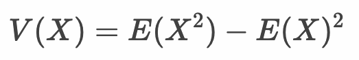

# 確率変数

* **確率変数**とは確率（確率分布）によって値の決まる変数
* 確率変数は値の取りうる確率を`P`、確率変数の**期待値**を`E`、確率変数の**分散**を`V`という記号で表現する
* 確率変数は**離散型確率変数**、**連続型確率変数**に分類できる

> 変数とは何かしらの具体的な値を持ちます。確率変数とはその具体的な値と、その値の出現する確率（確率分布）を持ちます。

---

## 確率変数と確率の表記

* ある確率変数 X について、具体的な値である a を取りうる確率が Y の場合、次のように記述する


* たとえばサイコロの出目を確率変数Xとした場合、1が出る確率は以下のように記述できる

```
P(X=1) = 1/6
```

* あるいは以下のように確率変数X を省略して記述することもある
  
```
P(1) = 1/6
```

---

## 確率分布

* **確率分布**とは、確率変数のとりうる値とその確率の対応を表すもの
* 離散型確率分布、連続型確率分布に分かれる
* 離散型確率分布にはベルヌーイ分布、二項分布、ポアソン分布などがあり、連続型確率分布には正規分布やt分布などがある

### 例：サイコロの出目の確率分布


> サイコロの出目のような各値についての確率が一様に等しい分布を**一様分布**と呼びます。

---

## 確率変数の期待値

* 確率変数のとりうる値の平均値を**期待値**と呼ぶ
* 確率変数の期待値は `E` を使って記述する
* ある確率変数 X の期待値がAの場合、以下のように記述する


* たとえばサイコロの出目を確率変数Xで表す場合、その期待値 `E(X)` は以下のようになる
  
```
E(X) = (1 * 1/6) + (2 * 1/6) + (3 * 1/6) + (4 * 1/6) + (5 * 1/6) + (6 * 1/6) 
     = 3.5
```

> 離散型の確率変数Xの期待値 E(X) は以下のように表すことができます。


### 確率変数の期待値の性質

* X、Yを確率変数、Cを定数とすると、期待値Eの演算は以下のようになる

```
E(C) = C
E(X + C) = E(X) + C
E(X * C) = C * E(X)
E(X + Y) = E(X) + E(Y)
```

* たとえばサイコロの出目を確率変数Xとし、2 * X + 1　の期待値を求めると次のようになる

```
E(X) = 3.5
E(2 * X + 1) = 2 * E(X) + 1 = 2 * 3.5 + 1 = 8
```

> 期待値の性質を理解することで、以下のように計算するよりも簡単になることを確認してください。

```
E(2 * X + 1) = (3 * 1/6) + (5 * 1/6) + (7 * 1/6) + (9 * 1/6) + (11 * 1/6) + (13 * 1/6) 
     = 8
```
---

## 確率変数の分散

* 確率変数のとりうる値にはばらつき（**分散**）がある
* 確率変数の分散は `V` を使って記述する
* ある確率変数 X の分散がAの場合、以下のように記述する


* たとえばサイコロの出目を確率変数Xで表す場合、その分散 `V(X)` は以下のようになる
  
```
V(X) = ((1 - 3.5)^2 + (2 - 3.5)^2 + (3 - 3.5)^2  + 
        (4 - 3.5)^2 + (5 - 3.5)^2  + (6 - 3.5)^2) / 6
     = 2.916667
```

* あるいは以下のように偏差の2乗値に確率を掛けて求めることもできます。

```
V(X) = (1 - 3.5)^2 * 1/6 + (2 - 3.5)^2 * 1/6 + (3 - 3.5)^2 * 1/6 + 
       (4 - 3.5)^2 * 1/6 + (5 - 3.5)^2 * 1/6 + (6 - 3.5)^2 * 1/6
     = 2.916667
```

> 離散型の確率変数Xの分散 V(X) は以下のように表すことができます。


---

### 確率変数の分散の性質

* Xを確率変数、Cを定数とすると、分散Vの演算は以下のようになる

```
V(C) = 0
V(X + C) = V(X)
V(X * C) = C^2 * V(X)
```

* たとえばサイコロの出目を確率変数Xとし、2 * X + 1　の分散を求めると次のようになる

```
V(X) = 2.916667
V(2 * X + 1) = 2^2 * V(X) = 4 * 2.916667 = 11.66667
```

> 分散の性質を理解することで、以下のように計算するよりも簡単になることを確認してください。

```
E(2 * X + 1) = 8
V(2 * X + 1) = ((3 - 8)^2 + (5 - 8)^2 + (7 - 8)^2  + (9 - 8)^2  + (11 - 8)^2  + (13 - 8)^2) / 6
     = 11.66667
```

---

## （参考）確率変数の期待値と分散の関係

* 後述するように確率変数の分散は以下のように確率変数の期待値で計算できる



> 確率変数Xの分散は、確率変数Xの2乗値の期待値から確率変数Xの期待値の2乗値を引いたものになります。

* たとえばサイコロの出目を確率変数Xで表す場合、その分散 `V` は以下のようになる

```
E(X) = 3.5
(E(X))^2 = 3.5 * 3.5 = 12.25

E(X^2) =  (1 * 1/6) + (4 * 1/6) + (9 * 1/6) + (16 * 1/6) + (25 * 1/6) + (36 * 1/6) 
     = 15.16667

V(X) = E(X^2) - (E(X))^2 = 15.16667 - 12.25 = 2.91667
```
 
> 以前に求めたサイコロの出目の分散と一致していることがわかります。

---

## エクササイズ

### 設問1

2枚のコインを投げて表の出た枚数を確率変数Xとします。

* 確率変数Xの確率分布を表にまとめてください。
* 確率 `P(X=0)` を求めてください。
* 確率 `P(X<=1)` を求めてください。
* 期待値 `E(X)` を求めてください。
* 分散 `V(X)` を求めてください。
* 期待値 `E(2 * X + 5)` を求めてください。
* 分散 `V(2 * X + 5)` を求めてください。

---

### 設問2

2つのサイコロの出た目の和を確率変数Xとします。

* 確率変数Xの確率分布を表にまとめてください。
* 確率 `P(X=1)` を求めてください。
* 確率 `P(X<=3)` を求めてください。
* 確率 `P(5<X<=8)` を求めてください。
* 期待値 `E(X)` を求めてください。
* 分散 `V(X)` を求めてください。
* 期待値 `E(5 * X + 10)` を求めてください。
* 分散 `V(5 * X + 10)` を求めてください。

---

### 設問3

以下の確率分布に従うサイコロがあります。

|出目|1|2|3|4|5|6|
|:--:|:--:|:--:|:--:|:--:|:--:|:--:|
|確率|1/2|1/10|1/10|1/10|1/10|1/10|

* 期待値 `E(X)` を求めてください。
* 分散 `V(X)` を求めてください。

<!--
### 設問1
* 確率変数Xの確率分布を表にまとめてください。

|X   |0  |1  |2|
|P(X)|1/4|2/4|1/4|

* 確率 `P(X=0)` を求めてください。

P(X=0) = 1/4

* 確率 `P(X<=1)` を求めてください。

P(X<=1) = 3/4

* 期待値 `E(X)` を求めてください。

E(X) = 0 * 1/4 + 1 * 1/2 + 2 / 1/4 = 1

* 分散 `V(X)` を求めてください。

V(X) = ((0 - 1)^2 + (1 - 1)^2 + (1 - 1)^2 + (2 - 1)^2) / 4
     = 0.5 ※出現回数に注意

V(X) = (0 - 1)^2 * 1/4 + (1 - 1)^2 * 1/2 + (2 - 1)^2 * 1/4
     = 0.5

E(X^2) = 0^2 * 1/4 + 1^2 * 1/2 + 2^2 / 1/4 = 1/2 + 1 = 1.5
(E(X))^2 = 1
V(X) = E(X^2) - (E(X))^2 = 1.5 - 1 = 0.5

* 期待値 `E(2 * X + 5)` を求めてください。
E(X) = 1
E(2 * X + 5) = 7

* 分散 `V(2 * X + 5)` を求めてください。

V(X) = 0.5
V(X + C) = V(X), V(X * C) = C^2 * V(X) より
V(2 * X + 5) = 4 * V(X) = 2


### 設問2

* 確率変数Xの確率分布を表にまとめてください。

(6,1)(6,2)(6,3)(6,4)(6,5)(6,6)
(5,1)(5,2)(5,3)(5,4)(5,5)(5,6)
(4,1)(4,2)(4,3)(4,4)(4,5)(4,6)
(3,1)(3,2)(3,3)(3,4)(3,5)(3,6)
(2,1)(2,2)(2,3)(2,4)(2,5)(2,6)
(1,1)(1,2)(1,3)(1,4)(1,5)(1,6)

X   | 2  | 3  | 4  | 5  | 6  | 7  | 8  | 9  | 10 | 11 | 12 |
P(X)|1/36|2/36|3/36|4/36|5/36|6/36|5/36|4/36|3/36|2/36|1/36| 


* 確率 `P(X=1)` を求めてください。

P(X=1) = 0

* 確率 `P(X<=3)` を求めてください。

P(X<=3) = 6 / 36 = 1/6

* 確率 `P(5<X<=8)` を求めてください。

P(5<X<=8) = (5 + 6 + 5) / 36 = 16/36 = 4/9

* 期待値 `E(X)` を求めてください。

E(X) = 2 * 1/36 + 3 * 2/36 + 4 * 3/36 + 5 * 4/36 + 6 * 5/36 + 7 * 6/36 + 8 * 5/36 + 9 * 4/36 + 10 * 3/36 + 11 * 2/36 + 12 * 1/36 = 7

あるいは2つのサイコロなので、
1つあたりのサイコロの期待値をE(Y) = 3.5とすると
E(Y + Y) = E(Y) + E(Y) = 3.5 + 3.5 = 7

* 分散 `V(X)` を求めてください。

V(X) = (2 - 7)^2 * 1/36
     + (3 - 7)^2 * 2/36
     + (4 - 7)^2 * 3/36
     + (5 - 7)^2 * 4/36
     + (6 - 7)^2 * 5/36
     + (7 - 7)^2 * 6/36
     + (8 - 7)^2 * 5/36
     + (9 - 7)^2 * 4/36
     + (10 - 7)^2 * 3/36
     + (11 - 7)^2 * 2/36
     + (12 - 7)^2 * 1/36
     = 5.83333

E(X^2) = 2^2 * 1/36 + 3^2 * 2/36 + 4^2 * 3/36 + 5^2 * 4/36 + 6^2 * 5/36 
       + 7^2 * 6/36 + 8^2 * 5/36 + 9^2 * 4/36 + 10^2 * 3/36 + 11^2 * 2/36 + 12^2 * 1/36 = 54.83333
E(X)^2 = 7 * 7 = 49
V(X) = E(X^2) - E(X)^2 = 54.83333 - 49 = 5.83333

* 期待値 `E(5 * X + 10)` を求めてください。

E(X) = 7
E(5 * X + 10) = 45

* 分散 `V(5 * X + 10)` を求めてください。
V(X) = 5.83333
V(5 * X + 10) = 5^2 * V(X) = 145.8333


### 設問3

以下の確率分布に従うサイコロがあります。

|出目|1|2|3|4|5|6|
|:--:|:--:|:--:|:--:|:--:|:--:|:--:|
|確率|1/2|1/5|1/5|1/5|1/5|1/5|

* 期待値 `E(X)` を求めてください。

E(X) = 1 * 1/2 + 2 * 1/10 + 3 * 1/10 + 4 * 1/10 + 5 * 1/10 + 6 * 1/10 = 2.5

* 分散 `V(X)` を求めてください。

V(X) = (1 - 2.5)^2 * 1/2 
     + (2 - 2.5)^2 * 1/10
     + (3 - 2.5)^2 * 1/10
     + (4 - 2.5)^2 * 1/10 
     + (5 - 2.5)^2 * 1/10 
     + (6 - 2.5)^2 * 1/10 = 3.25

E(X^2) = 1^2 * 1/2 + 2^2 * 1/10 + 3^2 * 1/10 + 4^2 * 1/10 + 5^2 * 1/10 + 6^2 * 1/10 = 9.5
E(X)^2 = 2.5^2 = 6.25
V(X) = E(X^2) - E(X)^2 = 9.5 - 6.25 = 3.25

-->
