# 二項分布

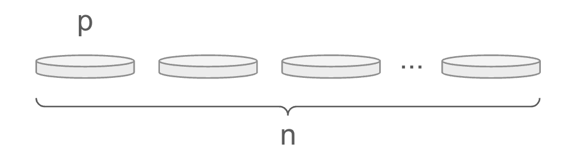

* 独立した `n` 回のベルヌーイ試行において、発生回数 `x` がしたがう確率分布を二項分布と呼ぶ
* 二項分布は試行回数 `n` と成功確率 `p` 2つのパラメータをとる
* 二項分布の試行回数 `n` を大きくするとその確率分布は正規分布に近似する

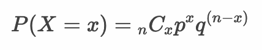

> 上記の二項分布の確率関数では `n`、`p`、`x` と3つの変数が登場しますが、二項分布のパラメータ（分布の形状を決めるもの）は `n` と `p` の2つである点に注意してください。`x` は確率変数の値であり、発生回数（成功回数）を意味します。

---

## 二項分布にしたがう確率変数X

* 二項分布のパラメータは試行回数 `n` と 成功確率 `p`

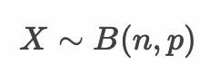

> 二項分布はBやBi、Binなどと表現します。また 〜 は分布にしたがうという意味です。この場合、確率変数Xは試行回数 n 確率 p の二項分布にしたがうと読みます。

---

## 例：コイン投げ

* 3枚のコインを投げて表の出る枚数を確率変数Xとする

```
X〜B(3, 0.5)
```

|X|0枚|1枚|2枚|3枚|
|:--:|:--:|:--:|:--:|:--:|
|P(X)|1/8|3/8|3/8|1/8|

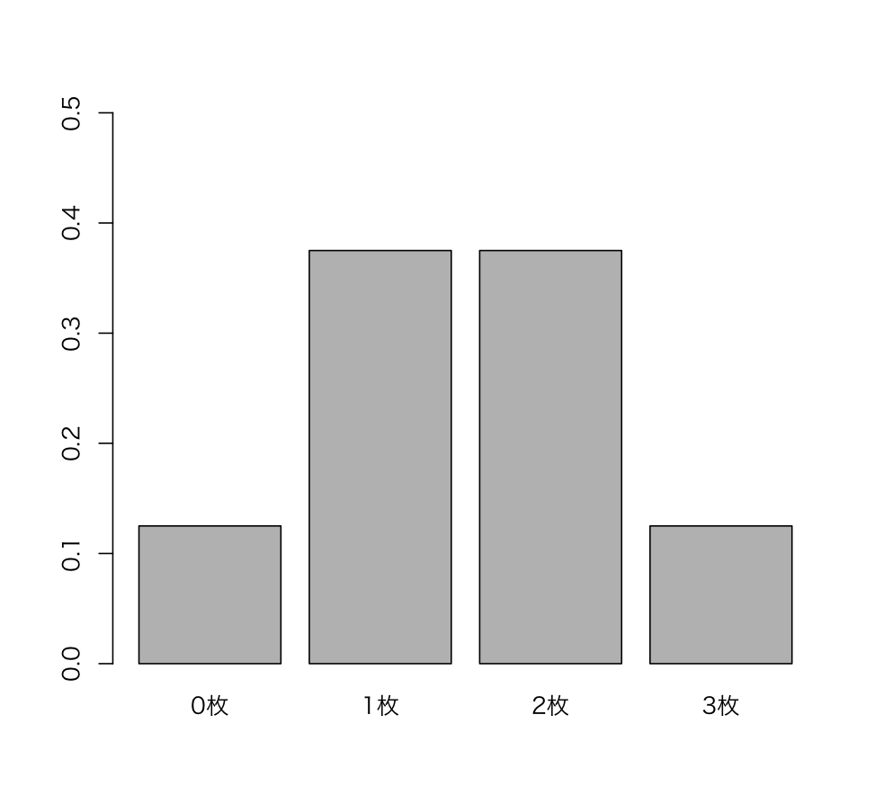


---

## 例：サイコロ

* サイコロを3回投げて1が出る回数を確率変数Xとする

```
X〜B(3, 1/6)
```

|X|0回|1回|2回|3回|
|:--:|:--:|:--:|:--:|:--:|
|P(X)|125/216|75/216|15/216|1/216|

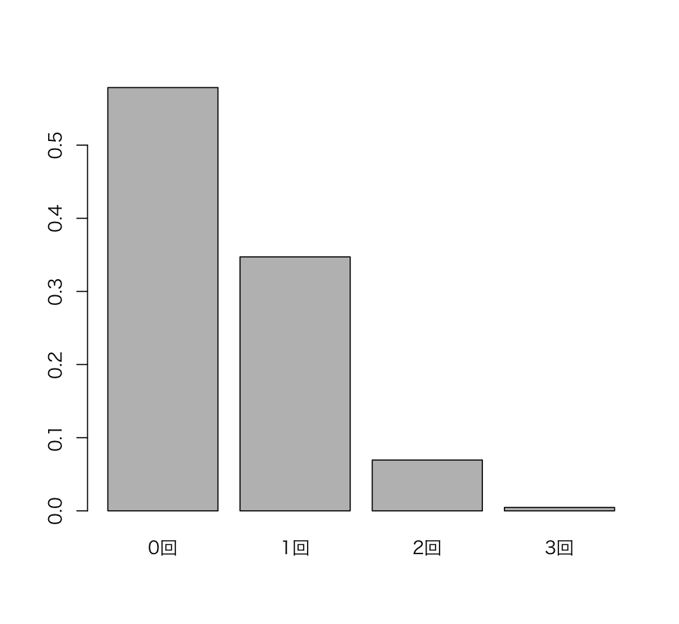

---


## 二項分布の期待値

* 二項分布の期待値は `np` となる

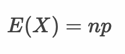

> 二項分布の期待値はベルヌーイ分布の期待値を n 倍したものと考えると良いでしょう。ここでは詳細な証明は割愛します。

---

## 二項分布の分散

* 二項分布の分散は `npq` となる

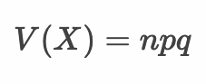

> 独立な確率変数の和の分散は各変数の分散の和となるため、二項分布の分散はベルヌーイ分布の分散を n 倍したものと考えると良いでしょう。ここでは詳細な証明は割愛します。

---

## 二項分布と正規分布、ポアソン分布の関係

* 二項分布の試行回数 `n` を大きくするとその分布は正規分布 `N(np, npq)` に近似する
* ただし、試行回数 `n` が大きく 確率 `p` が小さい場合は次に紹介するポアソン分布で近似できる
* 一般的に `n >= 100` 、 `p <= 0.05` 程度を基準に考えるとよい

> 参考文献： [基本統計学](https://www.amazon.co.jp/dp/464116455X)

---

## Rプログラミング

### rbinom 関数  - binom1.R

* `rbinom` 関数は二項分布から乱数を生成する
* `rbinom` 関数は第1引数 `n` に生成する乱数の数、第2引数 `size` に試行回数、第3引数 `prob` に成功確率を指定する

> 二項分布のパラメータは `size` 引数と `prop` 引数です。

```r
x <- rbinom(n = 1000, size = 50, prob = 1/2)
hist(x)
```

#### 実行結果

```r
> x <- rbinom(n = 1000, size = 50, prob = 1/2)
> hist(x)
```

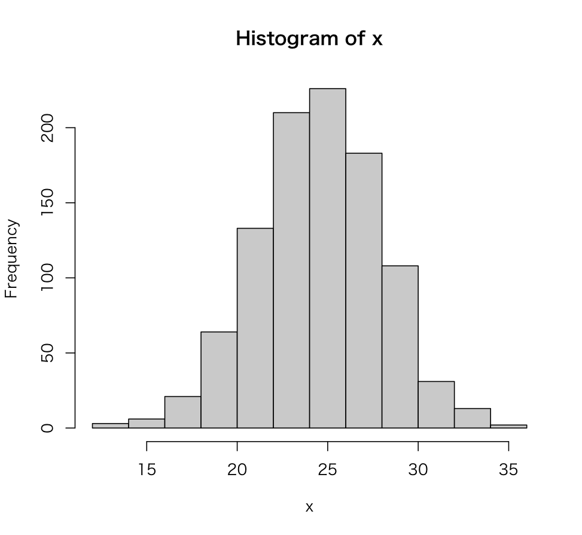

---

### dbinom 関数  - binom2.R

* `dbinom` 関数は二項分布の確率関数（確率質量関数）から確率を算出する
* `dbinom` 関数は第1引数 `x` に発生回数、第2引数 `size` に試行回数、第3引数 `prob` に成功確率を指定する

```r
x <- 0:3
y <- dbinom(x = x, size = 3, prob = 1/2)
barplot(y, names.arg = x)
```

#### 実行結果

```r
> x <- 0:3
> y <- dbinom(x = x, size = 3, prob = 1/2)
> barplot(y, names.arg = x)
```

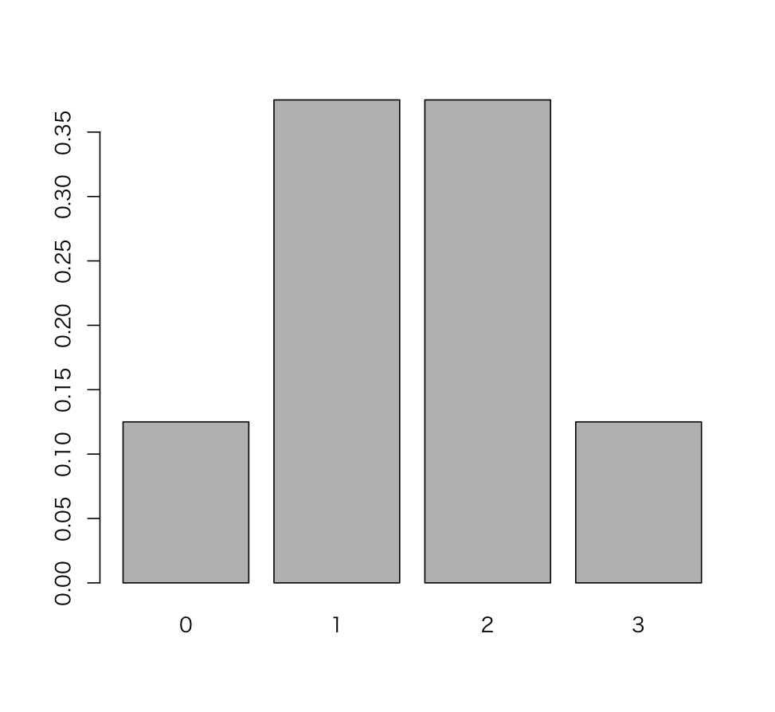

---

### pbinom 関数  - binom3.R

* `pbinom` 関数は二項分布の累積分布関数から発生回数が引数で指定された発生回数以下の確率を求める
* `pbinom` 関数は第1引数 `q` に発生回数、第2引数 `size` に試行回数、第3引数 `prob` に成功確率を指定する

```r
x <- 0:3
y <- pbinom(q = x, size = 3, prob = 1/2)
barplot(y, names.arg = x)
```

#### 実行結果

```r
> x <- 0:3
> y <- pbinom(q = x, size = 3, prob = 1/2)
> barplot(y, names.arg = x)
```

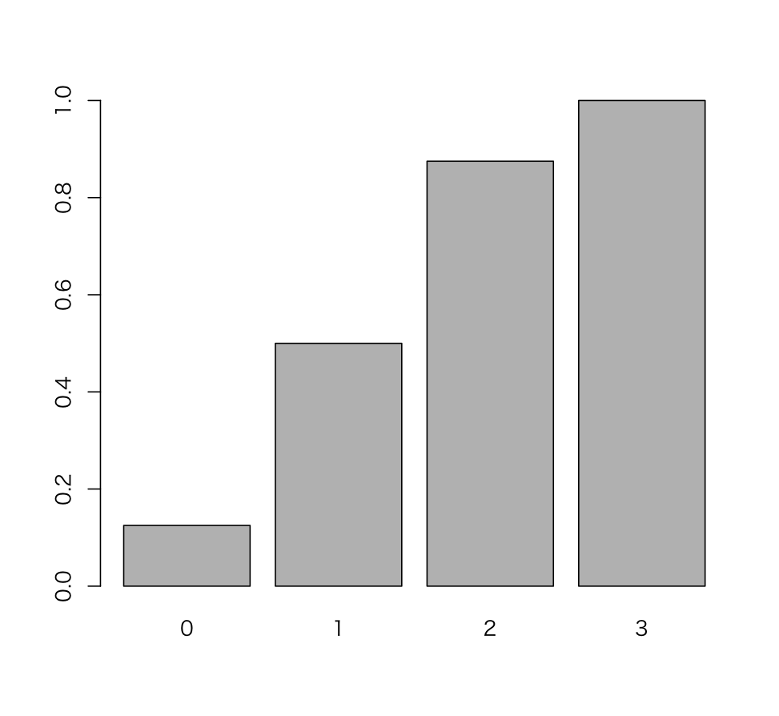

> 累積分布関数は、確率変数 `X` の値が `x` 以下となる確率 `P(X <= x)` と考えると良いでしょう。

---

### qbinom 関数  - binom4.R

* `qbinom` 関数は二項分布の確率から確率点（quantile、分位数）を算出する
* `qbinom` 関数は第1引数 `p` に確率、第2引数 `size` に試行回数、第3引数 `prob` に成功確率を指定する

```r
p <- c(0.125, 0.5, 0.875, 1)
qbinom(p = p, size = 3, prob = 1/2)
```

#### 実行結果

```r
> p <- c(0.124, 0.5, 0.875, 1)
> qbinom(p = p, size = 3, prob = 1/2)
[1] 0 1 2 3
```

---

## エクササイズ

1. 4枚のコインを投げて表が出る枚数ごとの確率を求めてください。

    |X|0枚|1枚|2枚|3枚|4枚|
    |:--:|:--:|:--:|:--:|:--:|:--:|
    |P(X)|?|?|?|?|?|

    > ヒント：二項分布のパラメータ `n` と `p` がいくつであるかを考えるようにします。

2. サイコロを4回投げて1が出る回数ごとの確率を求めてください。また結果を棒グラフで出力してください。

    |X|0回|1回|2回|3回|4回|
    |:--:|:--:|:--:|:--:|:--:|:--:|
    |P(X)|?|?|?|?|?|

3. 10枚のコインを投げて表が出る枚数が9枚以下となる確率を求めてください。

4. プロ野球において、打率 0.300 のバッターが4打席中3安打する確率を求めてください。

5. プロ野球において、打率 0.250 のバッターが4打席中3安打する確率を求めてください。

6. 試行回数:500、成功確率:0.5 の二項分布から乱数を1000個生成してヒストグラムを生成してください。ただし縦軸は頻度ではなく確率密度を表示するものとします。


7. 上記の二項分布の期待値（平均）と分散を求めてください。またヒストグラムに正規分布の確率密度関数を描画してください。

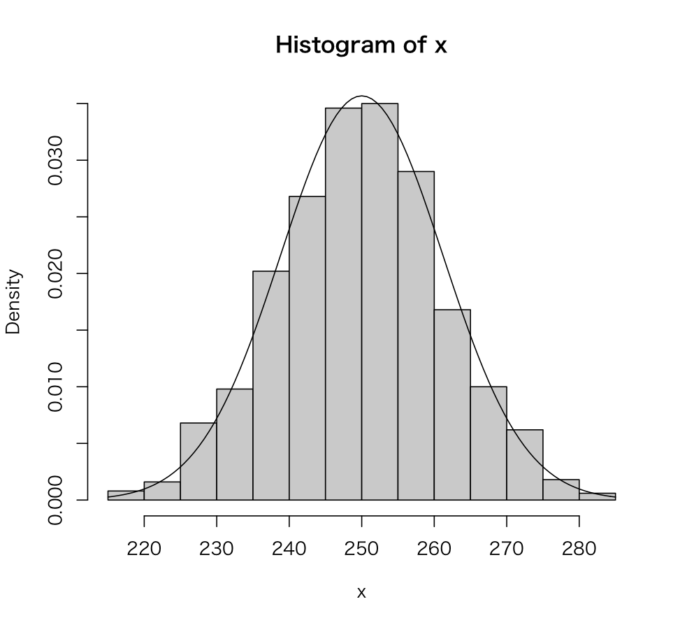

> 試行回数 `n` が500と大きい（成功確率 `p` は 0.5）であるため正規分布に近似しているのがわかります。

<!--

> dbinom(0:4, 4, 1/2)
[1] 0.0625 0.2500 0.3750 0.2500 0.0625

> x <- dbinom(0:4, 4, 1/6)
> x
[1] 0.4822530864 0.3858024691 0.1157407407 0.0154320988 0.0007716049
> barplot(x, names.arg = 0:4)

> pbinom(9, 10, 0.5)
[1] 0.9990234
> 1 - dbinom(10, 10, 1/2)
[1] 0.9990234

> dbinom(3, 4, 0.3)
[1] 0.0756

> dbinom(3, 4, 0.25)
[1] 0.046875

 -->