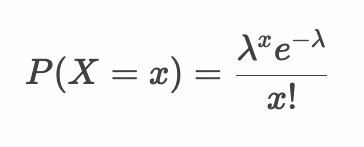
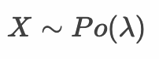
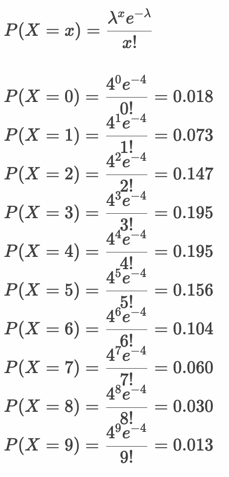
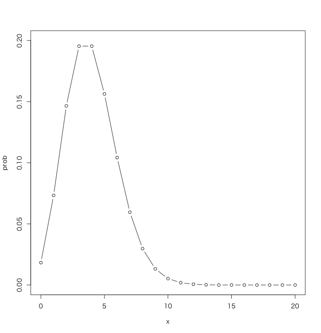
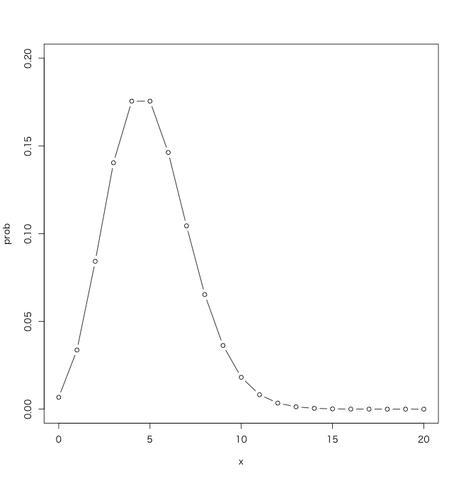
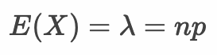
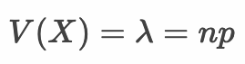
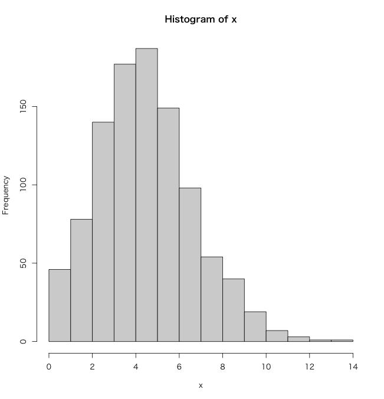
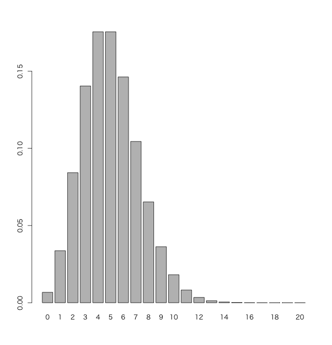
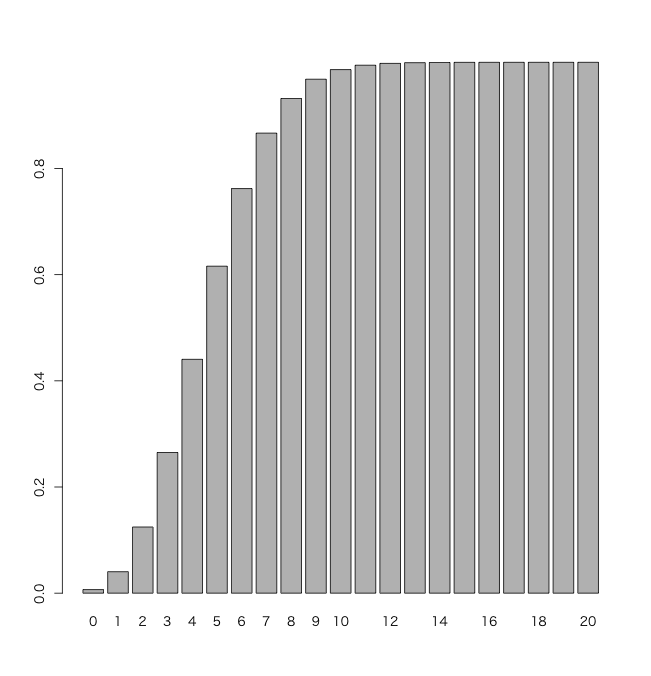

# ポアソン分布

* 二項分布は試行回数 `n` が大きくなる（`n >= 100`）と計算が手間になる
* 試行回数 `n` が大きく、かつ確率 `p` が小さい場合はポアソン分布で近似できる
* 具体的には工場で大量生産される部品の不良品率や、交通事故の発生確率のようなケースがポアソン分布で表現できる



> 以下に示すようにポアソンのパラメータは期待値である `λ` 1つだけです。`e` は定数（ネイピア数2.718282...） 、`x` 確率変数の値である点に注意してください。

---

## ポアソン分布にしたがう確率変数X

* ポアソン分布のパラメータは `λ` 
* ポアソン分布のパラメータ `λ` は二項分布の期待値 `np` に等しい



> ポアソン分布は Po や P などの記号で表現します。

---


## 例：自動車の交通事故件数

* ある街での5日間の交通事故件数は以下のとおりとする

    |日|事故件数|
    |:--:|:--:|
    |N月1日|1|
    |N月2日|0|
    |N月3日|0|
    |N月4日|2|
    |N月5日|1|

* 0,1 の 2値変数で表現できるように（二項分布として考えるために）データの発生区間を変更（時間単位）する

    |日|0|1|2|3|4|〜|19|20|21|22|23|
    |:--:|:--:|:--:|:--:|:--:|:--:|:--:|:--:|:--:|:--:|:--:|:--:|
    |N月1日|0|0|0|0|0|省略|1|0|0|0|0|
    |N月2日|0|0|0|0|0|省略|0|0|0|0|0|
    |N月3日|0|0|0|0|0|省略|0|0|0|0|0|
    |N月4日|0|0|1|0|0|省略|0|0|0|1|0|
    |N月5日|0|0|0|0|0|省略|0|1|0|0|0|

    > 試行回数 `n = 5 * 24 = 120` 発生確率 `p = 4/120 = 0.03` と考えることができる

* さらに範囲を細かくして分単位にする
    > 試行回数 `n = 5 * 25 * 60 = 7200` 発生確率 `p = 4/7200 = 0.0005` と考えることができる

* 時間単位の場合も、分単位の場合も二項分布の期待値 `E(X) = np = 4` は同じになる（ `n` を無限に近づけると `p` は `0` に近づく）
    * この期待値が `E(X) = np = λ` である

* このような条件下において5日間に事故が0件〜9件でである確率は以下のとおり



* これをグラフで表すと次のようになる



> ここで x 軸の値は離散型変数である点に注意してください。x 軸の値が 3, 4のときの確率が最も高くなります。


---

## 例：工場での部品の不良品率

* 問題
    * ある工場で生産される部品Aは1000個に1つ不良品がある（ `p = 0.001` ）
    * この部品Aを5000個生産した場合（ `n = 5000` ）、どの程度の数の不良品が発生するか
    * また不良品の数が3個以下となる確率はいくらか
* 解法
    * 期待値 `E(X) = λ = np = 5000 * 0.001 = 5`
    * P(X=x) = λ^x\*e^(-λ)/x! = 5^x\*e^(-5)/x!
        * あとは x に不良品の個数を代入して確率を求める

    ```
    P(X=0) = 0.007
    P(X=1) = 0.034
    P(X=2) = 0.084
    P(X=3) = 0.140
    P(X=4) = 0.175
    P(X=5) = 0.175
    ...
    ```

    

    > 不良品の数が3個以下になる確率は `0.007 + 0.034 + 0.084 + 0.140 = 0.265 = 26.5%` 程度である

---

## ポアソン分布の期待値

* ポアソン分布の期待値は `E(X) = λ = np` となる



> 二項分布の期待値 `np` と同じです。

---

## ポアソン分布の分散

* ポアソン分布の分散は `V(X) = λ = np` となる



> ポアソン分布では `n` が無限に大きいとき `p` は `0` に近づき、`np` は一定となります。このとき `q` は `(1 - p)` であるため `1` と考えることができます。

---

## Rプログラミング

### rpois 関数  - pois1.R

* `rpois` 関数はポアソン分布から乱数を生成する
* `rpois` 関数は第1引数 `n` に生成する乱数の数、第2引数 `lambda` に期待値を指定する

```r
x <- rpois(n = 1000, lambda = 5)
hist(x)
```

#### 実行結果

```r
> x <- rpois(n = 1000, lambda = 5)
> hist(x)
```



> ポアソン分布は離散型確率変数の確率分布です。変数 x の内容も出力してみてください。

---

### dpois 関数  - pois2.R

* `dpois` 関数はポアソン分布の確率関数（確率質量関数）から確率を算出する
* `dpois` 関数は第1引数 `x` に発生回数、第2引数 `lambda` に期待値を指定する

```r
x <- 0:20
y <- dpois(x, lambda = 5)
barplot(y, names.arg = x)
```

#### 実行結果

```r
> barplot(x, y)
> barplot(y)
> barplot(y, names.arg = x)
```



---

### ppois 関数  - pois3.R

* `ppois` 関数はポアソン分布の累積分布関数から成功回数が引数で指定された成功回数以下の確率を求める
* `ppois` 関数は第1引数 `q` に発生回数、第2引数 `lambda` に期待値を指定する

```r
x <- 0:20
y <- ppois(q = x, lambda = 5)
barplot(y, names.arg = x)
```

#### 実行結果

```r
> x <- 0:20
> y <- ppois(q = x, lambda = 5)
> barplot(y, names.arg = x)
```



---

### qpois 関数  - pois4.R

* `qpois` 関数はポアソン分布の確率から確率点（quantile、分位数）を算出する
* `qpois` 関数は第1引数 `p` に確率、第2引数 `lambda` に期待値を指定する

```r
p <- c(0.1, 0.2, 0.3, 0.4, 0.5)
qpois(p, lambda = 5)
# 0.006737947 0.040427682 0.124652019 0.265025915 0.440493285
```

#### 実行結果

```r
> p <- c(0.1, 0.2, 0.3, 0.4, 0.5)
> qpois(p, lambda = 5)
[1] 2 3 4 4 5
> # 0.006737947 0.040427682 0.124652019 0.265025915 0.440493285
```

---

## エクササイズ

1. 期待値が10のポアソン分布から1000個の乱数を生成してヒストグラムを作成してください。

1. あるメーカーで生産している製品の不良品率が0.2%の場合、1000個の製品を生産したとき不良品が1個以上発生する確率を求めてください。

1. 1年間で授業に遅刻した回数を調べると3回であった。その翌年の遅刻の回数が0回である確率を求めてください。

1. 2つのサイコロを投げて両方のサイコロの目が1になる回数を記録する。100回試行した場合、2つのサイコロの目が両方とも1となる回数が2回となる確率を求めてください。

<!--

> # 1
> x <- rpois(1000, 10)
> hist(x)
> 
> # 2
> ppois(1, 1000 * 0.0002)
[1] 0.9824769
> 
> # 3
> lambda = 3
> dpois(0, lambda = lambda)
[1] 0.04978707
> 
> # 4
> p = 1/36
> n = 100
> lambda = n * p
> dpois(2, lambda = lambda)
[1] 0.2398786

 -->