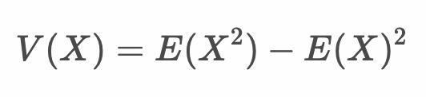

# 連続型確率変数

* 連続型確率変数とは確率変数の取りうる値が連続値となるもの
* 連続型確率変数はとりうる値と、その値の出現する確率を関数（確率分布関数）で表現できない
* 連続型確率変数は確率密度関数によって範囲を指定して積分することで確率を計算する

> 離散型確率変数と異なり、具体的なある値の確率を求めるとができません。そのため確率密度関数の範囲を指定して面積を求めることで確率を計算します。

---

## 連続型確率変数の確率分布

* 連続型確率変数の確率は、確率密度関数を積分する（面積を求める）ことで計算できる

    

> f(x) は確率分布関数ではなく確率密度関数です。確率密度関数を積分することで確率を計算します。

### 確率密度関数の性質


* 確率密度関数の出力は0以上の値をとる

    

* 確率密度関数の全領域（-∞ 〜 +∞）の面積は1となる

    


### 例：確率密度関数

* 次の確率密度関数がある

    

    

* xが0〜1の範囲をとる確率は 1 * 2/25 * 1/2 = 1/25 = 4%
* xが0〜2の範囲をとる確率は 2 * 4/25 * 1/2 = 4/25 = 16%
* xが2〜5の範囲をとる確率は 1 - 0.16 = 84%
* xが5〜6の範囲をとる確率は 0%

> 確率密度関数の面積を求めるためには積分を使います。ただし、ここでは三角形の面積として考えることも可能です。

### 積分の例（xが0〜1の範囲をとる確率）

$$
\int_0^1\frac{2}{25}xdx = [\frac{1}{25}x^2]^1_0 = \frac{1}{25} = 0.04
$$

---

## 連続型確率変数の期待値

* 連続型確率変数Xの期待値 E(X) は以下のようになる


> 離散型確率変数の期待値 E(X) はΣを使って計算しましたが、連続型確率変数は∫を使って計算します。


### 例：連続型確率変数の期待値

* 次の確率密度関数がある

    

    

* この確率密度関数をとる連続型確率変数 X の期待値は次のようになる

    

---

## 連続型確率変数の分散

* 連続型確率変数Xの分散 V(X) は以下のようになる

  

  > 確率変数Xの期待値 E[X] を μ で表現しています。

* また離散型確率変数の分散と同様に以下のように計算することもできる

  


### 例：確率密度関数の分散

* 次の確率密度関数がある

    

    

* この確率密度関数をとる連続型確率変数 X の分散は次のようになる

    

---

## 連続型確率変数の確率分布

* 連続型確率変数の代表的な確率分布は以下のとおり
    * 正規分布
    * カイ二乗分布
    * t分布
    * F分布

> これらの確率分布の詳細については後ほど取り上げます。

---

## エクササイズ

### 設問1

* 次の確率密度関数があります。

    

    

* x の値が以下の範囲をとる場合の確率を求めてください
  * xが0〜1の範囲をとる確率
  * xが0〜2の範囲をとる確率
  * xが2〜4の範囲をとる確率
  * xが4〜6の範囲をとる確率

* この確率密度関数をとる連続型確率変数 X の期待値を求めてください。
* この確率密度関数をとる連続型確率変数 X の分散を求めてください。

### 設問2

* 次の確率密度関数があります。

    

    

* x の値が以下の範囲をとる場合の確率を求めてください
  * xが0〜1の範囲をとる確率
  * xが0〜2の範囲をとる確率
  * xが2〜4の範囲をとる確率
  * xが4〜6の範囲をとる確率

* この確率密度関数をとる連続型確率変数 X の期待値を求めてください。
* この確率密度関数をとる連続型確率変数 X の分散を求めてください。

<!-- 


### 設問1

  * xが0〜1の範囲をとる確率: 1/16 = 6.25%
  * xが0〜2の範囲をとる確率: 1/4 = 0.25%
  * xが2〜4の範囲をとる確率: 1 - 1/4 = 0.75% 
  * xが4〜6の範囲をとる確率: 0%

* この確率密度関数をとる連続型確率変数 X の期待値を求めてください。

2.67

370.png

* この確率密度関数をとる連続型確率変数 X の分散を求めてください。

0.89
372.png

### 設問2

  * xが0〜1の範囲をとる確率: 1/4 = 0.25%
  * xが0〜2の範囲をとる確率: 1/2 = 0.50%
  * xが2〜4の範囲をとる確率: 1 - 1/2 = 0.50% 
  * xが4〜6の範囲をとる確率: 0%

* この確率密度関数をとる連続型確率変数 X の期待値を求めてください。

2

371.png

* この確率密度関数をとる連続型確率変数 X の分散を求めてください。

1
373.png


```
library(tidyverse)

# 0 < x < 5 rect
my_data <- tibble(
  x = append(append(seq(-5, 0, len= 100), seq(0, 5, len = 50)), seq(5, 10, len = 50)),
  x2 = append(append(seq(-5, 0, len= 100), seq(0, 5, len = 50)), seq(5, 10, len = 50)),
  y1 = append(append(rep(0, 100), rep(0.2, 50)), rep(0, 50)),
  y2 = append(append(rep(0, 100), rep(0.2, 50)), rep(0, 50))
)
my_data %>%
  ggplot() +
  geom_line(aes(x, y1)) +
  geom_ribbon(aes(x2, y2, ymin=0, ymax=y2 ), fill="orange")+
  ylab("y") + 
  xlim(-5, 10) + 
  ylim(0, 0.5)

# 0 < x < 5 triangle
my_data <- tibble(
  x = append(append(seq(-5, 0, len= 100), seq(0, 5, len = 50)), seq(5, 10, len = 50)),
  x2 = append(append(seq(-5, 0, len= 100), seq(0, 5, len = 50)), seq(5, 10, len = 50)),
  y1 = append(append(rep(0, 100), seq(0, 0.4, len = 50)), rep(0, 50)),
  y2 = append(append(rep(0, 100), seq(0, 0.4, len = 50)), rep(0, 50))
)
my_data %>%
  ggplot() +
  geom_line(aes(x, y1)) +
  geom_ribbon(aes(x2, y2, ymin=0, ymax=y2 ), fill="orange")+
  ylab("y") + 
  xlim(-5, 10) + 
  ylim(0, 0.5)

# 0 < x < 4 rect
my_data <- tibble(
  x = append(append(seq(-4, 0, len= 100), seq(0, 4, len = 50)), seq(4, 10, len = 50)),
  x2 = append(append(seq(-4, 0, len= 100), seq(0, 4, len = 50)), seq(4, 10, len = 50)),
  y1 = append(append(rep(0, 100), seq(0, 0.5, len = 50)), rep(0, 50)),
  y2 = append(append(rep(0, 100), seq(0, 0.5, len = 50)), rep(0, 50))
)
my_data %>%
  ggplot() +
  geom_line(aes(x, y1)) +
  geom_ribbon(aes(x2, y2, ymin=0, ymax=y2 ), fill="orange")+
  ylab("y") + 
  xlim(-4, 8) + 
  ylim(0, 0.5)

# 0 < x < 4 triangle
my_data <- tibble(
  x = append(append(seq(-4, 0, len= 100), seq(0, 4, len = 50)), seq(4, 10, len = 50)),
  x2 = append(append(seq(-4, 0, len= 100), seq(0, 4, len = 50)), seq(4, 10, len = 50)),
  y1 = append(append(rep(0, 100), rep(0.25, 50)), rep(0, 50)),
  y2 = append(append(rep(0, 100), rep(0.25, 50)), rep(0, 50))
)
my_data %>%
  ggplot() +
  geom_line(aes(x, y1)) +
  geom_ribbon(aes(x2, y2, ymin=0, ymax=y2 ), fill="orange")+
  ylab("y") + 
  xlim(-4, 8) + 
  ylim(0, 0.5)
```


-->