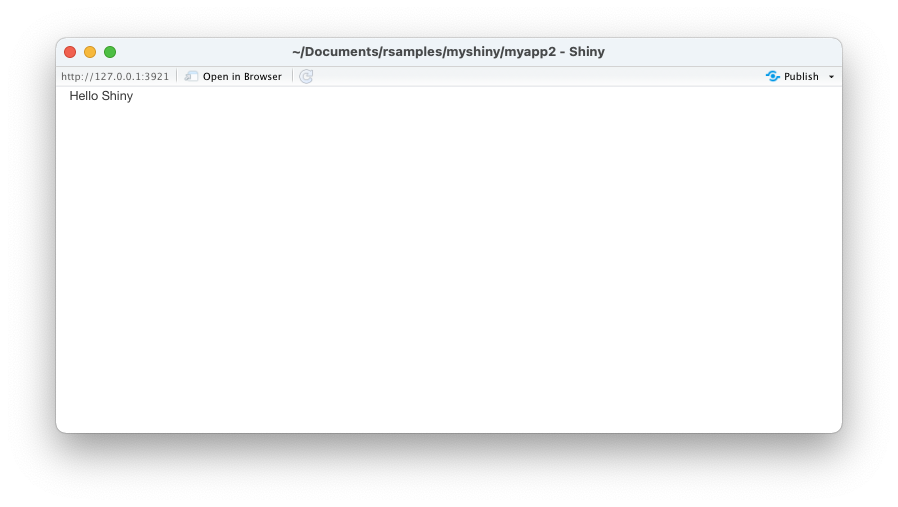
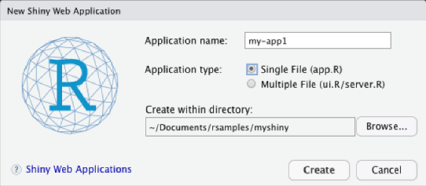
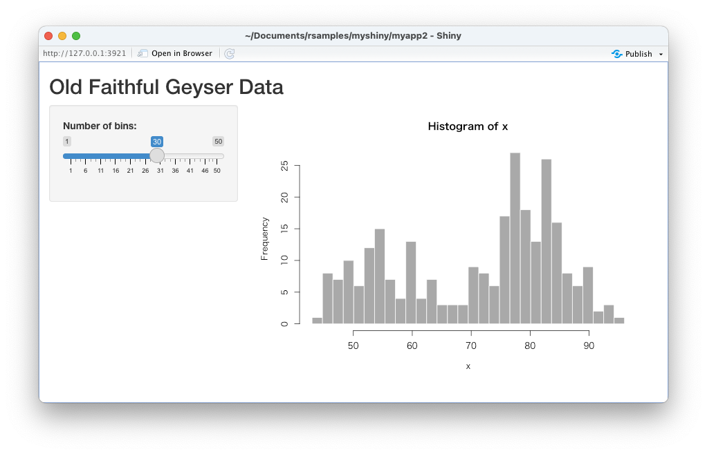
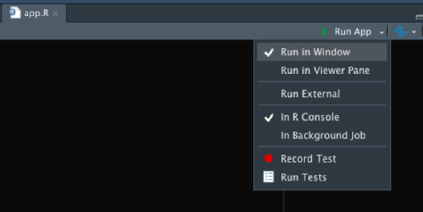

# Shiny

* [Shiny](https://shiny.rstudio.com/) はRのWebアプリケーションフレームワークであり、Rの特徴を活かしたデータ分析ツール（BIツール）を開発できる
* リアクティブプログラミングという考え方でプログラムを開発する
* Shinyアプリケーションはクラウドサービスの Shinyapps.io を使えば簡単にホスティングできる

> ShinyはCSSフレームワークにBootstrapを採用しています。HTMLやCSS、JavaScript等の詳細な知識がなくともWebアプリケーションを開発できます。

## Hello Shiny

* Shinyは `shinyApp` 関数によってWebアプリケーションを起動する
* `shinyApp` 関数はユーザインタフェースを指定する `ui` 引数と、サーバサイド処理を定義する `server` 引数を受け取る
* ユーザインタフェースは `fluidPage` 関数などを使って定義し、サーバサイド処理は `input` 引数、`output` 引数の2つを受け取る関数として定義する

```r
library(shiny)

ui <- fluidPage("Hello Shiny")
server <- function(input, output) {}
shinyApp(ui = ui, server = server)
```

> 上記のファイルを `app.R` という名前で保存します。

### 実行結果

```r
> library(shiny)
> 
> ui <- fluidPage("Hello Shiny")
> server <- function(input, output) {}
> shinyApp(ui = ui, server = server)

Listening on http://127.0.0.1:3921
```



---

## Shinyアプリケーションの作成方法

* RStudio 上のメニューから File => New File => Shiny Web App と指定すると次のようなダイアログが表示される

    

* Application name に指定した名前でフォルダが作成される
* Application type で Single File を選択すると `app.R` という名前のファイルが作成される
* Application type で Multiple File を選択すると `ui.R`、`server.R` という2つのファイルが作成される

> シンプルなプログラムの場合はSingle Fileで良いでしょう。複雑なプログラムを作成するのであれば、Multiple Fileを選択しておくとユーザインタフェースの処理とサーバサイドの処理とコードが分割されるので管理しやすくなります。Single Fileを選択すると次のような `app.R` ファイルが生成されます。

### app.R - 自動生成されたファイル

```r
#
# This is a Shiny web application. You can run the application by clicking
# the 'Run App' button above.
#
# Find out more about building applications with Shiny here:
#
#    http://shiny.rstudio.com/
#

library(shiny)

# Define UI for application that draws a histogram
ui <- fluidPage(

    # Application title
    titlePanel("Old Faithful Geyser Data"),

    # Sidebar with a slider input for number of bins 
    sidebarLayout(
        sidebarPanel(
            sliderInput("bins",
                        "Number of bins:",
                        min = 1,
                        max = 50,
                        value = 30)
        ),

        # Show a plot of the generated distribution
        mainPanel(
           plotOutput("distPlot")
        )
    )
)

# Define server logic required to draw a histogram
server <- function(input, output) {

    output$distPlot <- renderPlot({
        # generate bins based on input$bins from ui.R
        x    <- faithful[, 2]
        bins <- seq(min(x), max(x), length.out = input$bins + 1)

        # draw the histogram with the specified number of bins
        hist(x, breaks = bins, col = 'darkgray', border = 'white')
    })
}

# Run the application 
shinyApp(ui = ui, server = server)
```

> コードの詳細な説明については割愛します。現時点ではユーザインタフェースの作成処理とサーバサイド処理の2つが存在することを確認しておいてください。

### 実行結果



---

## Shinyアプリケーションの起動方法

* RStudioの実行ボタン横のプルダウンから起動方法を選択できる

    |起動方法|動作|
    |:--|:--|
    |Run in Window| 専用のウインドウで開く |
    |Run in Viewer Pane| RStudio内のビューワで開く|
    |Run External| 外部ツール（ブラウザ）で開く |

    

---

## Shinyリファレンス

* 以下のURLでリファレンスを確認できる

https://shiny.rstudio.com/reference/shiny/
