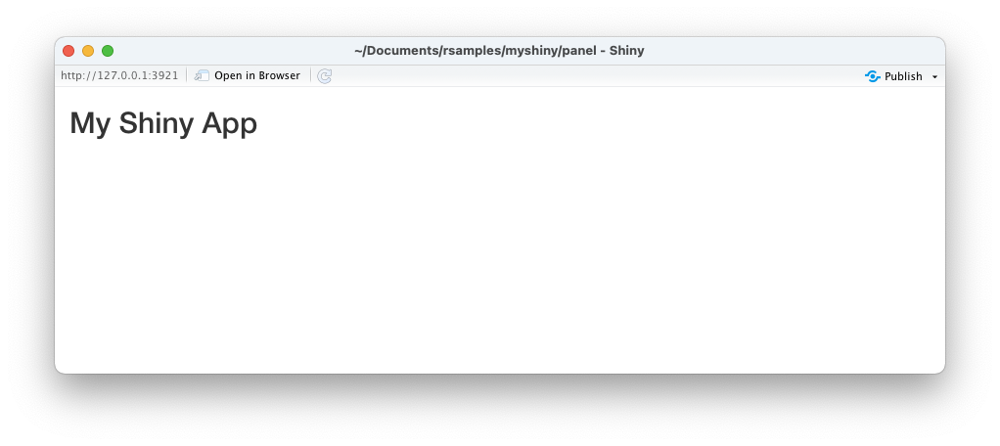

# Shinyアプリケーションの基本

## UI Layout

* `titlePanel` 関数によってタイトルを出力できる

```r
library(shiny)

ui <- fluidPage(
  titlePanel(title = "My Shiny App")
)
server <- function(input, output) {}
shinyApp(ui = ui, server = server)
```

> 上記のプログラムを `app.R` という名前で保存します。

### 実行結果


 

### HTMLコードの確認

* `titlePanel(title = "My Shiny App")` を選択して実行すると以下のような生成されるHTMLコードを確認できる

```r
> titlePanel(title = "My Shiny App")
<h2>My Shiny App</h2>
```

> Shinyではユーザインタフェースを構築するために Page, Layout, Panel といった概念が用意されています。

---

## UI Inputs

* `selectInput` 関数でセレクトボックスを表示できる
* `selectInput` 関数は `inputId` 引数に入力項目に一意なIDを指定し、`label` 引数で画面に表示する項目名を指定する
* `selectInput` 関数の `choices` 引数にはセレクトボックスに表示する値と送信する値をペアで指定する

```r
library(shiny)

ui <- fluidPage(
  titlePanel(title = "My Shiny App"),
  selectInput(inputId = "species", label = "Species",
              choices = c("setosa" = "setosa", 
                          "versicolor" = "versicolor", 
                          "virginica" = "virginica")),
)
server <- function(input, output) {}
shinyApp(ui = ui, server = server)
```

> `selectInput` 関数の `inputId` 引数は後のサーバサイド処理で入力データを参照するために使います。

### 実行結果


---

## UI Outputs / Rendering functions

* `plotOutput` 関数はサーバサイド処理で生成されたグラフを表示する
* `server` 関数では `input` 引数を参照して入力データを受け取り、`output`引数を参照して出力データを定義する
* `renderPlot` 関数内で出力したグラフ（ヒストグラムなど）をユーザインタフェースの `plotOutput` 関数で表示できる

```r
library(shiny)

ui <- fluidPage(
  titlePanel(title = "My Shiny App"),
  selectInput(inputId = "species", label = "Species",
              choices = c("setosa" = "setosa", 
                          "versicolor" = "versicolor", 
                          "virginica" = "virginica")),
  plotOutput(outputId = "plotIris")
)
server <- function(input, output) {
  output$plotIris = renderPlot({
    selected_iris <- iris[iris$Species == input$species, 1] 
    hist(selected_iris)
  })
}
shinyApp(ui = ui, server = server)
```

> `server` 関数では `output$plotIris` のようにネストした変数を定義します。ここで指定した変数名 `plotIris` を `plotOutput` 関数の `outputId` 引数に指定することでグラフが出力されます。

### 実行結果


### リアクティブプログラミング

* Shinyは入力データの変更を自動的に検出し、データ変更の影響を受ける `server` 関数内の処理を呼び出す（リアクティブプログラミング）

> ここで作成したプログラムの場合、ユーザがセレクトボックスの値を変更すると、自動的に `server` 関数内の `renderPlot` 関数の引数に指定した処理が呼び出されます。

---

## エクササイズ

### 設問1

以下の仕様に従ってShinyアプリケーションを作成してください。

* Column セレクトボックスを表示する
  * Sepal.Length, Sepal.Width, Petal.Length, Petal.Width の4つを表示する
* Column セレクトボックスで選択されたデータをヒストグラムに表示する


---

### 設問2

設問1で作成したShinyアプリケーションに機能を追加します。

* Species セレクトボックスを表示する
  * setosa, versicolor, virginica
* Column セレクトボックス、Species セレクトボックスで選択されたデータをヒストグラムに表示する
  


---

### 設問3

設問2で作成したShinyアプリケーションに機能を追加します。

* Bins スライダーを表示する
  * 最小値：1,　最大値：50, 初期値：10
  * ヒント：`sliderInput` 関数を使う
* Column セレクトボックス、Species セレクトボックスで選択されたデータをヒストグラムに表示する
  * ヒストグラムのビンの数をBins スライダーで指定された値とする
  


---

### 設問4

設問3で作成したShinyアプリケーションに機能を追加します。

* Column セレクトボックス、Species セレクトボックスで選択されたデータをヒストグラムに表示する
  * ヒストグラムのタイトル、X軸ラベルを設定する
    * タイトルはSpecies セレクトボックスで選択された値、Column セレクトボックスで選択された値を連結して表示する
    * X軸ラベルは cm と表示する
  


<!-- 
library(shiny)

ui <- fluidPage(
  titlePanel(title = "My Iris App"),
  selectInput(inputId = "column", label = "Column", 
              choices = c("Sepal.Length" = "1", 
                          "Sepal.Width" = "2", 
                          "Petal.Length" = "3", 
                          "Petal.Width" = "4")),
  selectInput(inputId = "species", label = "Species",
              choices = c("setosa" = "setosa", 
                          "versicolor" = "versicolor", 
                          "virginica" = "virginica")),
  sliderInput(inputId = "bins", label = "Bins",
              min = 1, max = 50, value = 10),
  plotOutput(outputId = "plotIris")
)

server <- function(input, output) {
  output$plotIris <- renderPlot({
    selected_iris <- iris[iris$Species == input$species, as.integer(input$column)]
    bins <- seq(min(selected_iris), max(selected_iris), length = input$bins + 1)
    column <- colnames(iris)[as.integer(input$column)]
    title <- paste(input$species, "-", column)
    hist(selected_iris, breaks = bins, main = title, xlab = "cm")
  })
}
shinyApp(ui = ui, server = server)
-->