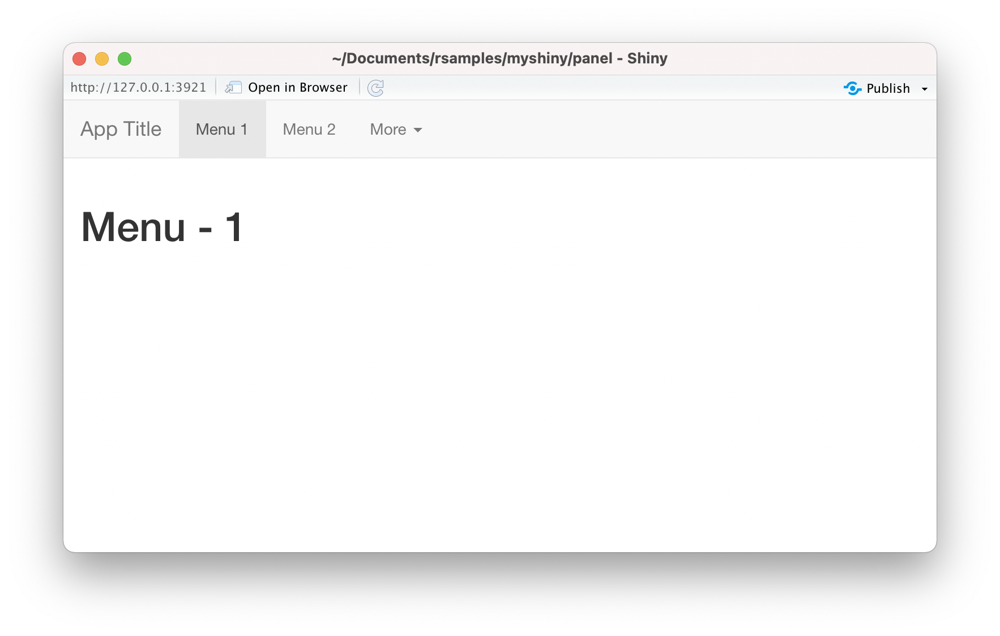
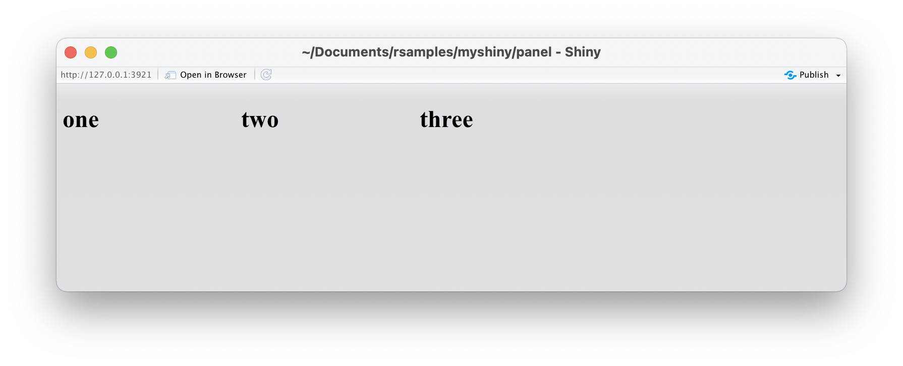
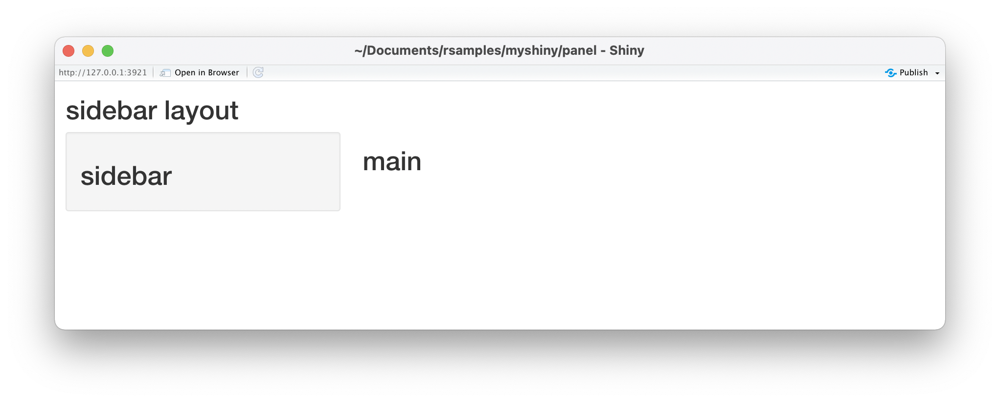
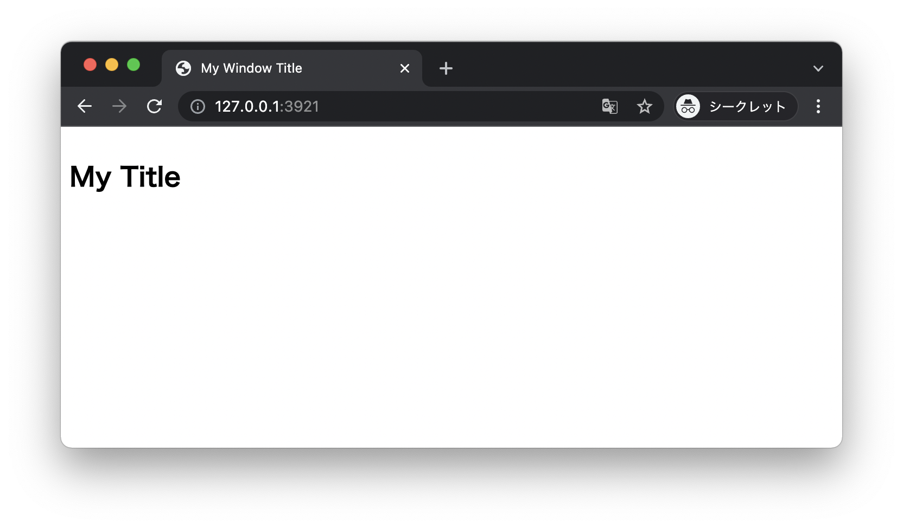
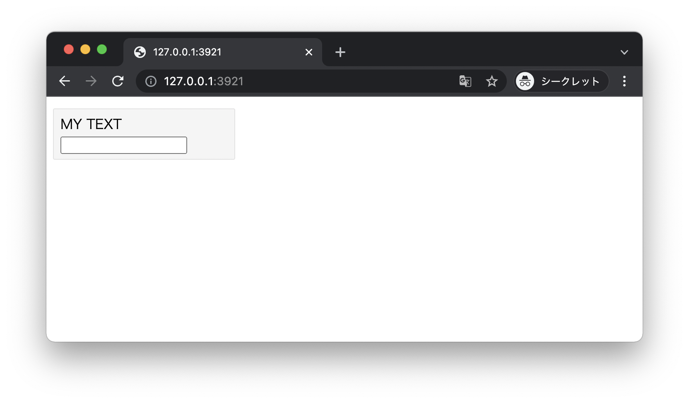
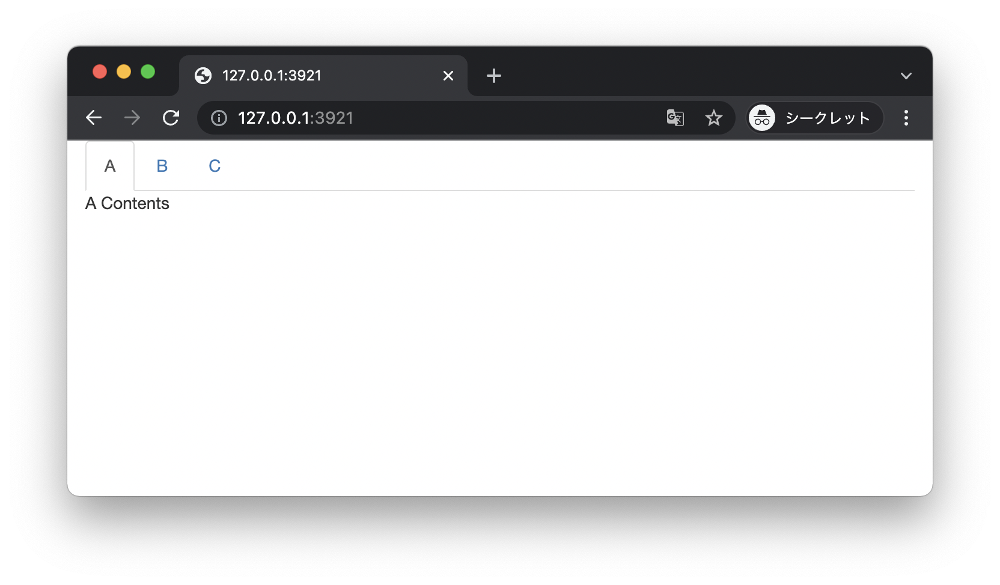
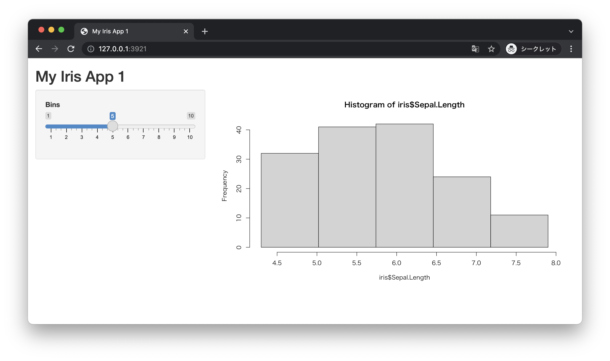
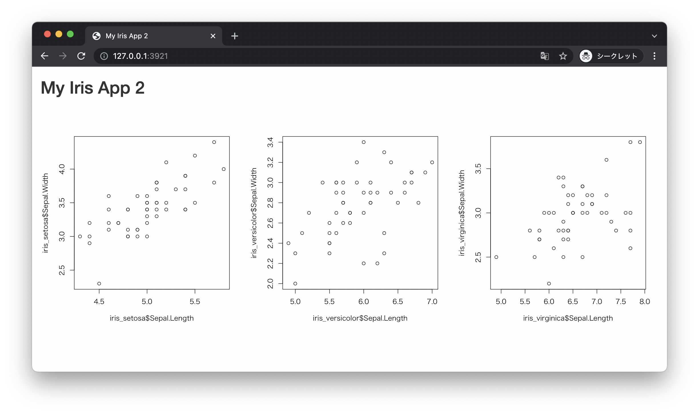
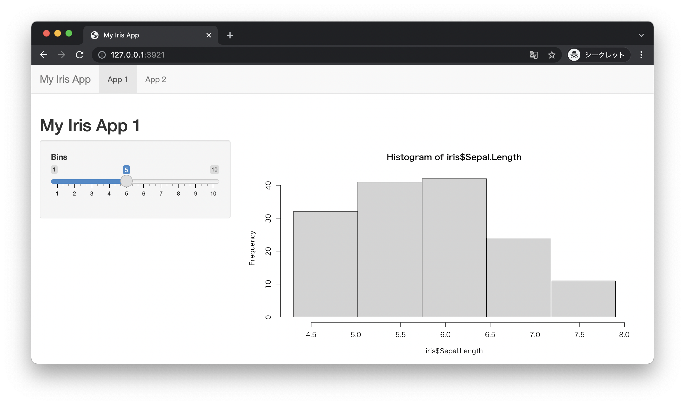
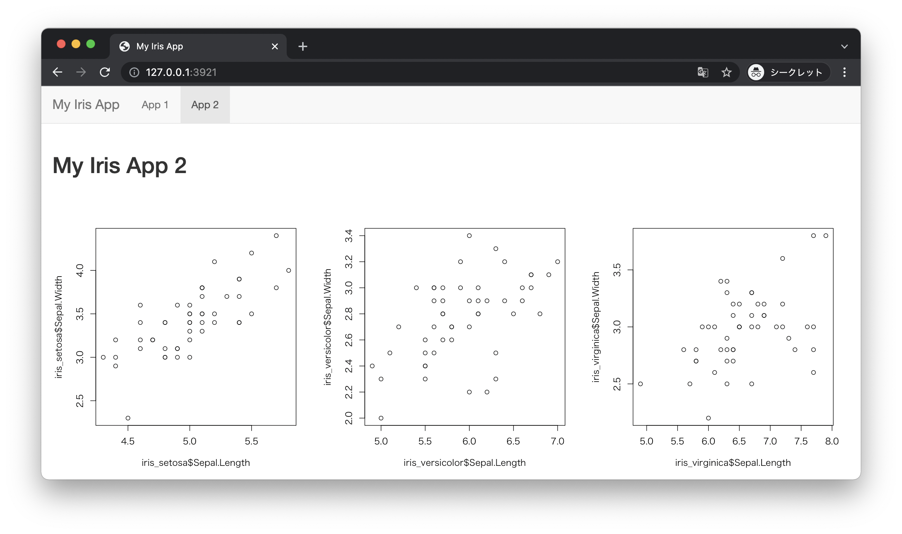

# UI Layout

+ ShinyのUI Layoutの定義には大きくPage、Layout、Panelの3種類が用意されている
+ Page は画面全体、Layoutは画面の構成、PanelはLayout内の領域を制御する
+ 上記以外に入力項目（UI Inputs）や出力項目（UI Outputs）なども存在する

## Page

* ShinyではUIを構築するために `fluidPage` 等の関数を使ってページを定義する
* 代表的な関数は以下のとおり

| 関数 | 機能 |
|:--|:--|
| `fillPage` | 画面幅を全て使う（コンテナ制御なし）|
| `fixedPage` |画面幅を固定的に制御する（コンテナ制御あり）|
| `fluidPage` |画面幅を流動的に制御する（コンテナ制御あり）|
| `navbarPage` |ナブバーを表示する（コンテナ制御あり、固定的/流動的は `fluid` 引数で指定）|

> 固定的、流動的という表現がわかりにくいかもしれません。ブラウザの横幅を変化させて確認してみてください。

---

### page.R

```r
library(shiny)

ui <- fillPage("Hello World!")
ui
ui <- fixedPage("Hello World!")
ui
ui <- fluidPage("Hello World!")
ui
ui <- navbarPage("Hello World!", fluid = T)
ui
```

### 実行結果

```r
> library(shiny)
> 
> ui <- fillPage("Hello World!")
> ui
Hello World!
> ui <- fixedPage("Hello World!")
> ui
<div class="container">Hello World!</div>
> ui <- fluidPage("Hello World!")
> ui
<div class="container-fluid">Hello World!</div>
> ui <- navbarPage("Hello World!", fluid = T)
> ui
<nav class="navbar navbar-default navbar-static-top" role="navigation">
  <div class="container-fluid">
    <div class="navbar-header">
      <span class="navbar-brand">Hello World!</span>
    </div>
    <ul class="nav navbar-nav" data-tabsetid="1531"></ul>
  </div>
</nav>
<div class="container-fluid">
  <div class="tab-content" data-tabsetid="1531"></div>
</div>
```

> いずれの関数を使っても最終的にはHTMLコードが生成されます。

---

### navbar.R

+ `nabvarPage` 関数でナビゲーションバーを表示できる
+ ナビゲーションバーに表示するメニューは `tabPanel` 関数で定義できる
+ `navbarMenu` 関数でナビゲーションバー上に詳細なメニューを定義できる

```r
ui <- navbarPage("App Title",
           tabPanel("Menu 1", h1("Menu - 1")),
           tabPanel("Menu 2", h1("Menu - 2")),
           navbarMenu("More", 
                      tabPanel("Menu 3", h1("Menu - 3")), 
                      tabPanel("Menu 4", h1("Menu - 4")))
)
server <- function(input, output) {}
shinyApp(ui, server)
```

### 実行結果



---

## Layout

* ページのレイアウトを定義できる関数が用意されている
* ページ関数と組み合わせて利用できる
* 代表的なレイアウトを定義する関数は以下のとおり

|関数|機能|
|:--|:--|
|flowLayout|横方向（左から右）に要素が配置される|
|verticalLayout|縦方向（上から下）に要素が配置される|
|splitLayout|画面サイズを分割して要素を配置する|
|sidebarLayout|サイドバーとメイン領域（デフォルトで1:3幅）を表示する|

---

### flow.R

```r
library(shiny)

ui <- flowLayout(h1("one"), h1("two"), h1("three"))
server <- function(input, output) {}
shinyApp(ui, server)
```

### 実行結果



> `flowLayout` の部分を `verticalLayout` や `splitLayout` に変更してみてください。

---

### sidebar.R

```r
library(shiny)

ui <- fluidPage(
  h1("sidebar layout"),
  sidebarLayout(
    sidebarPanel = sidebarPanel(
      h1("sidebar")
    ),
    mainPanel = mainPanel(
      h1("main")
    )
  )
)
server <- function(input, output) {}
shinyApp(ui, server)
```

### 実行結果



---

## Panel

* パネルはレイアウト（ページ）内の領域を定義する
* 代表的な関数は以下のとおり

|関数|機能|
|:--|:--|
|titlePanel|タイトル（Windowのタイトルも含む）を表示する|
|inputPanel|入力用のパネル（背景がグレー）を表示する|
|tabsetPanel|タブバーを表示する|
|tabPanel|ナビゲーションバーやタブバー用のパネルを表示する|
|sidebarPanel|サイドバー用のパネル（背景がグレー）を表示する|
|mainPanel|メイン領域用のパネルを表示する|

---

### title.R

* `titlePanel` 関数はページのタイトルを表示する
* `windowTitle` 引数でウィンドウのタイトルも指定できる

```r
library(shiny)

ui <- flowLayout(
  titlePanel(title = "My Title", windowTitle = "My Window Title")
)
server <- function(input, output) {}
shinyApp(ui, server)
```

### 実行結果



---

### input.R

* `inputPanel` 関数は入力項目を表示する際に背景をグレーにできる

```r
library(shiny)

ui <- flowLayout(
  inputPanel(textInput("myText", "MY TEXT"))
)
server <- function(input, output) {}
shinyApp(ui, server)
```

### 実行結果



---

### tabset.R

* `tabsetPanel` 関数でタブバーを定義する
* タブバーに表示する内容は個別に `tabPanel` 関数で定義する

```r
library(shiny)

ui <- fluidPage(tabsetPanel(tabPanel("A", "A Contents"),
                            tabPanel("B", "B Contents"),
                            tabPanel("C", "C Contents")))
server <- function(input, output) {}
shinyApp(ui, server)
```

### 実行結果



---

## エクササイズ

### 設問1

* 以下の仕様にしたがってアプリケーションを作成してください。
  * タイトルに `My Iris App 1` と表示する
  * サイドバーにスライダーを表示する
    * スライダーの仕様は以下のとおり
      * ラベル：Bins
      * 最小値：1
      * 最大値:10
      * 初期値：5
      * スライダーを変更するとメイン領域のヒストグラムのビン数が変化するものとする
  * メイン領域には `iris` データセットの `Sepal.Length` 列のデータをヒストグラムで表示する



---

### 設問2

* 以下の仕様にしたがってアプリケーションを作成してください。
  * タイトルに `My Iris App 2` と表示する
  * 画面幅を3つに分割して以下のグラフを出力する
    * `iris` データセットの `Species` が `setosa` のレコードについて `Sepal.Length`、`Sepal.Width`の散布図を出力する 
    * `iris` データセットの `Species` が `versicolor` のレコードについて `Sepal.Length`、`Sepal.Width`の散布図を出力する 
    * `iris` データセットの `Species` が `virginica` のレコードについて `Sepal.Length`、`Sepal.Width`の散布図を出力する 




---

### 設問3

* 以下の仕様にしたがってアプリケーションを作成してください。
  * ナビゲーションバーを表示する
    * ナビゲーションバーのタイトルに `My Iris App` と表示する
    * ナビゲーションバーの1つ目のタブを `App 1`とし、選択されたときに設問1で作成したアプリケーションを表示する
    * ナビゲーションバーの2つ目のタブを `App 2`とし、選択されたときに設問2で作成したアプリケーションを表示する

#### App 1 タブを選択時



#### App 2 タブを選択時



<!-- 
# 1
library(shiny)

ui <- fluidPage(
        titlePanel("My Iris App 1"),
        sidebarLayout(
          sidebarPanel(
            sliderInput("bins", "Bins", min = 1, max = 10, value = 5)
          ),
          mainPanel(
            plotOutput("myPlot")
          )
        )
      )
server <- function(input, output) {
  output$myPlot = renderPlot({
    x <- as.integer(input$bins)
    bins <- seq(min(iris$Sepal.Length), max(iris$Sepal.Length), length = x + 1)
    hist(iris$Sepal.Length, breaks = bins)
  })
}
shinyApp(ui, server)


# 2
library(shiny)

ui <- fluidPage(
  titlePanel("My Iris App 2"),
  splitLayout(
    plotOutput("iris_setosa"),
    plotOutput("iris_versicolor"),
    plotOutput("iris_virginica")
  )  
)
server <- function(input, output) {
  iris_setosa <- iris[iris$Species == "setosa", ]
  iris_versicolor <- iris[iris$Species == "versicolor", ]
  iris_virginica <- iris[iris$Species == "virginica", ]
  output$iris_setosa <- renderPlot({plot(iris_setosa$Sepal.Length, iris_setosa$Sepal.Width)})
  output$iris_versicolor <- renderPlot({plot(iris_versicolor$Sepal.Length, iris_versicolor$Sepal.Width)})
  output$iris_virginica <- renderPlot({plot(iris_virginica$Sepal.Length, iris_virginica$Sepal.Width)})
}
shinyApp(ui, server)


# 3
library(shiny)

ui <- navbarPage("My Iris App",
                 tabPanel("App 1", 
                          titlePanel("My Iris App 1"),
                          sidebarLayout(
                            sidebarPanel(
                              sliderInput("bins", "Bins", min = 1, max = 10, value = 5)
                            ),
                            mainPanel(
                              plotOutput("myPlot")
                            )
                          )
                  ),
                  tabPanel("App 2",   
                          titlePanel("My Iris App 2"),
                          splitLayout(
                            plotOutput("iris_setosa"),
                            plotOutput("iris_versicolor"),
                            plotOutput("iris_virginica")
                          )
                  )
)
server <- function(input, output) {
  iris_setosa <- iris[iris$Species == "setosa", ]
  iris_versicolor <- iris[iris$Species == "versicolor", ]
  iris_virginica <- iris[iris$Species == "virginica", ]
  output$iris_setosa <- renderPlot({plot(iris_setosa$Sepal.Length, iris_setosa$Sepal.Width)})
  output$iris_versicolor <- renderPlot({plot(iris_versicolor$Sepal.Length, iris_versicolor$Sepal.Width)})
  output$iris_virginica <- renderPlot({plot(iris_virginica$Sepal.Length, iris_virginica$Sepal.Width)})
  output$myPlot = renderPlot({
    x <- as.integer(input$bins)
    bins <- seq(min(iris$Sepal.Length), max(iris$Sepal.Length), length = x + 1)
    hist(iris$Sepal.Length, breaks = bins)
  })
}
shinyApp(ui, server)


-->