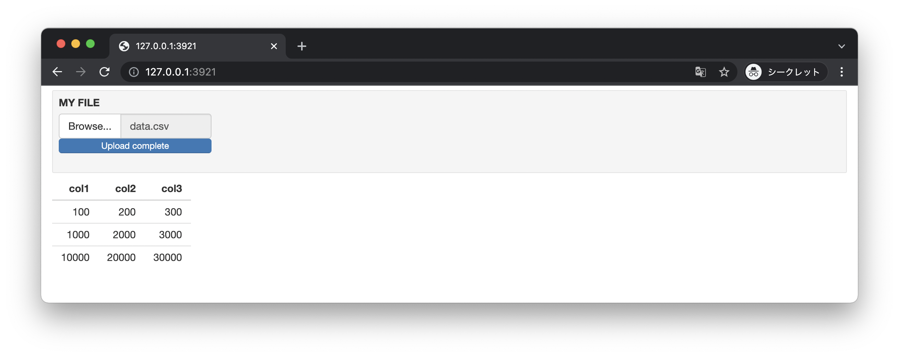

# UI Inputs

+ Shinyアプリケーションでは関数を使って入力項目を定義できる
+ 代表的な関数は以下のとおり

|関数|処理内容|
|:--|:--|
| textInput	| テキスト入力 | 
| textAreaInput	| テキストエリア入力 | 
| passwordInput	| パスワード入力 | 
| numericInput | 数値入力 |
| dateInput |	日付選択カレンダー| 
| dateRangeInput | 期間選択カレンダー |
| checkboxGroupInput | チェックボックスグループ |
| checkboxInput | 1つのチェックボックス |
| radioButtons | 複数のラジオボタン |
| selectInput | セレクトボックス | 
| sliderInput | スライダーバー | 
| fileInput | ファイルアップロード |
| submitButton | 送信ボタン |
| actionButton | アクションボタン |

> ここであげた関数は一例です。詳細についてはShinyのリファレンスを参照（https://shiny.rstudio.com/reference/shiny/）してください。

---

## プログラミングの例

ここでは以下の手順にしたがってプログラムを作成します。

+ テキストボックス
+ 日付入力
+ チェックボックス / ラジオボタン
+ ファイルアップロード
+ アクションボタン
+ サブミットボタン

---


## テキストボックス

* `textInput` 関数でテキストボックスを表示できる
* `textAreaInput` 関数でテキストエリア（複数行入力可能）を表示できる
* 入力項目には `inputId` を付与することで `server` 関数内で入力データにアクセスできる

### text.R

```r
library(shiny)

ui <- fluidPage(
  splitLayout(
    inputPanel(
      textInput(inputId = "myText", label = "MY TEXT")
    ),
    textOutput(outputId = "myTextOutput"),
    inputPanel(
      textAreaInput(inputId = "myTextArea", label = "MY TEXT AREA")
    ),
    verbatimTextOutput(outputId = "myTextAreaOutput")
  )
)
server <- function(input, output) {
  output$myTextOutput <- renderText({
    toupper(input$myText)
  })
  output$myTextAreaOutput <- renderText({
    toupper(input$myTextArea)
  })
}
shinyApp(ui, server)
```

> `verbatimTextOutput` 関数は入力内容についてスペースや改行コードなどをそのまま出力します。

### 実行結果


> テキストボックスやテキストエリアの入力内容はアプリケーション全体に即座に反映されます。このような仕組みをリアクティブプログラミングと呼びます。

---

## 日付入力 

+ `dateInput` 関数で日付を入力できる
+ `dateRangeInput` 関数で日付の範囲を入力できる 
+ `server` 関数において日付項目は `input` 変数から `Date` オブジェクトとして取得できる
  
> `Date` オブジェクトの日付フォーマットを指定するために `format` 関数を使います。

### date.R

```r
library(shiny)

ui <- fluidPage(
  splitLayout(
    inputPanel(
      dateInput(inputId = "myDate", label = "MY DATE", language = "ja")
    ),
    textOutput(outputId = "myDateOutput"),
    inputPanel(
      dateRangeInput(inputId = "myDateRange", label = "MY DATE RANGE")
    ),
    verbatimTextOutput(outputId = "myDateRangeOutput")
  )
)
server <- function(input, output) {
  output$myDateOutput <- renderText({
    format(input$myDate, "%Y-%m-%d")
  })
  output$myDateRangeOutput <- renderText({
    date1 <- format(input$myDateRange[1], "%Y-%m-%d")
    date2 <- format(input$myDateRange[2], "%Y-%m-%d")
    paste(date1, "-", date2)
  })
}
shinyApp(ui, server)
```

### 実行結果


---

## チェックボックス / ラジオボタン

+ `checkboxGroupInput` 関数で複数のチェックボックスをまとめて定義できる
+ `checkboxInput` 関数で1つのチェックボックスをまとめて定義できる
+ `radioButtons` 関数で複数のラジオボタンをまとめて定義できる

### check.R

```r
library(shiny)

ui <- fluidPage(
  splitLayout(
    inputPanel(
      checkboxGroupInput(inputId = "myCheckboxGroup", label = "MY CHECK BOX GROUP",
                         choices = c("itemA" = "A", "itemB" = "B", "itemC" = "C"))
    ),
    textOutput(outputId = "myCheckboxGroupOutput"),
    inputPanel(
      radioButtons(inputId = "myRadioButtons", label = "MY RADIO BUTTONS", 
                   choices = c("item1" = "1", "item2" = "2", "item3" = "3"))
    ),
    textOutput(outputId = "myRadioButtonsOutput")
  )
)
server <- function(input, output) {
  output$myCheckboxGroupOutput <- renderText({
    input$myCheckboxGroup
  })
  output$myRadioButtonsOutput <- renderText({
    input$myRadioButtons
  })
}
shinyApp(ui, server)
```


### 実行結果


---

## ファイルアップロード

* `fileInput` 関数でファイルアップロードボタンを表示できる
* `server` 関数においては `input$myFile$datapath` のようにしてアップロードされたファイルのパスを参照できる
* `server` 関数において `req` 関数によって必須入力チェックを実装できる

### file.R

```r
library(shiny)

ui <- fluidPage(
  inputPanel(
    fileInput(inputId = "myFile", label = "MY FILE", accept = ".csv")
  ),
  tableOutput(outputId = "myFileOutput")
)
server <- function(input, output) {
  output$myFileOutput <- renderTable({
    req(input$myFile)
    read.csv(input$myFile$datapath)
  })
}
shinyApp(ui, server)
```

### 実行結果

以下のCSVファイルを `data.csv` という名前で用意しておく

```csv
col1,col2,col3
100,200,300
1000,2000,3000
10000,20000,30000
```



---

## アクションボタン

+ `actionButton` 関数によってアクションボタンを定義できる
+ アクションボタンのクリック時に `server` 関数の処理を呼び出すことができる
+ `isolate` 関数によってデフォルトのリアクティブな挙動を制御できる

> 以下のコードでは `server` 関数内で `isolate(input$myText)` と実装しています。これによってデフォルトのテキストボックス（ `myText` ）変更時の処理を無効にできます。

### action.R

```r
library(shiny)

ui <- fluidPage(
  inputPanel(
    textInput(inputId = "myText", label = "MY TEXT")
  ),
  actionButton(inputId = "myAction", label = "MY ACTION"),
  textOutput(outputId = "myTextOutput")
)
server <- function(input, output) {
  output$myTextOutput <- renderText({
    input$myAction 
    myText <- isolate(input$myText)
    myText
  })
}
shinyApp(ui, server)
```

> `renderText` 関数内に `input$myAction` という記述があります。これによってアクションボタンクリック時に `renderText` 関数内の処理が実行されるようになります。

### 実行結果


---

## サブミットボタン

+ `submitButton` 関数によって送信ボタンを定義できる
+ `submitButton` 関数を定義することでデフォルトのリアクティブプログラミングの挙動は無効になる
+ `submitButton` 関数はShinyの特徴であるリアクティブプログラミングの挙動を抑制するので必要最低限の利用が望ましい

### submit.R

```r
library(shiny)

ui <- fluidPage(
  inputPanel(
    textInput(inputId = "myText", label = "MY TEXT")
  ),
  submitButton(text = "MY SUBMIT"),
  textOutput(outputId = "myTextOutput")
)
server <- function(input, output) {
  output$myTextOutput <- renderText({
    input$myText
  })
}
shinyApp(ui, server)
```

### 実行結果


---

## エクササイズ

### 設問1

* 以下の仕様にしたがってアプリケーションを作成してください。
  * タイトルに `My Iris App 3` と表示する
  * サイドバーにラジオボタンを表示する
    * ラジオボタンの仕様は以下のとおり
      * ラベル：`SPECIES`
      * 項目：`setosa`, `versicolor`, `virginica`
      * 初期値：`setosa`
  * メイン領域には選択された `species` の `iris` データセットについて以下のヒストグラムを表示する
    * `Sepal.Length` のヒストグラム
    * `Sepal.Width` のヒストグラム
    * `Petal.Length` のヒストグラム
    * `Petal.Width` のヒストグラム


---

### 設問2

* 以下の仕様にしたがってアプリケーションを作成してください。
  * タイトルに `My Iris App 4` と表示する
  * サイドバーにチェックボックスを表示する
    * チェックボックスの仕様は以下のとおり
      * ラベル：`SPECIES`
      * 項目：`setosa`, `versicolor`, `virginica`
      * 初期値：なし
  * メイン領域には選択された `species` の `iris` データセットについて以下のヒストグラムを表示する
    * `Sepal.Length` のヒストグラム
    * `Sepal.Width` のヒストグラム
    * `Petal.Length` のヒストグラム
    * `Petal.Width` のヒストグラム


> チェックボックスのため、複数の品種（ `species` ）を選択できるように実装します。

---

<!-- 

# 1
library(shiny)

ui <- fluidPage(
  titlePanel("My Iris App 3"),
  sidebarLayout(
    sidebarPanel(
      radioButtons("species", "SPECIES", c("setosa", "versicolor", "virginica")) 
    ),
    mainPanel(
      verticalLayout(
        splitLayout(
          plotOutput("irisSL"),
          plotOutput("irisSW")
        ),
        splitLayout(
          plotOutput("irisPL"),
          plotOutput("irisPW")
        )
      )
    )
  )
)
server <- function(input, output) {
  breaks <- seq(0, 10, 0.5)
  ylim <- c(0, 50)
  output$irisSL <- renderPlot({ 
    hist(iris[input$species == iris$Species, "Sepal.Length"], main = "Sepal.Length", xlab = "cm", breaks = breaks, ylim = ylim) 
  })
  output$irisSW <- renderPlot({ 
    hist(iris[input$species == iris$Species, "Sepal.Width"], main = "Sepal.Width", xlab = "cm", breaks = breaks, ylim = ylim)
  })
  output$irisPL <- renderPlot({ 
    hist(iris[input$species == iris$Species, "Petal.Length"], main = "Petal.Length", xlab = "cm", breaks = breaks, ylim = ylim)
  })
  output$irisPW <- renderPlot({ 
    hist(iris[input$species == iris$Species, "Petal.Width"], main = "Petal.Width", xlab = "cm", breaks = breaks, ylim = ylim)
  })
}
shinyApp(ui, server)


# 2

library(shiny)

ui <- fluidPage(
  titlePanel("My Iris App 4"),
  sidebarLayout(
    sidebarPanel(
      checkboxGroupInput("species", "SPECIES", c("setosa", "versicolor", "virginica")) 
    ),
    mainPanel(
      verticalLayout(
        splitLayout(
          plotOutput("irisSL"),
          plotOutput("irisSW")
        ),
        splitLayout(
          plotOutput("irisPL"),
          plotOutput("irisPW")
        )
      )
    )
  )
)
server <- function(input, output) {
  breaks <- seq(0, 10, 0.5)
  ylim <- c(0, 50)
  output$irisSL <- renderPlot({ 
    hist(iris[iris$Species %in% input$species, "Sepal.Length"], main = "Sepal.Length", xlab = "cm", breaks = breaks, ylim = ylim) 
  })
  output$irisSW <- renderPlot({ 
    hist(iris[iris$Species %in% input$species, "Sepal.Width"], main = "Sepal.Width", xlab = "cm", breaks = breaks, ylim = ylim)
  })
  output$irisPL <- renderPlot({ 
    hist(iris[iris$Species %in% input$species, "Petal.Length"], main = "Petal.Length", xlab = "cm", breaks = breaks, ylim = ylim)
  })
  output$irisPW <- renderPlot({ 
    hist(iris[iris$Species %in% input$species, "Petal.Width"], main = "Petal.Width", xlab = "cm", breaks = breaks, ylim = ylim)
  })
}
shinyApp(ui, server)

-->