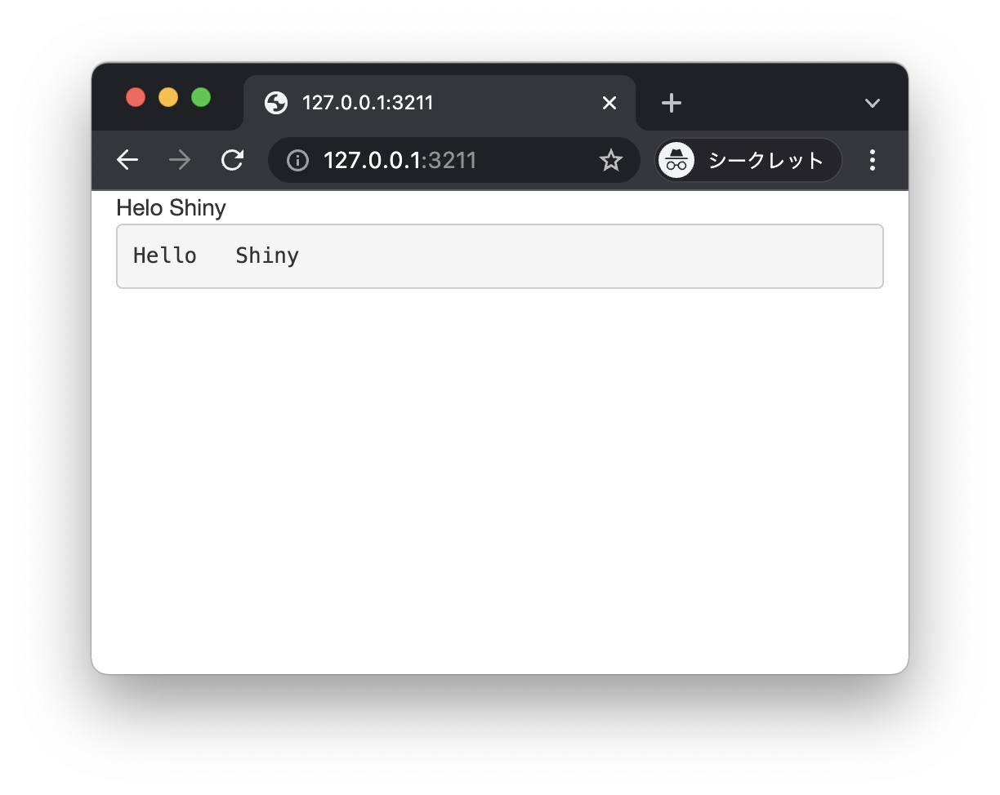
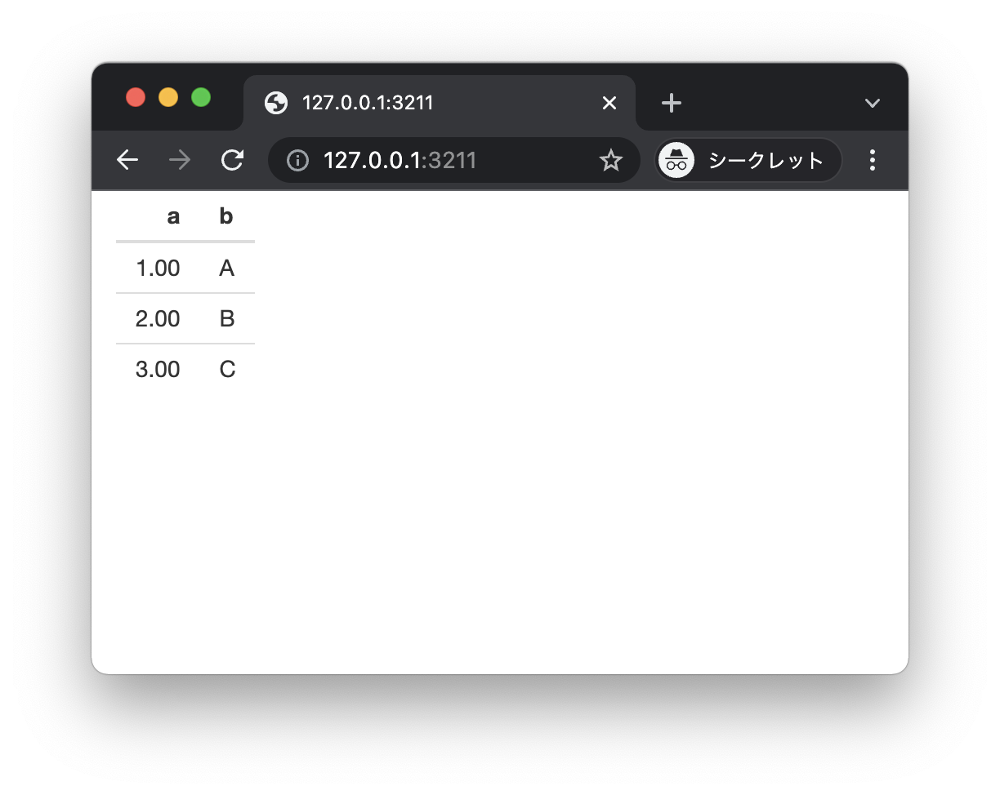
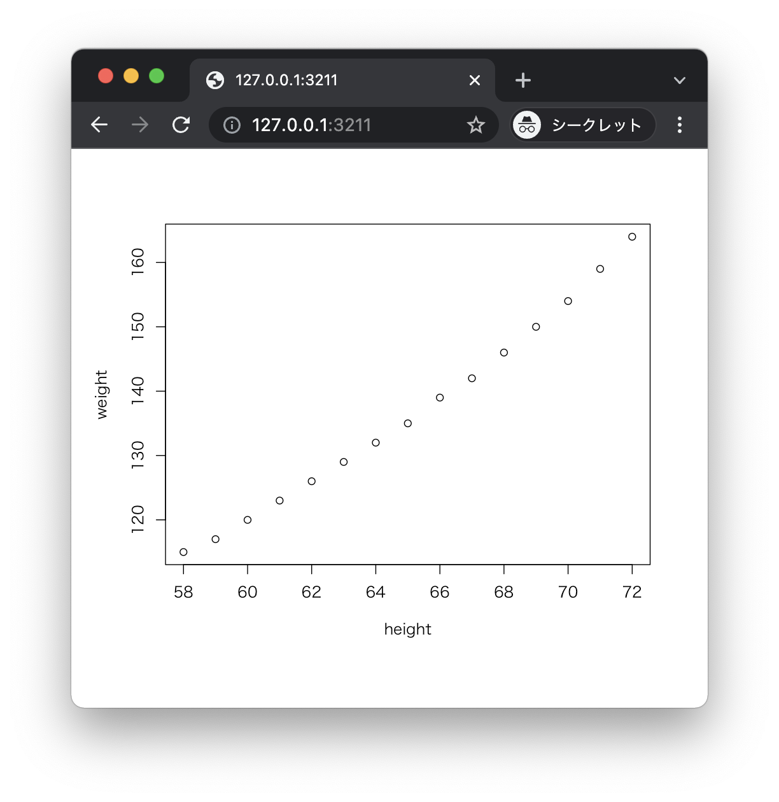
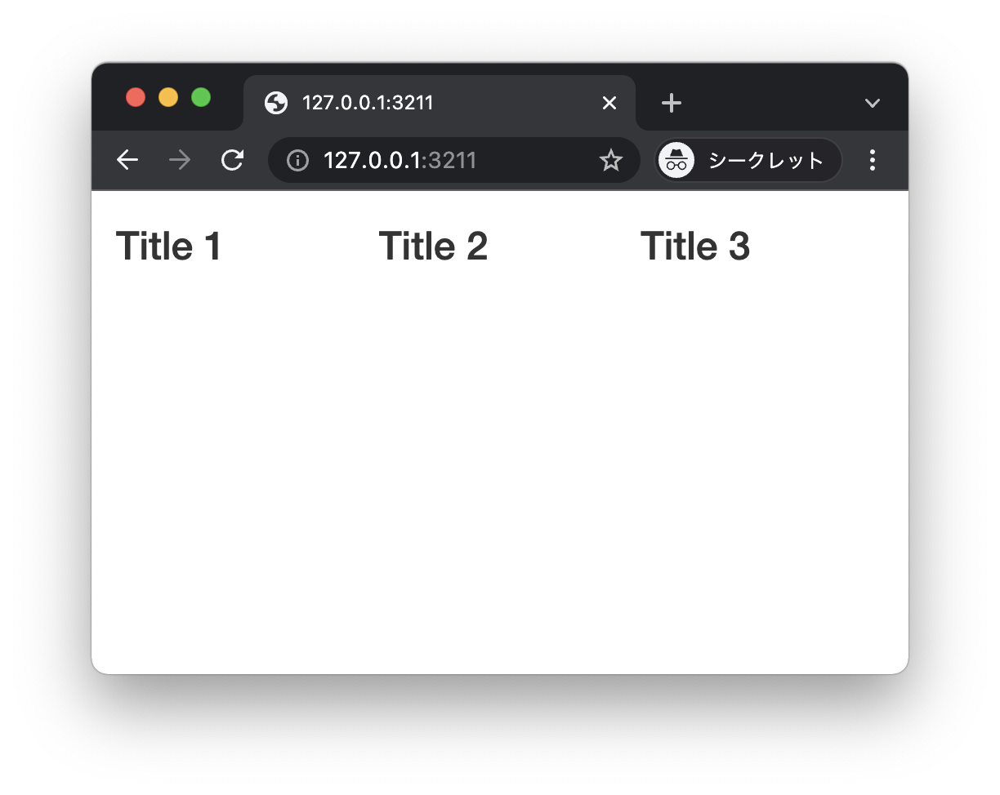
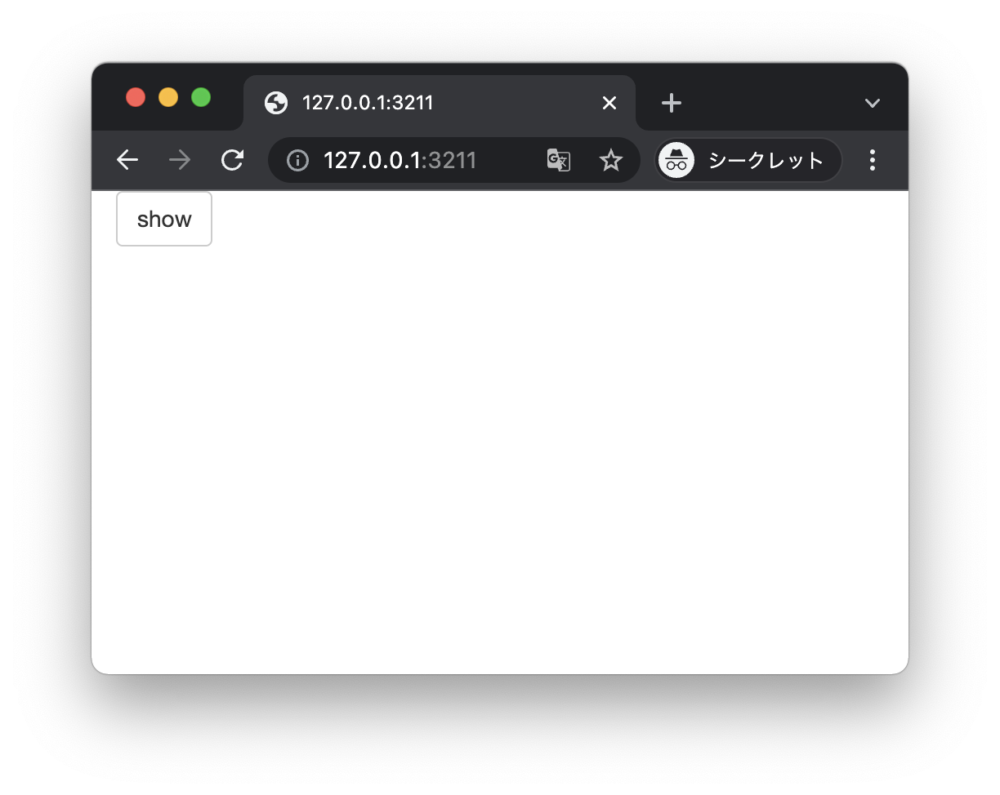
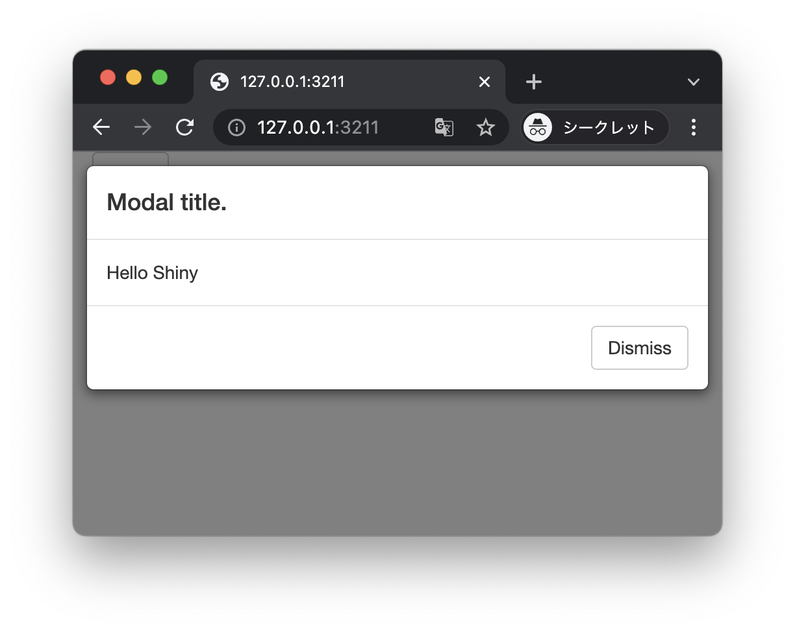
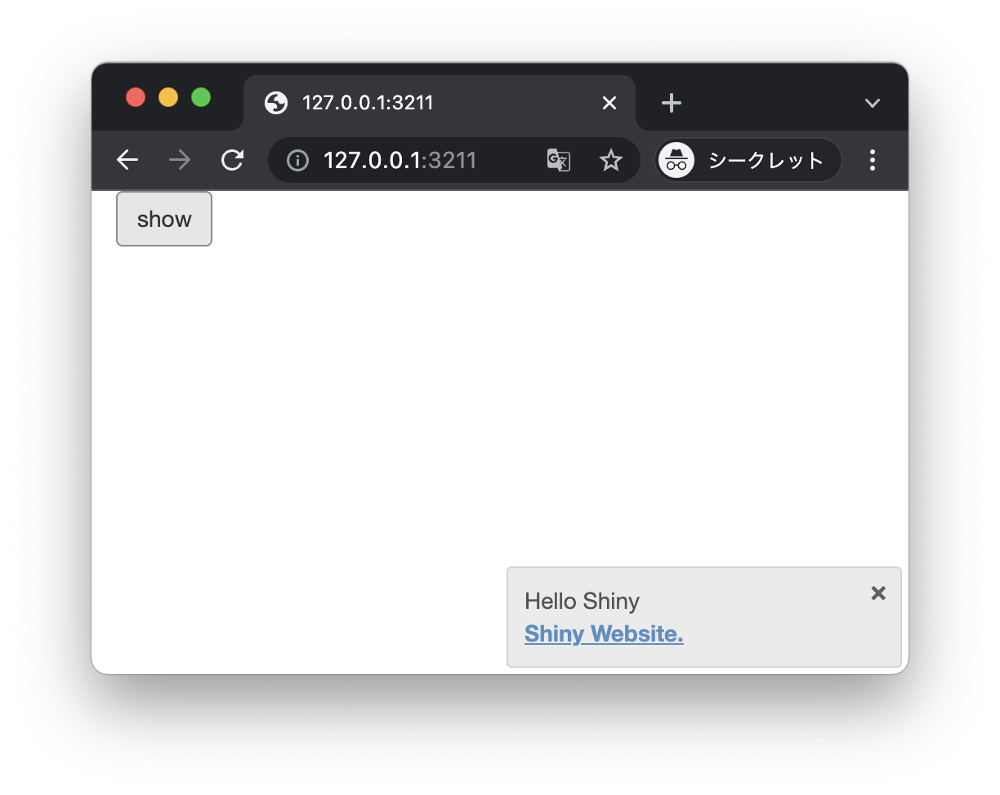
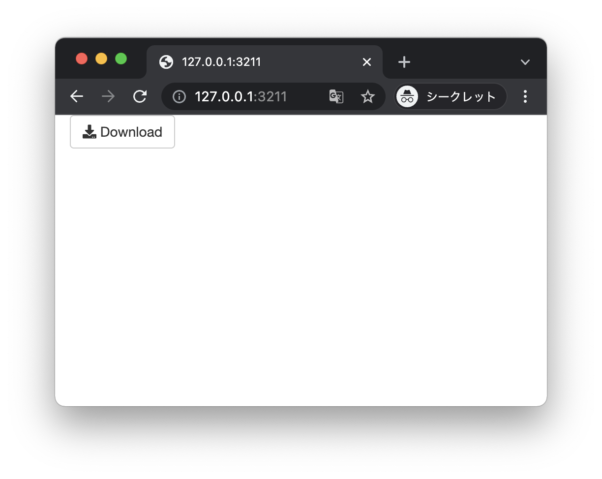
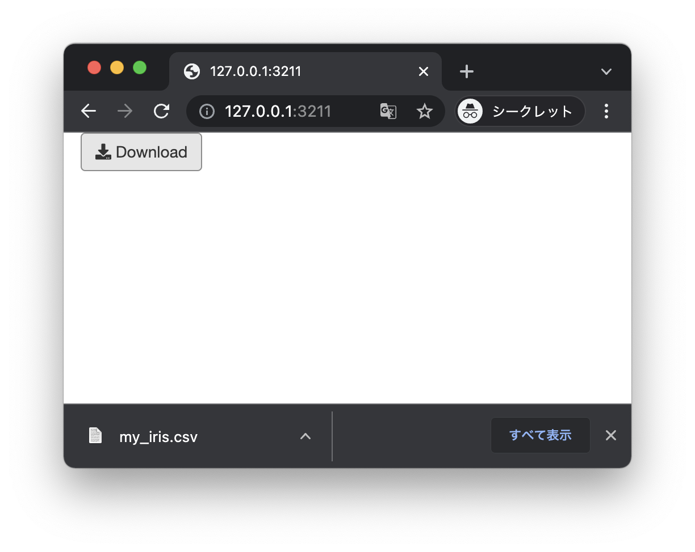
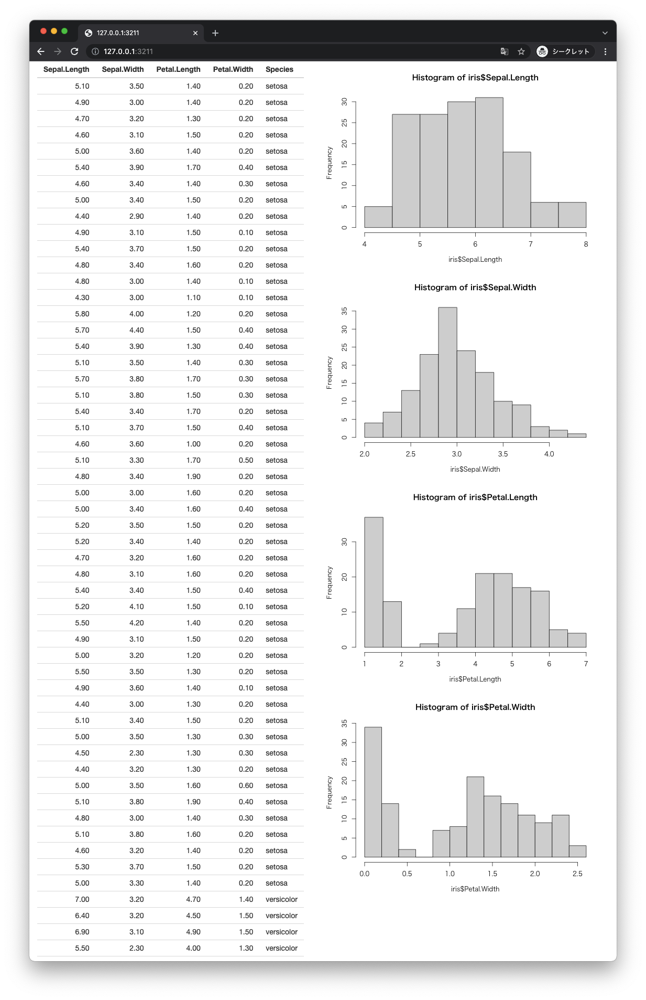

# UI Outputs / Rendering Functions

+ Shinyアプリケーションでは関数を使って出力項目を定義できる
+ 出力項目への実際のデータ出力はあとのレンダリング関数を使う
+ 代表的な関数は以下のとおり

|関数|処理内容|
|:--|:--|
|htmlOutput() uiOutput() | HTML要素の出力|
|imageOutput() plotOutput() |プロット（グラフなど）の出力|
|tableOutput() dataTableOutput() | テーブルの出力|
|textOutput() verbatimTextOutput() | テキストの出力|
|downloadButton() downloadLink() | ダウンロードボタン|
|modalDialog() modalButton() | モーダルダイアログの出力|
|urlModal() | URLモーダルダイアログの出力|
|showModal() removeModal() | モーダルダイアログの表示|
|showNotification() removeNotification() |ノーティフィケーションの表示（非表示）|

## レンダリング関数

* 出力項目に対してデータを描画する関数

|関数|処理内容|
|:--|:--|
|renderPlot() | プロットのレンダリング|
|renderCachedPlot() |キャッシュしたプロットのレンダリング|
|renderPrint() renderText()| テキストのレンダリング|
|renderDataTable() |データテーブルのレンダリング|
|renderImage() |イメージのレンダリング|
|renderTable() |テーブルのレンダリング|
|renderUI() |UIのレンダリング|
|downloadHandler() |ダウンロードハンドラ|
|createRenderFunction() |レンダリング関数の実装|

> ここであげた関数は一例です。詳細についてはShinyのリファレンスを参照（https://shiny.rstudio.com/reference/shiny/）してください。

---

## プログラミングの例

ここでは以下の手順にしたがってプログラムを作成します。

+ テキストの出力
+ テーブルの出力
+ プロット（グラフ）の出力
+ 動的なUIの出力
+ モーダルダイアログの出力
+ ノーティフィケーションの出力
+ ダウンロードボタンの出力

---


## テキストの出力

+ `textOutput` 関数でテキストを出力できる
+ `verbatimTextOutput` 関数でテキストをそのまま(`pre` タグ付き)出力できる
+ `server` 関数において `renderText` 関数を使ってテキストデータをレンダリングする

### out_text.R

```r
library(shiny)

ui <- fluidPage(
  textOutput(outputId = "myText"),
  verbatimTextOutput(outputId = "myText2")
)
server <- function(input, output) {
  output$myText <- renderText({
    str <- "Helo   Shiny"
    str
  })
  output$myText2 <- renderText({
    str <- "Hello   Shiny"
    str
  })
}
shinyApp(ui, server)
```

> `verbatimTextOutput` 関数は入力内容についてスペースや改行コードなどをそのまま出力します。

### 実行結果



---

## テーブルの出力

+ `tableOutput` 関数でテーブル（表）データを出力できる
+ `server` 関数において `renderTable` 関数を使ってテーブルデータをレンダリングする

### out_table.R

```r
library(shiny)

ui <- fluidPage(
  tableOutput(outputId = "myTable")
)
server <- function(input, output) {
  output$myTable = renderTable({
    df <- data.frame(
      "a" = c(1, 2, 3),
      "b" = c("A", "B", "C")
    )
    df
  })
}
shinyApp(ui, server)
```

### 実行結果



---

## プロット（グラフ）の出力

+ `plotOutput` 関数でプロット（グラフ）データを出力できる
+ `server` 関数において `renderPlot` 関数を使ってプロットデータをレンダリングする

### out_plot.R

```r
library(shiny)

ui <- fluidPage(
  plotOutput(outputId = "myPlot")
)
server <- function(input, output) {
  output$myPlot = renderPlot({
    plot(women)
  })
}
shinyApp(ui, server)
```

### 実行結果



---

## 動的なUIの出力

+ `uiOutput` 関数でUIデータ（`server` 関数内で生成したUIオブジェクト）を出力できる
+ `server` 関数において `renderUI` 関数を使ってUIデータをレンダリングする

### out_ui.R

```r
library(shiny)

ui <- fluidPage(
  uiOutput(outputId = "myUi")
)
server <- function(input, output) {
  output$myUi = renderUI({
    ui <- splitLayout(
      h3("Title 1"),
      h3("Title 2"),
      h3("Title 3")
    )
    ui
  })
}
shinyApp(ui, server)
```

### 実行結果



> `uiOutput` 関数は `server` 関数内で動的にUIを生成したいときに利用します。

---

## モーダルダイアログの出力

+ `server` 関数において `showModal` 関数、`modalDialog` 関数を使ってダイアログを生成する
+ `modalDialog` 関数に引数を指定してダイアログのタイトルやフッターの表示などをカスタマイズできる
+ `server` 関数において `observeEvent` 関数を利用することでイベントの発生を監視できる

### out_modal.R

```r
library(shiny)

ui <- fluidPage(
  actionButton(inputId = "myAction", label = "show")
)
server <- function(input, output) {
  observeEvent(input$myAction, {
    showModal(modalDialog("Hello Shiny", title = "Modal title."))
  })
}
shinyApp(ui, server)
```

> `observeEvent` 関数を使って `myAction` ボタンがクリックされることを監視しています。

### 実行結果





---


## ノーティフィケーションの出力

+ `server` 関数において `showNotification` 関数を使ってノーティフィケーションを生成する
+ `server` 関数において `observeEvent` 関数を利用することでイベントの発生を監視できる

### out_notification.R

```r
library(shiny)

ui <- fluidPage(
  actionButton(inputId = "myAction", label = "show")
)
server <- function(input, output) {
  observeEvent(input$myAction, {
    showNotification("Hello Shiny",
                     action = a(href="https://shiny.rstudio.com", "Shiny Website."))
  })
}
shinyApp(ui, server)
```

> `observeEvent` 関数を使って `myAction` ボタンがクリックされることを監視しています。

### 実行結果




---

## ダウンロードボタンの出力

+ `downloadButton` 関数でダウンロードボタンを出力できる
+ `server` 関数において `downloadHandler` 関数を使ってダウンロード対象のファイルを定義する
* `downloadHandler` 関数は `filename` 引数にファイル名、`content` 引数にデータを返却する関数を定義する

### out_download.R

```r
library(shiny)

ui <- fluidPage(
  downloadButton(outputId = "myDownload")
)
server <- function(input, output) {
  output$myDownload <- downloadHandler(
    filename = "my_iris.csv",
    content = function(file) {
      data <- iris
      write.csv(data, file)
    }
  )
}
shinyApp(ui, server)
```

### 実行結果





---

## エクササイズ

### 設問1

* 以下の仕様にしたがってアプリケーションを作成してください。
  * `splitLayout` で画面を横に分割する
    * 左側には `iris` データをテーブルで出力する
    * 右側には `verticalLayout` で項目を縦並びに出力する
      * `iris` データの `Sepal.Length` のヒストグラムを出力する
      * `iris` データの `Sepal.Width` のヒストグラムを出力する
      * `iris` データの `Petal.Length` のヒストグラムを出力する
      * `iris` データの `Petal.Width` のヒストグラムを出力する



<!-- 
library(shiny)

ui <- fluidPage(
  splitLayout(
    tableOutput("myTable"),
    verticalLayout(
      plotOutput("myPlot1"),
      plotOutput("myPlot2"),
      plotOutput("myPlot3"),
      plotOutput("myPlot4"),
    )
  )
)
server <- function(input, output) {
  output$myTable = renderTable({
    iris
  })
  output$myPlot1 = renderPlot({
    hist(iris$Sepal.Length)
  })
  output$myPlot2 = renderPlot({
    hist(iris$Sepal.Width)
  })
  output$myPlot3 = renderPlot({
    hist(iris$Petal.Length)
  })
  output$myPlot4 = renderPlot({
    hist(iris$Petal.Width)
  })
}
shinyApp(ui, server)
-->