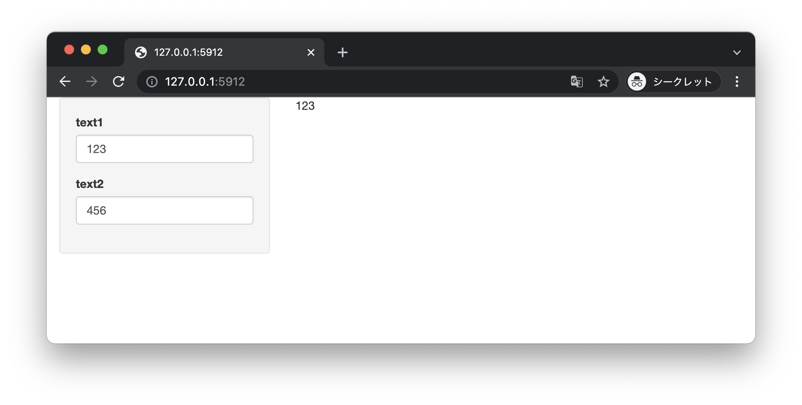
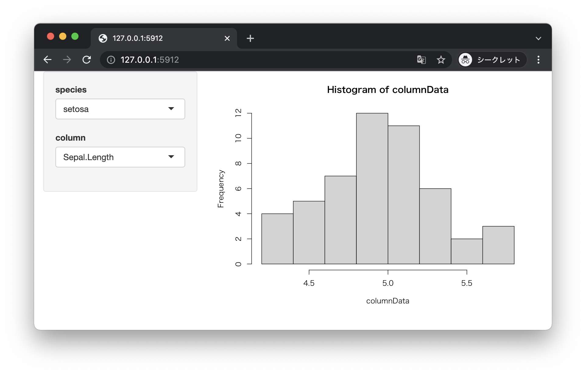
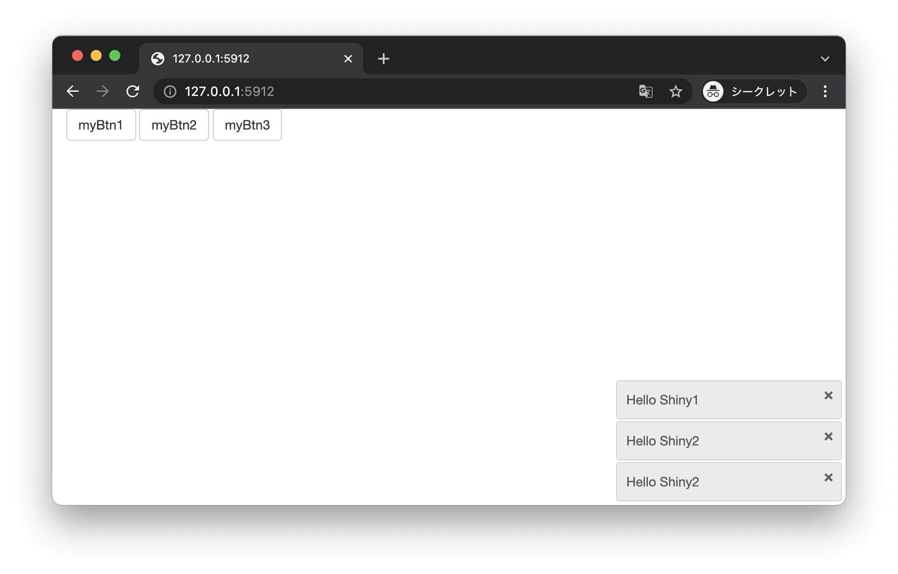

# リアクティブプログラミング

+ Shinyアプリケーションはユーザの入力などによって、アプリケーションの状態が更新されると即座に画面に反映される（リアクティブプログラミング）
+ 大きなデータの読み込みなどが発生する場合は、リアクティブな挙動を制御する必要がある
+ リアクティブプログラミングに関する代表的な関数は以下のとおり

|関数|処理内容|
|:--|:--|
|isolate() | 非リアクティブなスコープを作成|
|reactive() | リアクティブな式（expression）を作成|
|observe() | リアクティブなオブザーバを作成 |
|observeEvent() | イベントハンドラを定義 |

> ここであげた関数は一例です。詳細についてはShinyのリファレンスを参照（https://shiny.rstudio.com/reference/shiny/）してください。

---

## プログラミングの例

ここでは以下の手順にしたがってプログラムを作成します。

+ `isolate` 関数の使い方
+ `reactive` 関数の使い方
+ `observe` 関数、`observeEvent` 関数の使い方

---

## `isolate` 関数の使い方

* `isolate` 関数によって非リアクティブなコードを定義できる
* `renderText` 関数などのレンダリング関数は、引数で参照している変数の更新を検出する（リアクティブ）
* `isolate` 関数によって変数の更新を無視できる

### isolate.R

```r
library(shiny)

ui <- fluidPage(
  sidebarLayout(
    sidebarPanel(
      textInput(inputId = "myText1", "text1"),
      textInput(inputId = "myText2", "text2")
    ),
    mainPanel(
      textOutput(outputId = "myText3")
    )
  )
)
server <- function(input, output) {
  output$myText3 = renderText({
    txt1 <- input$myText1 
    txt2 <- isolate(input$myText2)
    paste(txt1, txt2)
  })
}
shinyApp(ui, server)
```

> `renderText` 関数の引数であるコードブロックにおいて `isolate` 関数の引数に `input$myText2` を指定しています。これによって2つ目のテキストボックス（`myText2`） の更新が`renderText` 関数に通知されなくなります。

### 実行結果



> 2つ目のテキストボックスの更新時は、画面に反映されないことを確認します。 

---

## `reactive` 関数の使い方

* `reactive` 関数によってリアクティブなコードを定義できる
* `reactive` 関数によって生成されたデータは `server` 関数内でキャッシュされる
* 処理時間のかかるコードを `reactive` 関数によって定義しておくことで、不要なコードの再実行を防ぐことができる

### reactive.R

> 次のプログラムは `reactive` 関数を使わない一般的なものです。

```r
library(shiny)

ui <- fluidPage(
  sidebarLayout(
    sidebarPanel(
      selectInput(inputId = "speciesId", label ="species", 
                  choices = c("setosa" = "1", "versicolor" = "2", "virginica" = "3")),
      selectInput(inputId = "columnId", label ="column",
                  choices = c("Sepal.Length" = "1", "Sepal.Width" = "2", "Petal.Length" = "3", "Petal.Width" = "4")),
    ),
    mainPanel(
      plotOutput("myPlot")
    )
  )
)
server <- function(input, output) {
  output$myPlot <- renderPlot({
    print(date())
    speciesId <- input$speciesId
    species <- switch (speciesId,
                       "1" = "setosa",
                       "2" = "versicolor",
                       "3" = "virginica",
                       stop("Invalid speciesId."))
    irisBySpecies <- iris[iris$Species == species, ]
    columnId <- input$columnId
    columnName <- switch(columnId,
                         "1" = "Sepal.Length",
                         "2" = "Sepal.Width",
                         "3" = "Petal.Length",
                         "4" = "Petal.Width",
                         stop("Invalid columnId."))
    columnData <- irisBySpecies[, columnName]
    hist(columnData)
  })
}
shinyApp(ui, server)
```

> このプログラムは画面に2つのセレクトボックス（ `species` 、`column` ）を表示します。 また `server` 関数の `renderPlot` 関数において `iris` データセットに対して選択された`species` による行指定、選択された `column` による列指定の2つの処理を実装しています。また `print(date())` によってターミナルにログを出力しています。

### 実行結果


### reactive2.R

> 次のプログラムは `reactive` 関数を使って `iris` データセットの行指定処理を分割しています。これによって `column` セレクトボックス変更時は `speceis` セレクトボックスの変更に関わる処理をスキップできます（以前のデータを再利用します）。

```r
library(shiny)

ui <- fluidPage(
  sidebarLayout(
    sidebarPanel(
      selectInput(inputId = "speciesId", label ="species", 
                  choices = c("setosa" = "1", "versicolor" = "2", "virginica" = "3")),
      selectInput(inputId = "columnId", label ="column",
                  choices = c("Sepal.Length" = "1", "Sepal.Width" = "2", "Petal.Length" = "3", "Petal.Width" = "4")),
    ),
    mainPanel(
      plotOutput("myPlot")
    )
  )
)
server <- function(input, output) {
  irisBySpecies <- reactive({
    print(date())
    speciesId <- input$speciesId
    species <- switch (speciesId,
                       "1" = "setosa",
                       "2" = "versicolor",
                       "3" = "virginica",
                       stop("Invalid speciesId."))
    irisBySpecies <- iris[iris$Species == species, ]
    irisBySpecies
  })
  
  output$myPlot <- renderPlot({
    columnId <- input$columnId
    columnName <- switch(columnId,
                         "1" = "Sepal.Length",
                         "2" = "Sepal.Width",
                         "3" = "Petal.Length",
                         "4" = "Petal.Width",
                         stop("Invalid columnId."))
    
    irisBySpecies <- irisBySpecies()
    columnData <- irisBySpecies[, columnName]
    hist(columnData)
  })
}
shinyApp(ui, server)
```

### 実行結果



### ターミナル

> 以前のプログラムと比べて、2つのセレクトボックスを変化させたときにログの出力が変わる点を確認してください。

```
Listening on http://127.0.0.1:5912
[1] "Tue Dec 14 09:20:46 2021"
[1] "Tue Dec 14 09:20:57 2021"
[1] "Tue Dec 14 09:21:10 2021"
[1] "Tue Dec 14 09:21:13 2021"
```

---

##  `observe` 関数、`observeEvent` 関数の使い方

* `observeEvent` 関数で特定の入力項目のイベントを監視できる
* `observe` 関数で、引数に受け取ったコードブロック内の変数の変更を検出できる
* 2つの関数は出力項目に戻り値を返さない（ `showNotification` 関数等を利用するのに適している）

### observe.R

```r
library(shiny)

ui <- fluidPage(
  actionButton(inputId = "myBtn1", label = "myBtn1"),
  actionButton(inputId = "myBtn2", label = "myBtn2"),
  actionButton(inputId = "myBtn3", label = "myBtn3"),
)
server <- function(input, output) {
  observeEvent(input$myBtn1, {
    showNotification("Hello Shiny1")
  })
  
  observe({
    input$myBtn2
    input$myBtn3
    showNotification("Hello Shiny2")
  })
}
shinyApp(ui, server)
```

> プログラムを実行すると3つのボタンが表示されます。1つ目のボタンは `observeEvent` 関数で監視しており、2つ目と3つ目のボタンは `observe` 関数で監視しています。

### 実行結果



> クリックするボタンによって異なる通知が表示されます。

---

## エクササイズ

### 設問1

* 次のプログラム（ `ex_reactive.R` ）があります。


#### ex_reactive.R

```r
library(shiny)

ui <- fluidPage(
  sidebarLayout(
    sidebarPanel(
      selectInput(inputId = "speciesId", label ="species", 
                  choices = c("setosa" = "1", "versicolor" = "2", "virginica" = "3")),
      sliderInput(inputId = "bins", label = "bins", min = 1, max = 10, value = 5)
    ),
    mainPanel(
      plotOutput("myPlot")
    )
  )
)
server <- function(input, output) {
  
  output$myPlot <- renderPlot({
    print(date())
    speciesId <- input$speciesId
    species <- switch (speciesId,
                       "1" = "setosa",
                       "2" = "versicolor",
                       "3" = "virginica",
                       stop("Invalid speciesId."))
    irisBySpecies <- iris[iris$Species == species, "Sepal.Length"]

    # TODO reactive
    binsInt <- as.integer(input$bins)
    bins <- seq(min(iris$Sepal.Length), max(iris$Sepal.Length), length = binsInt + 1)

    hist(irisBySpecies, breaks = bins)
  })
}
shinyApp(ui, server)
```

* スライダー（ `bins` ）の処理（TODOコメントの部分）を `reactive` 関数で再定義してください。

> セレクトボックス（`speciesId`） 変更時は、スライダー（ `bins` ）の再計算をスキップできるようになります。