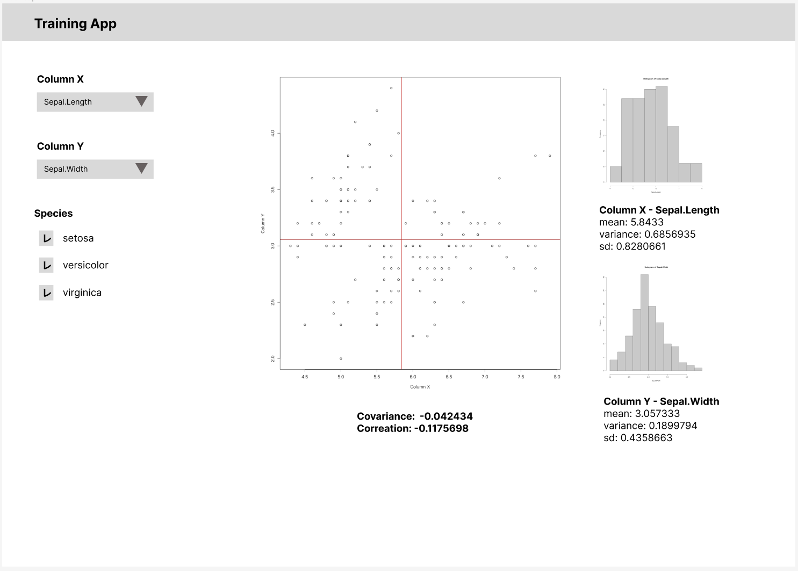

# Shiny - 総合演習

* 以下の画面仕様に従ってShinyを使ったWebアプリケーションを作成してください。

* データ仕様
  * Rに標準で組み込まれている `iris` データセットを使うこと

* 画面仕様
  * 入力項目
    * Column X
      * セレクトボックスで以下の選択肢を表示する
        * `Sepal.Length`
        * `Sepal.Width`
        * `Petal.Length`
        * `Petal.Width`
    * Column Y
      * セレクトボックスで以下の選択肢を表示する
        * `Sepal.Length`
        * `Sepal.Width`
        * `Petal.Length`
        * `Petal.Width`
    * Species
      * チェックボックスで以下の選択肢を表示する
        * `setosa`
        * `versicolor`
        * `virginica`
  * 出力項目
    * 散布図
      * Column XとColumn Yの散布図を表示する
        > 赤い直線は各変数の平均値を意味する
      * 散布図の下には以下の2つの項目を表示する
        * Covoriance
          * 共分散
        * Correlation
          * 相関係数
    * ヒストグラム（上）
      * Column X で指定した項目のヒストグラムを表示する
      * ヒストグラムの下にはColumn Xで選択された項目について、以下の内容を表示する
        * mean
          * 平均
        * variance
          * 分散
        * sd
          * 標準偏差
    * ヒストグラム（下）
      * Column Y で指定した項目のヒストグラムを表示する
      * ヒストグラムの下にはColumn Xで選択された項目について、以下の内容を表示する
        * mean
          * 平均
        * variance
          * 分散
        * sd
          * 標準偏差

> その他の細かな仕様は自分で考えて決定して大丈夫です。
