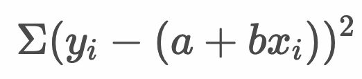
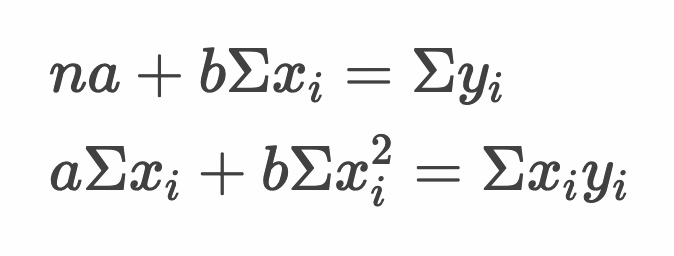

# 単回帰分析


* 回帰分析とは、1つ以上の変数から目的となる変数との関係を推定すること
* 回帰分析の入力値となる変数を説明変数（独立変数）、目的となる変数を目的変数（従属変数）と呼ぶ
* 説明変数が1つのものを単回帰分析、複数あるものを重回帰分析と呼ぶ

---

## 線形回帰

* 線形回帰とは回帰分析の最も一般的な形式
* 一般的に線形回帰においてパラメータ（a:切片、b:回帰係数）を求めるために最小二乗法を使う
* 線形回帰モデルでは目的変数 y と説明変数 x との間に以下の関係を定義する

  

  > aは切片、bは回帰係数（傾き）と呼びます。線形回帰のパラメータの推定には最小二乗法を使うことが一般的です。それ以外の手法に最小絶対値法なども存在します。

### 予測値と実測値

* データとして与えれる `y` を実測値と呼ぶ
* 回帰式より求めた値 `y^` を予測値と呼ぶ
* 実測値 `y` と予測値 `y^` のずれを残差と呼ぶ

  > 残差は `e` という記号で表現します。

---

## 最小二乗法

* 最小二乗法では、実測値と予測値のずれ（残差）の二乗和を最小にするパラメータ（切片と回帰係数）を求める

  

* また`y^ = a + bx` より、予測値を次のように表現できる

  


> 上記の計算結果を最小とする切片 `a` と回帰係数 `b` を求めます。実際には手元にあるデータから `x` と `y` については具体的な値が決まるので、切片である `a` と 回帰係数である `b` だけの式になります。これら `a` と `b` について偏微分した結果を0とおいて連立方程式を解くことで、`a` と `b`を求めることができます。

### 例： ある植物の花びらの縦幅と横幅

* ある植物の花びらの縦幅と横幅の関係を整理すると次のようになった

  |縦幅 x|横幅 y|
  |--:|--:|
  |5.2|6.2|
  |5.4|6.8|
  |5.6|6.6|
  |5.8|7.8|

* 最小二乗法によって回帰式（線形回帰モデル）を求めると次のようになる

```
Σ(y - (a + bx))^2 
  = (6.2 - a - 5.2b)^2
  + (6.8 - a - 5.4b)^2
  + (6.6 - a - 5.6b)^2
  + (7.8 - a - 5.8b)^2
  = (38.44 + a^2 + 27.04b^2 - 12.4a + 10.4ab - 64.48b)
  + (46.24 + a^2 + 29.16b^2 - 13.6a + 10.8ab - 73.44b)
  + (43.56 + a^2 + 31.36b^2 - 13.2a + 11.2ab - 73.92b)
  + (60.84 + a^2 + 33.64b^2 - 15.6a + 11.6ab - 90.48b)
  = 189.08 + 4a^2 + 121.20b^2 - 54.80a + 44.00ab - 302.32b
```

> `(a + b + c)^2 = a^2 + b^2 + c^2 + 2ab + 2bc + 2ac` で計算しています。

* `189.08 + 4a^2 + 121.20b^2 - 54.80a + 44.00ab - 302.32b` の `a` 、`b` について偏微分した結果を0とおいて連立方程式を解く

```
8a + 44b - 54.8 = 0
44a + 242.4b - 302.32 = 0

a = -5.8 b = 2.3 となる
```
---

### （参考）正規方程式

* 最小二乗法の式を `a`, `b`で偏微分した結果を0と置くことで、次のような連立方程式（正規方程式）を導くこともできる

$$
na + b\sum x_i = \sum y_i 
$$

$$
a\sum x_i + b\sum x_i^2 = \sum x_iy_i
$$

#### 正規方程式の導出

* 最小二乗法

$$
S(a,b) = \sum(y_i - (a + bx_i))^2
$$


* S(a, b) をa, bで偏微分して0とおく

$$
\frac{\partial S(a,b)}{\partial a} = \sum2(y_i - (a + bx_i))(-1) = 0
$$

$$
\frac{\partial S(a,b)}{\partial b} = \sum2(y_i - (a + bx_i))(-x_i) = 0
$$

* 式を変形する

$$
\sum(y_i - (a + bx_i)) = 0
$$

$$
\sum(y_i - (a + bx_i))x_i = 0
$$


* 式を変形する（正規方程式）

$$
na + b\sum x_i = \sum y_i
$$

$$
a\sum x_i + b\sum x_i^2 = \sum x_iy_i
$$


---

### 参考：Rで連立方程式を解く

* `solve` 関数で連立方程式を解くことができる
* ここでは第1引数には左辺の値を2x2のマトリクスを指定する
  ```
  8, 44,
  44, 242.4
  ```
* 第2引数に右辺の値をベクトルを指定する
  ```
  54.8, 302.32
  ```

```r
a <- matrix(c(8, 44, 44, 242.4), 2, 2)
b <- c(54.8, 302.32)
solve(a, b)
```

#### 実行結果

```r
> a <- matrix(c(8, 44, 44, 242.4), 2, 2)
> b <- c(54.8, 302.32)
> solve(a, b)
[1] -5.8  2.3
```

---

### 参考：微分した結果が0になることの意味

* 以下のグラフは `y = x^2` を示している

  

* `y = x^2` を微分すると `y' = 2x` となり、各点におけるyの変化量は次のようになる

  |x|-4|-2|0|2|4|
  |:--|:--|:--|:--|:--|:--|
  |yの変化量|-8|-4|0|4|8|

* `yの変化量` が `0` となるのは `x` が `0` のときだとわかる（`y = x^2` のグラフを見ても、`x` が `0` のとき最小値となることがわかる）

---

### 線形回帰モデルのパラメータ（切片：a、回帰係数：b）の求め方

* 以下の正規方程式から線形回帰モデルのパラメータ a , b を計算できる



* 上記の連立方程式を a, b について解くと次のようになる


> `y-` `x-` はそれぞれの平均値です。また `Sxy` は `x` と `y` の共分散、`Sx^2`は `x` の分散です。`r` は相関係数、`Sx`、`Sy` はそれぞれの変数の標準偏差です。相関係数と共分散の関係は以下のとおりです。


```r
df <- data.frame(
  x <- c(5.2, 5.4, 5.6, 5.8),
  y <- c(6.2, 6.8, 6.6, 7.8)
)
x_mean = mean(df$x)
y_mean = mean(df$y)
r = cor(df$x, df$y)
sx = sd(df$x)
sy = sd(df$y)
b = r * sy / sx
a = y_mean - x_mean * b
a
b
```

#### 実行結果

```r
> df <- data.frame(
+   x <- c(5.2, 5.4, 5.6, 5.8),
+   y <- c(6.2, 6.8, 6.6, 7.8)
+ )
> x_mean = mean(df$x)
> y_mean = mean(df$y)
> r = cor(df$x, df$y)
> sx = sd(df$x)
> sy = sd(df$y)
> b = r * sy / sx
> a = y_mean - x_mean * b
> a
[1] -5.8
> b
[1] 2.3
```

> 以前に求めた連立方程式の解と一致しているのがわかります。

---


## Rプログラミング

### `lm` 関数  - lm1.R

* `lm` 関数はデータから線形モデルをフィッティングする
* `fomula` 引数には `目的変数 ~ 説明変数` というフォーマットで記述する
* `data` 引数にデータフレームを指定できる

```r
df <- data.frame(
  x <- c(5.2, 5.4, 5.6, 5.8),
  y <- c(6.2, 6.8, 6.6, 7.8)
)
lm(formula = y ~ x, data = df)
```

> `data` 引数でデータフレームを指定した場合、`formula` 引数でデータフレーム内の列名を指定できます。

#### 実行結果

```r
> df <- data.frame(
+   x <- c(5.2, 5.4, 5.6, 5.8),
+   y <- c(6.2, 6.8, 6.6, 7.8)
+ )
> lm(formula = y ~ x, data = df)

Call:
lm(formula = y ~ x, data = df)

Coefficients:
(Intercept)            x  
       -5.8          2.3  

```

### `lm` 関数 - 戻り値の使い方  - lm2.R

* `lm` 関数は戻り値に `list` オブジェクトを返す
* `list` オブジェクトの `coefficients` にアクセスすると切片や回帰係数にアクセスできる
* 後述するように戻り値の`list` オブジェクトを `summary` 関数に渡すことで詳細な内容を確認できる

```r
df <- data.frame(
  x <- c(5.2, 5.4, 5.6, 5.8),
  y <- c(6.2, 6.8, 6.6, 7.8)
)
result <- lm(formula = y ~ x, data = df)
result$coefficients
```

#### 実行結果

```r
> df <- data.frame(
+   x <- c(5.2, 5.4, 5.6, 5.8),
+   y <- c(6.2, 6.8, 6.6, 7.8)
+ )
> result <- lm(formula = y ~ x, data = df)
> result$coefficients
(Intercept)           x 
       -5.8         2.3 
```

### `lm` 関数 - 回帰直線  - lm3.R

* `lm` 関数の戻り値を `abline` 関数に渡すことで回帰直線を描画できる

```r
df <- data.frame(
  x <- c(5.2, 5.4, 5.6, 5.8),
  y <- c(6.2, 6.8, 6.6, 7.8)
)
result <- lm(formula = y ~ x, data = df)
plot(df$x, df$y)
abline(result)
```

#### 実行結果

```r
> df <- data.frame(
+   x <- c(5.2, 5.4, 5.6, 5.8),
+   y <- c(6.2, 6.8, 6.6, 7.8)
+ )
> result <- lm(formula = y ~ x, data = df)
> plot(df$x, df$y)
> abline(result)
```


### `lm` 関数 - 回帰予測  - lm4.R

* `lm` 関数の戻り値を `predict` 関数に渡すことで予測値を取得できる
* `predict` 関数は第1引数にモデルオブジェクト（ `lm` 関数の戻り値など）、第2引数にデータフレームやリストなどでデータを指定します。

```r
df <- data.frame(
  x <- c(5.2, 5.4, 5.6, 5.8),
  y <- c(6.2, 6.8, 6.6, 7.8)
)
result <- lm(formula = y ~ x, data = df)
predict(result)
new_df <- data.frame(
  x <- seq(5, 6, 0.1)
)
predict(result, new_df)
```

#### 実行結果

```r
> df <- data.frame(
+   x <- c(5.2, 5.4, 5.6, 5.8),
+   y <- c(6.2, 6.8, 6.6, 7.8)
+ )
> result <- lm(formula = y ~ x, data = df)
> predict(result)
   1    2    3    4 
6.16 6.62 7.08 7.54 
> new_df <- data.frame(
+   x <- seq(5, 6, 0.1)
+ )
> predict(result, new_df)
   1    2    3    4    5    6    7    8    9   10   11 
5.70 5.93 6.16 6.39 6.62 6.85 7.08 7.31 7.54 7.77 8.00 
```

---


## エクササイズ

### 設問 1

次のデータがあります。yを目的変数、xを説明変数として、線形回帰モデルを最小二乗法によって定義してください。ただし、以下の3つのアプローチでパラメータ（a:切片、b:回帰係数）を求めるものとします。

1. `x`の平均、標準偏差、`y`の平均、標準偏差、および相関係数 `r` から算出する
2. R の `lm` 関数によって `a`、`b` を算出する
3. `a` と `b` について偏微分した結果を0とおいて連立方程式を解く

    |x|y|
    |--:|--:|
    |2|3|
    |4|7|
    |6|8|
    |7|10|
    |8|12|

### 設問 2

設問1 で求めた線形回帰モデルを使って散布図と回帰直線を描画してください。 


### 設問 3

1. iris データについて `Species` が `setosa` のレコードを抽出して `Sepal.Length` と `Sepal.Width` の散布図を描画してください。また回帰直線を描画してください。ただし、`Sepal.Length` を説明変数、`Sepal.Width` を目的変数とします。

2. 上記で作成した回帰式を使って `Sepal.Length` が 10のとき、`Sepal.Width` はいくつになるか予測してください。

<!--

  1. `a` と `b` について偏微分した結果を0とおいて連立方程式を解く

```
Σ(y - (a + bx))^2
  = (3 - a - 2b)^2
  + (7 - a - 4b)^2
  + (8 - a - 6b)^2
  + (10 - a - 7b)^2
  + (12 - a - 8b)^2
  = (9   + a^2 + 4b^2  - 6a  +  4ab - 12)
  + (49  + a^2 + 16b^2 - 14a +  8ab - 56)
  + (64  + a^2 + 36b^2 - 16a + 12ab - 96)
  + (100 + a^2 + 49b^2 - 20a + 14ab - 140)
  + (144 + a^2 + 64b^2 - 24a + 16ab - 192)
  =  366 + 5a^2 + 169b^2 - 80a + 54ab - 496b

`a` 、`b` について偏微分した結果を0とおいて連立方程式を解く 
10a +  54b - 80 = 0
54a + 338b - 496 = 0

a <- matrix(c(10, 54, 54, 338), 2, 2)
b <- c(80, 496)
solve(a, b)
```

  2. `x`の平均、標準偏差、`y`の平均、標準偏差、および相関係数 `r` から算出する

```
df <- data.frame(
  x = c(2, 4, 6, 7, 8),
  y = c(3, 7, 8, 10, 12)
)
x_mean = mean(df$x)
y_mean = mean(df$y)
r = cor(df$x, df$y)
sx = sd(df$x)
sy = sd(df$y)
b = r * sy / sx
a = y_mean - x_mean * b
a
b
```

```
> df <- data.frame(
+   x = c(2, 4, 6, 7, 8),
+   y = c(3, 7, 8, 10, 12)
+ )
> x_mean = mean(df$x)
> y_mean = mean(df$y)
> r = cor(df$x, df$y)
> sx = sd(df$x)
> sy = sd(df$y)
> b = r * sy / sx
> a = y_mean - x_mean * b
> a
[1] 0.5517241
> b
[1] 1.37931
```


  3. R の `lm` 関数によって `a`、`b` を算出する

```
lm(formula = y ~ x, data = df)
```

```
> lm(formula = y ~ x, data = df)

Call:
lm(formula = y ~ x, data = df)

Coefficients:
(Intercept)            x
     0.5517       1.3793
```

2. 上記で求めた線形回帰モデルを使って散布図と回帰直線を描画してください。

```
result <- lm(formula = y ~ x, data = df)
plot(df$x, df$y)
abline(result)
```

3. iris データについて `Species` が `setosa` のレコードを抽出して `Sepal.Length` と `Sepal.Width` の散布図を描画してください。また回帰直線を描画してください。

```
iris_setosa <- iris[iris$Species == "setosa", ]
result <- lm(Sepal.Width ~ Sepal.Length, data = iris_setosa)
plot(iris_setosa$Sepal.Length, iris_setosa$Sepal.Width)
abline(result)
```

-->