# 残差の性質と決定係数

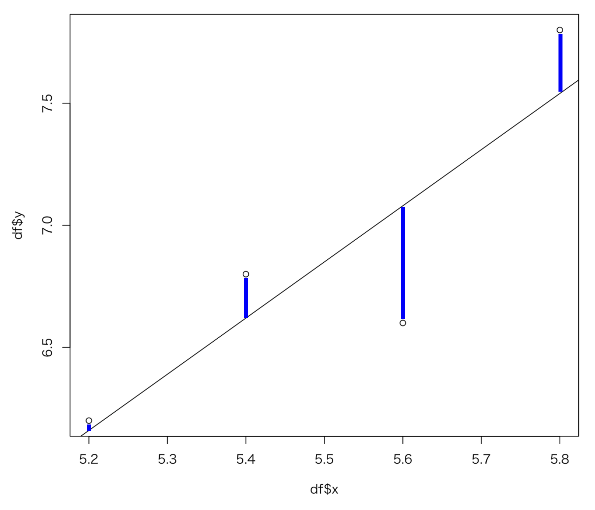

* 実測値と予測値の差分を残差（ `e` ）と呼ぶ
* 実測値は予測値と残差に分解できる
* 実測値に対する予測値の当てはまりの良さを表す尺度に決定係数がある

---

## 実測値と予測値と残差の関係

* 残差は以下の式で表現できる

  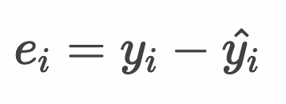

* 最小二乗法では残差の平方和を最小にする `a`：切片 と `b`：回帰係数 を算出する

  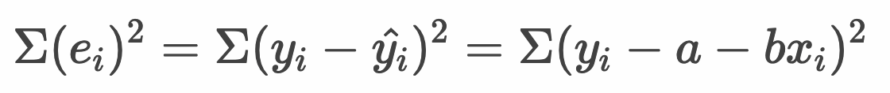

---

## 残差の性質

* 残差の平均は 0 となる

  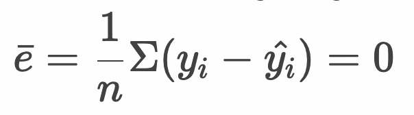

* 説明変数（xi）と残差（ei）に相関はない（無相関である）

  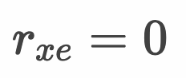

* 予測値（y^i）と残差（ei）に相関はない（無相関である）

  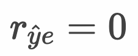

> 説明変数 x_i と 目的変数 y^i の相関係数は完全相関（ 1 あるいは -1 ）となります。

---

## 直行分解

* 残差を求める式は以下のように変形できる

  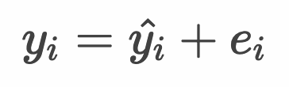

  > 実測値は予測値と残差で構成されていることを意味します。このような式を直行分解の式と呼びます。

* また実測値の分散は、予測値と残差は独立（無相関）であるためは以下のように分解できる

  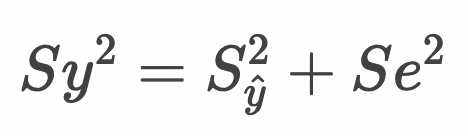


### 参考：2つの確率変数の分散について

* 2つの確率変数の分散は以下のとおり考えることができる

  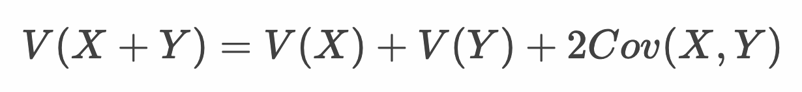

* また2つの確率変数が独立である場合は共分散を 0 と考えることができる

  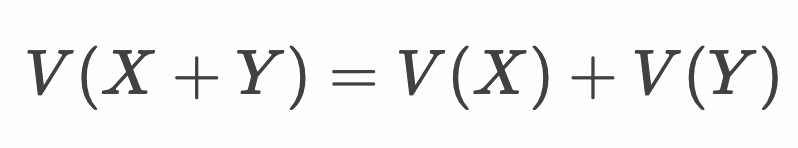

---

## 決定係数

* 実測値に対する予測値の当てはまりの良さを表す尺度に決定係数（r^2）がある
* 決定係数は 0〜1 の範囲の値をとり、1に近いほど回帰式の当てはまりは良い
* 決定係数は以下の計算で算出できる

  

> 決定係数は、実測値 y の分散のうち 予測値 y^ の分散でどれだけ説明できているかを意味します。決定係数は分散説明率と呼ばれることもあります。

### 参考：決定係数の算出

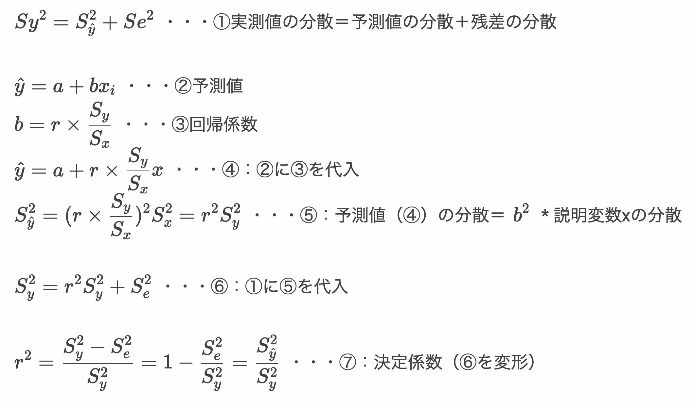

> 決定係数という用語の定義には様々な解釈があります。ここでは最小二乗法による線形回帰モデルを例に解説しています。 参考：https://ja.wikipedia.org/wiki/%E6%B1%BA%E5%AE%9A%E4%BF%82%E6%95%B0

---

## Rプログラミング

### 残差 - residual.R

* 残差は予測値と実測値の差分として計算できる

```r
df <- data.frame(
  x <- c(5.2, 5.4, 5.6, 5.8),
  y <- c(6.2, 6.8, 6.6, 7.8)
)
result <- lm(formula = y ~ x, data = df)
y_hat <- predict(result)
e <- y - y_hat
e
# sum(e)
# cor(x, e)
# cor(y_hat, e)
# cor(x, y_hat)
```

> コメント部分を解除して、残差の総和や相関係数について確認してください。

#### 実行結果

```r
> df <- data.frame(
+   x <- c(5.2, 5.4, 5.6, 5.8),
+   y <- c(6.2, 6.8, 6.6, 7.8)
+ )
> result <- lm(formula = y ~ x, data = df)
> y_hat <- predict(result)
> e <- y - y_hat
> e
    1     2     3     4 
 0.04  0.18 -0.48  0.26 
> # sum(e)
> # cor(x, e)
> # cor(y_hat, e)
> # cor(x, y_hat)
```

> 残差は `resid(model)` や `result$residuals` で取得することもできます。


### 決定係数  - r2.R

* 決定係数は、予測値の分散 / 実測値の分散で算出できる

```r
df <- data.frame(
  x <- c(5.2, 5.4, 5.6, 5.8),
  y <- c(6.2, 6.8, 6.6, 7.8)
)
result <- lm(formula = y ~ x, data = df)
y_hat <- predict(result)
r2 <- var(y_hat) / var(y)
r2
```

#### 実行結果

```r
> df <- data.frame(
+   x <- c(5.2, 5.4, 5.6, 5.8),
+   y <- c(6.2, 6.8, 6.6, 7.8)
+ )
> result <- lm(formula = y ~ x, data = df)
> y_hat <- predict(result)
> r2 <- var(y_hat) / var(y)
> r2
[1] 0.7611511
```

### `summary` 関数 - summary.R

* `lm` 関数の戻り値を `summary` 関数に渡すことで残差や決定係数など様々な情報を確認できる

```r
df <- data.frame(
  x <- c(5.2, 5.4, 5.6, 5.8),
  y <- c(6.2, 6.8, 6.6, 7.8)
)
result <- lm(formula = y ~ x, data = df)
summary(result)
```

#### 実行結果

```r
> df <- data.frame(
+   x <- c(5.2, 5.4, 5.6, 5.8),
+   y <- c(6.2, 6.8, 6.6, 7.8)
+ )
> result <- lm(formula = y ~ x, data = df)
> summary(result)

Call:
lm(formula = y ~ x, data = df)

Residuals:
    1     2     3     4 
 0.04  0.18 -0.48  0.26 

Coefficients:
            Estimate Std. Error t value Pr(>|t|)
(Intercept)   -5.800      5.015  -1.157    0.367
x              2.300      0.911   2.525    0.128

Residual standard error: 0.4074 on 2 degrees of freedom
Multiple R-squared:  0.7612,	Adjusted R-squared:  0.6417 
F-statistic: 6.373 on 1 and 2 DF,  p-value: 0.1276

```

> `Residuals` に残差を確認できます。また `Multiple R-squared` に決定係数を確認できます。その他の項目の意味については後述します。

---


## エクササイズ

### 設問 1

Rの `cars` データセットについて、`dist` を目的変数、 `speed` を説明変数として以下のとおり分析してください。

* 回帰式 y = a + bx を求めてください。
* 決定係数を求めてください。
* 散布図と回帰直線を描画してください。
* `speed` が 30 のとき `dist` はいくらになるか求めてください。 

### 設問 2

Rの `women` データセットについて、`weight` を目的変数、 `height` を説明変数として以下のとおり分析してください。

* 回帰式 y = a + bx を求めてください。
* 決定係数を求めてください。
* 散布図と回帰直線を描画してください。
* `height` が 75 のとき `weight` はいくらになるか求めてください。 

### 設問 3

Rの `iris` データセットについて、`Sepal.Width` を目的変数、 `Sepal.Length` を説明変数として以下のとおり分析してください。

* 回帰式 y = a + bx を求めてください。
* 決定係数を求めてください。
* 散布図と回帰直線を描画してください。
* `Sepal.Length` が 8 のとき `Sepal.Width` はいくらになるか求めてください。 

<!-- 

設問1
> result <- lm(dist~speed, cars)
> summary(result)

Call:
lm(formula = dist ~ speed, data = cars)

Residuals:
    Min      1Q  Median      3Q     Max 
-29.069  -9.525  -2.272   9.215  43.201 

Coefficients:
            Estimate Std. Error t value Pr(>|t|)    
(Intercept) -17.5791     6.7584  -2.601   0.0123 *  
speed         3.9324     0.4155   9.464 1.49e-12 ***
---
Signif. codes:  0 ‘***’ 0.001 ‘**’ 0.01 ‘*’ 0.05 ‘.’ 0.1 ‘ ’ 1

Residual standard error: 15.38 on 48 degrees of freedom
Multiple R-squared:  0.6511,	Adjusted R-squared:  0.6438 
F-statistic: 89.57 on 1 and 48 DF,  p-value: 1.49e-12

> predict(result, data.frame(speed = c(30)))
       1 
100.3932 
> plot(cars$speed, cars$dist)
> abline(result)


設問2
result <- lm(weight~height, women)
summary(result)
predict(result, data.frame(height = c(75)))
plot(women$height, women$weight)
abline(result)

> result <- lm(weight~height, women)
> summary(result)

Call:
lm(formula = weight ~ height, data = women)

Residuals:
    Min      1Q  Median      3Q     Max 
-1.7333 -1.1333 -0.3833  0.7417  3.1167 

Coefficients:
             Estimate Std. Error t value Pr(>|t|)    
(Intercept) -87.51667    5.93694  -14.74 1.71e-09 ***
height        3.45000    0.09114   37.85 1.09e-14 ***
---
Signif. codes:  0 ‘***’ 0.001 ‘**’ 0.01 ‘*’ 0.05 ‘.’ 0.1 ‘ ’ 1

Residual standard error: 1.525 on 13 degrees of freedom
Multiple R-squared:  0.991,	Adjusted R-squared:  0.9903 
F-statistic:  1433 on 1 and 13 DF,  p-value: 1.091e-14

> predict(result, data.frame(height = c(75)))
       1 
171.2333 
> plot(women$height, women$weight)
> abline(result)


設問3
result <- lm(Sepal.Width~Sepal.Length, iris)
summary(result)
predict(result, data.frame(Sepal.Length = c(8)))
plot(iris_x$Sepal.Length, iris_x$Sepal.Width)
abline(result)

> result <- lm(Sepal.Width~Sepal.Length, iris)
> summary(result)

Call:
lm(formula = Sepal.Width ~ Sepal.Length, data = iris)

Residuals:
    Min      1Q  Median      3Q     Max 
-1.1095 -0.2454 -0.0167  0.2763  1.3338 

Coefficients:
             Estimate Std. Error t value Pr(>|t|)    
(Intercept)   3.41895    0.25356   13.48   <2e-16 ***
Sepal.Length -0.06188    0.04297   -1.44    0.152    
---
Signif. codes:  0 ‘***’ 0.001 ‘**’ 0.01 ‘*’ 0.05 ‘.’ 0.1 ‘ ’ 1

Residual standard error: 0.4343 on 148 degrees of freedom
Multiple R-squared:  0.01382,	Adjusted R-squared:  0.007159 
F-statistic: 2.074 on 1 and 148 DF,  p-value: 0.1519

> predict(result, data.frame(Sepal.Length = c(8)))
       1 
2.923868 
> plot(iris_x$Sepal.Length, iris_x$Sepal.Width)
> abline(result)

-->