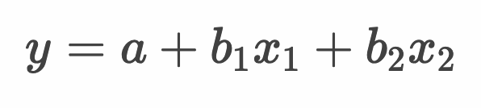
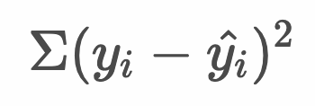
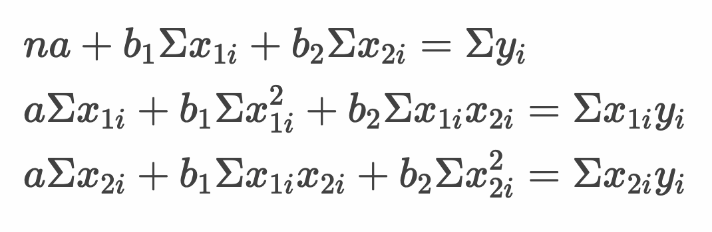
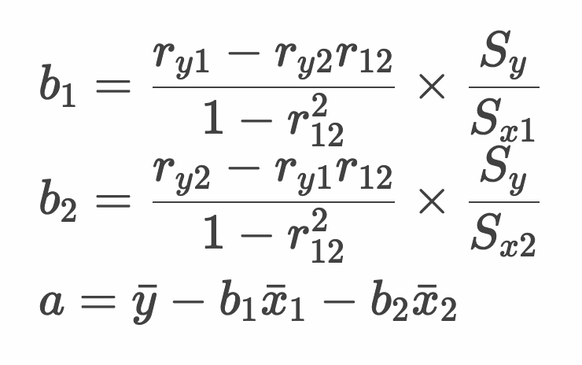
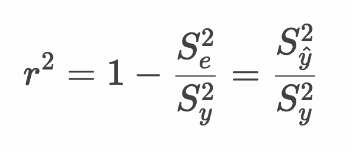
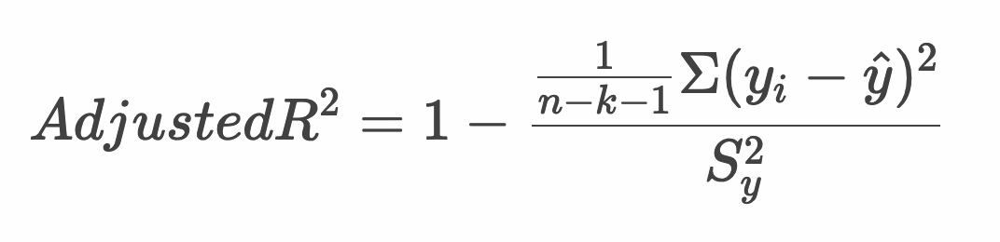

# 重回帰分析

| 距離 x1 | 部屋数 x2 | 価格 y |
|--:|--:|--:|
| 3 | 1 | 6 |
| 3 | 1 | 6.8 |
| 3 | 2 | 8.7 |
| 5 | 2 | 7.3 |
| 5 | 2 | 7 |
| 5 | 3 | 9.4 |
| 8 | 1 | 5.9 |
| 8 | 1 | 6.4 |
| 8 | 2 | 8.1 |
| 10 | 1 | 5.2 |
| 10 | 1 | 5.4 |
| 10 | 2 | 7.3 |
| 15 | 1 | 5.4 |
| 15 | 2 | 7.3 |
| 15 | 3 | 8.3 |

* 回帰分析において説明変数が複数になったものを重回帰分析と呼ぶ
* 重回帰分析においても最小二乗法で回帰係数（偏回帰係数）を算出できる
* 説明変数が増えるほど決定係数は高くなるので自由度調整済み決定係数を使う

---

## 線形回帰

* 重回帰分析において、説明変数を2つとる場合は、目的変数 y と説明変数 x1, x2 との間に以下の関係を定義する

  

  > 説明変数が3つ以上になる場合も同様に回帰係数b3, b4...と定義します。

---

## 最小二乗法

* 最小二乗法では、実測値と予測値のずれ（残差）の二乗和を最小にするパラメータ（切片と回帰係数）を求める

  

* また`y^ = a + b1x1 + b2x2` より、予測値を次のように表現できる

  


* 最小二乗法の式をパラメータa, b1, b2 で偏微分して0とおくと次のような連立方程式（正規方程式）となる

  

* 正規方程式を解くと線形回帰モデルのパラメータは以下のように算出できる

  

  > `r_y1` は `x1`と `y` の相関係数を意味します。実際には `lm` 関数でパラメータを計算できるので式を暗記する必要はありません。

---

## 自由度調整済み決定係数

* 重回帰分析においても決定係数を考えることができる

  

* ただし重回帰分析では説明変数を増やすと決定係数が高くなってしまう
* そのため説明変数の数を考慮した自由度調整済み決定係数を使って評価する

  

  > 自由度調整済み決定係数では、残差の分散を求める際に説明変数の数（ `k` ）を考慮します。

### 参考：重相関係数

* 予測値 `y^` と実測値 `y` の相関係数を重相関係数 `R` と呼ぶ
* 重相関係数 `R` を2乗した値（ `R^2` ）は決定係数と等しくなる


---


## 例：賃貸マンションの価格

* 社会人になったA君は一人暮らしをはじめようと考えている
* 賃貸マンションの部屋数と駅からの距離をもとに賃貸マンション価格を算出する

| 距離 x1 | 部屋数 x2 | 価格 y |
|--:|--:|--:|
| 3 | 1 | 6 |
| 3 | 1 | 6.8 |
| 3 | 2 | 8.7 |
| 5 | 2 | 7.3 |
| 5 | 2 | 7 |
| 5 | 3 | 9.4 |
| 8 | 1 | 5.9 |
| 8 | 1 | 6.4 |
| 8 | 2 | 8.1 |
| 10 | 1 | 5.2 |
| 10 | 1 | 5.4 |
| 10 | 2 | 7.3 |
| 15 | 1 | 5.4 |
| 15 | 2 | 7.3 |
| 15 | 3 | 8.3 |

> 以下のCSVデータを `room.csv` という名前で保存しておきます。

```csv
"distance","room","price"
3,1,6
3,1,6.8
3,2,8.7
5,2,7.3
5,2,7
5,3,9.4
8,1,5.9
8,1,6.4
8,2,8.1
10,1,5.2
10,1,5.4
10,2,7.3
15,1,5.4
15,2,7.3
15,3,8.3
```

* Rプログラムを作成する

```r
df <- read.csv("room.csv")
r_y1 <- cor(df$distance, df$price)
r_y2 <- cor(df$room, df$price)
r_12 <- cor(df$distance, df$room)
b1 <- (r_y1 - r_y2 * r_12) / (1 - r_12^2) * (sd(df$price) / sd(df$distance))
b2 <- (r_y2 - r_y1 * r_12) / (1 - r_12^2) * (sd(df$price) / sd(df$room))
a <- mean(df$price) - b1 * mean(df$distance) - b2 * mean(df$room)
b1
b2
a
```

### 実行結果

```r
> df <- read.csv("room.csv")
> r_y1 <- cor(df$distance, df$price)
> r_y2 <- cor(df$room, df$price)
> r_12 <- cor(df$distance, df$room)
> b1 <- (r_y1 - r_y2 * r_12) / (1 - r_12^2) * (sd(df$price) / sd(df$distance))
> b2 <- (r_y2 - r_y1 * r_12) / (1 - r_12^2) * (sd(df$price) / sd(df$room))
> a <- mean(df$price) - b1 * mean(df$distance) - b2 * mean(df$room)
> b1
[1] -0.08882552
> b2
[1] 1.607541
> a
[1] 5.015801
```

* 上記の実行結果から回帰式は以下のようになる

```
y = 5.016 + -0.089 * x1 + 1.608 * x2
```

* 上記の回帰式を使って以下の物件の価格を予測する
  * 駅からの距離：10
  * 部屋数：2

```r
x1 <- 10
x2 <- 2
y_hat <- 5.016 + -0.089 * x1 + 1.608 * x2
y_hat
```

### 実行結果

```
> x1 <- 10
> x2 <- 2
> y_hat <- 5.016 + -0.089 * x1 + 1.608 * x2
> y_hat
[1] 7.342
```

* 決定係数、自由度調整済み決定係数、重相関係数を計算する

```r
y <- df$price
x1 <- df$distance
x2 <- df$room
y_hat <- 5.016 + -0.089 * x1 + 1.608 * x2
e <- y - y_hat
R2 <- 1 - var(e) / var(y)
R2
k <- 2
n <- length(e)
AdujstedR2 <- 1 - ( sum((e - mean(e))^2) / (n - k - 1)  / var(y))
AdujstedR2
R <- cor(y, y_hat)  
R
```

### 実行結果

```
> y <- df$price
> x1 <- df$distance
> x2 <- df$room
> y_hat <- 5.016 + -0.089 * x1 + 1.608 * x2
> e <- y - y_hat
> R2 <- 1 - var(e) / var(y)
> R2
[1] 0.8722013
> k <- 2
> n <- length(e)
> AdujstedR2 <- 1 - ( sum((e - mean(e))^2) / (n - k - 1)  / var(y))
> AdujstedR2
[1] 0.8509016
> R <- cor(y, y_hat)  
> R
[1] 0.9339173
```

---

## Rプログラミング

### 重回帰分析 - モデルの作成 - mra1.R

* `lm` 関数で重回帰分析ができる
* `lm` 関数の第1引数には `目的変数 ~ 説明変数1 + 説明変数2` のように記述する

```r
df <- read.csv("room.csv")
model <- lm(price ~ distance + room, df)
model
```

#### 実行結果

```r
> df <- read.csv("room.csv")
> model <- lm(price ~ distance + room, df)
> model

Call:
lm(formula = price ~ distance + room, data = df)

Coefficients:
(Intercept)     distance         room  
    5.01580     -0.08883      1.60754  
```

### 重回帰分析 - データの予測 - mra2.R

* `predict` 関数で回帰式を使って予測できる
* `predict` 関数は第2引数にデータを指定する
* `predict` 関数は第2引数を省略した場合は、学習時のデータに対して予測する

```r
df <- read.csv("room.csv")
model <- lm(price ~ distance + room, df)
predict(model)
new_df <- data.frame(
  distance = c(10),
  room = c(2)
)
predict(model, new_df)
```

#### 実行結果

```r
> df <- read.csv("room.csv")
> model <- lm(price ~ distance + room, df)
> predict(model)
       1        2        3        4        5        6        7 
6.356865 6.356865 7.964406 7.786755 7.786755 9.394297 5.912738 
       8        9       10       11       12       13       14 
5.912738 7.520279 5.735087 5.735087 7.342628 5.290959 6.898500 
      15 
8.506041 
> new_df <- data.frame(
+   distance = c(10),
+   room = c(2)
+ )
> predict(model, new_df)
       1 
7.342628 
```

### 重回帰分析 - モデルのサマリー - mra3.R

* `lm` 関数の戻り値を `summary` 関数に渡すことで決定係数や自由度調整済み決定係数を確認できる

```r
df <- read.csv("room.csv")
model <- lm(price ~ distance + room, df)
summary(model)
```

#### 実行結果

```r
> df <- read.csv("room.csv")
> model <- lm(price ~ distance + room, df)
> summary(model)

Call:
lm(formula = price ~ distance + room, data = df)

Residuals:
     Min       1Q   Median       3Q      Max 
-0.78676 -0.34598 -0.01274  0.42232  0.73559 

Coefficients:
            Estimate Std. Error t value Pr(>|t|)    
(Intercept)  5.01580    0.39745  12.620 2.75e-08 ***
distance    -0.08883    0.03065  -2.898   0.0134 *  
room         1.60754    0.18263   8.802 1.39e-06 ***
---
Signif. codes:  0 ‘***’ 0.001 ‘**’ 0.01 ‘*’ 0.05 ‘.’ 0.1 ‘ ’ 1

Residual standard error: 0.4925 on 12 degrees of freedom
Multiple R-squared:  0.8722,	Adjusted R-squared:  0.8509 
F-statistic: 40.95 on 2 and 12 DF,  p-value: 4.357e-06
```

> 決定係数：Multiple R-squared:  0.8722、自由度調整済み決定係数：Adjusted R-squared:  0.8509 を確認できます。

---

## エクササイズ

### 設問 1

Rの `trees` データセットについて、`Volume` を目的変数、 `Girth`、 `Height` を説明変数として以下のとおり分析してください。

> `Volume` は体積、`Girth` は直径、`Height` は高さを意味します。

* 回帰式 y = a + b1 * x1 + b2 * x2 を求めてください。
* 決定係数を求めてください。
* 自由度調整済み決定係数を求めてください。
* `Girth` が 12、 `Height` が 80 のとき `Volume` はいくらになるか求めてください。 

### 設問 2

次のCSVデータ（ `my_data.csv` ）があります。

```csv
"x1","x2","x3","y"
93,44,9,634
117,49,11,746
121,51,10,755
115,49,10,719
100,54,7,696
112,46,6,762
99,57,8,659
111,54,11,720
96,48,11,629
110,43,10,760
96,43,6,629
103,48,14,630
107,51,8,721
97,54,7,699
105,52,10,686
109,48,11,727
119,51,8,836
116,49,9,797
101,57,12,699
111,50,10,781
```

`my_data.csv` ファイルについて、`y` を目的変数、 `x1`、 `x2`、`x3` を説明変数として以下のとおり分析してください。

* 回帰式 y = a + b1 * x1 + b2 * x2 + b3 * x3 を求めてください。
* 決定係数を求めてください。
* 自由度調整済み決定係数を求めてください。
* `x1` が 100、 `x2` が 50、`x3` が 10のとき `y` はいくらになるか求めてください。 

<!-- 

# 1

model <- lm(Volume ~ Girth + Height, trees)
summary(model)
cor(trees$Volume, predict(model))
x1 <- 12
x2 <- 80
y_hat = -57.9877 + 4.7082 * x1 + 0.3393 * x2
y_hat

> model <- lm(Volume ~ Girth + Height, trees)
> summary(model)

Call:
lm(formula = Volume ~ Girth + Height, data = trees)

Residuals:
    Min      1Q  Median      3Q     Max 
-6.4065 -2.6493 -0.2876  2.2003  8.4847 

Coefficients:
            Estimate Std. Error t value Pr(>|t|)    
(Intercept) -57.9877     8.6382  -6.713 2.75e-07 ***
Girth         4.7082     0.2643  17.816  < 2e-16 ***
Height        0.3393     0.1302   2.607   0.0145 *  
---
Signif. codes:  0 ‘***’ 0.001 ‘**’ 0.01 ‘*’ 0.05 ‘.’ 0.1 ‘ ’ 1

Residual standard error: 3.882 on 28 degrees of freedom
Multiple R-squared:  0.948,	Adjusted R-squared:  0.9442 
F-statistic:   255 on 2 and 28 DF,  p-value: < 2.2e-16

> cor(trees$Volume, predict(model))
[1] 0.9736273
> x1 <- 12
> x2 <- 80
> y_hat = -57.9877 + 4.7082 * x1 + 0.3393 * x2
> y_hat
[1] 25.6547


# 2

df <- read.csv("my_data.csv")
model <- lm(y~x1+x2+x3, df)
summary(model)
cor(df$y, predict(model))
predict(model, data.frame(x1 = 100, x2 = 50, x3 = 10))

> df <- read.csv("my_data.csv")
> model <- lm(y~x1+x2+x3, df)
> summary(model)

Call:
lm(formula = y ~ x1 + x2 + x3, data = df)

Residuals:
    Min      1Q  Median      3Q     Max 
-43.182 -18.620  -3.817  22.821  45.866 

Coefficients:
            Estimate Std. Error t value Pr(>|t|)    
(Intercept)   59.351    120.577   0.492   0.6292    
x1             6.172      0.809   7.628 1.02e-06 ***
x2             1.332      1.663   0.801   0.4347    
x3            -7.587      3.332  -2.277   0.0369 *  
---
Signif. codes:  0 ‘***’ 0.001 ‘**’ 0.01 ‘*’ 0.05 ‘.’ 0.1 ‘ ’ 1

Residual standard error: 29.53 on 16 degrees of freedom
Multiple R-squared:  0.789,	Adjusted R-squared:  0.7495 
F-statistic: 19.95 on 3 and 16 DF,  p-value: 1.181e-05

> cor(df$y, predict(model))
[1] 0.8882742
> predict(model, data.frame(x1 = 100, x2 = 50, x3 = 10))
       1 
667.2471 
-->