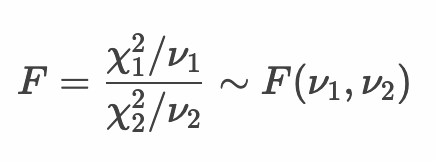
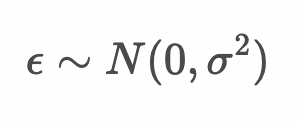
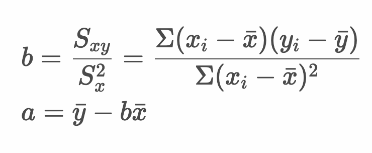
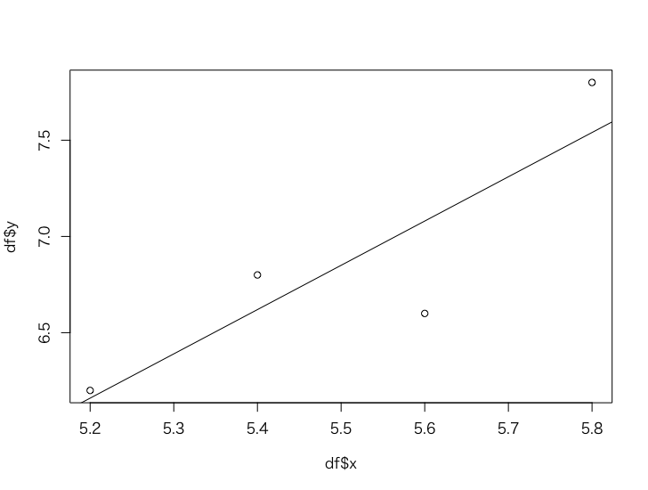

# 参考：F検定


* これまでに学習してきた回帰分析を母集団から得られた標本についての回帰分析と考える
* 標本は確率変数であるから、サンプリングされた標本によって回帰式も変わる
* 母集団には真の回帰直線が存在するものと考える

---

## 回帰の有意性の検定（F検定）

* 標本から作成した回帰式についてF検定を行うことで回帰式の有意性を確認できる
* 帰無仮説：回帰式の切片を除くすべての回帰係数が0である
* 対立仮説：回帰式の切片を除く少なくとも1つの回帰係数は0でない

> 帰無仮説に基づいて確率を考えることで、極端に低い確率（有意水準を下回る確率）であるときに帰無仮説を棄却します（対立仮説を採択します）。

---

## F分布

* F分布とは、カイ二乗分布にしたがう独立した2つの確率変数の比がしたがう確率分布
* F分布は2つの自由度をパラメータに持つ
* 2つの確率変数の等分散性の検定にF分布を使う


>  F分布の分布の形状はパラメータ（2つの自由度）によって異なります。横軸（X軸）は常に0以上の値をとります。

--- 

## 統計量F

* 統計量Fはカイ二乗分布にしたがう独立した2つの確率変数の比

  

* 自由度ν1, ν2 を2標本のサイズ m , n で置き換えると以下のようになる

  


* 統計量 χ2値 は以下のとおり

  

  > `(n-1)s^2` は分散を(n-1)倍したものです。つまり偏差平方和です。

---

## 母集団の回帰直線

* 母集団における回帰直線を以下のように表現する

  

  

  

> y = a + bx ではない点に注意してください。母集団のパラメータをα、βとしています。

* ここで `α` は母集団における真の回帰直線における切片、`β` は傾き、`ε` は誤差を表す
* 誤差 `ε` は平均：`0`、分散：`σ^2` の正規分布にしたがう ε〜N(0, σ^2)
* 目的変数 `y` は平均：`α + βx` 分散：`σ^2` の正規分布にしたがう y〜N(α+βx, σ^2)

---

## 参考：標本から得られた回帰式の傾きと切片について

* 標本から傾きと切片は以下のように算出できる（以下の正規方程式から線形回帰モデルのパラメータ a , b を計算できる）

  

* 上記の連立方程式を a, b について解くと次のようになる

  

---

## 例： ある植物の花びらの縦幅と横幅

* ある植物の花びらの縦幅と横幅の関係を整理すると次のようになった

  |縦幅 x|横幅 y|
  |--:|--:|
  |5.2|6.2|
  |5.4|6.8|
  |5.6|6.6|
  |5.8|7.8|

* Rプログラムで回帰式のサマリーを出力する

```r
df <- data.frame(
  x <- c(5.2, 5.4, 5.6, 5.8),
  y <- c(6.2, 6.8, 6.6, 7.8)
)
model <- lm(formula = y ~ x, data = df)
summary(model)
plot(df$x, df$y)
abline(model)
```

#### 実行結果

```r
> df <- data.frame(
+   x <- c(5.2, 5.4, 5.6, 5.8),
+   y <- c(6.2, 6.8, 6.6, 7.8)
+ )
> model <- lm(formula = y ~ x, data = df)
> summary(model)

Call:
lm(formula = y ~ x, data = df)

Residuals:
    1     2     3     4 
 0.04  0.18 -0.48  0.26 

Coefficients:
            Estimate Std. Error t value Pr(>|t|)
(Intercept)   -5.800      5.015  -1.157    0.367
x              2.300      0.911   2.525    0.128

Residual standard error: 0.4074 on 2 degrees of freedom
Multiple R-squared:  0.7612,	Adjusted R-squared:  0.6417 
F-statistic: 6.373 on 1 and 2 DF,  p-value: 0.1276

> plot(df$x, df$y)
> abline(model)
```



* ここでF検定の出力について確認する

```r
F-statistic: 6.373 on 1 and 2 DF,  p-value: 0.1276
```

> F分布（自由度1, 2）においてF値は6.373 であり、そのp値は0.1276であるとわかります。有意水準5%の場合、帰無仮説は棄却されません。つまり作成したモデルについては、有意性がある（意味のある）ともそうでないとも言えない、ということになります。

---

## 参考：F検定

* F分布とは、カイ二乗分布にしたがう独立した2つの確率変数の比がしたがう確率分布
* 回帰分析においては、実測値と予測値のずれ（残差）の偏差平方和と、予測値と実測値の平均のずれ（回帰）の偏差平方和の比がF分布にしたがう
* ただし自由度については以下のように計算する

  

  > 回帰と残差は独立しているので、総平方和は、回帰による平方和と残差による平方和に分解できます。

  


#### Rプログラム

```r
df <- data.frame(
  x <- c(5.2, 5.4, 5.6, 5.8),
  y <- c(6.2, 6.8, 6.6, 7.8)
)
model <- lm(formula = y ~ x, data = df)
summary(model)
k <- 1
n <- length(df$y)
ssy_hat <- sum((predict(model) - mean(y))^2)
sse <- sum((y - predict(model))^2)
f <- (ssy_hat / k) / (sse / (n - k - 1))
f
```

#### 実行結果

```r
> df <- data.frame(
+   x <- c(5.2, 5.4, 5.6, 5.8),
+   y <- c(6.2, 6.8, 6.6, 7.8)
+ )
> model <- lm(formula = y ~ x, data = df)
> summary(model)

Call:
lm(formula = y ~ x, data = df)

Residuals:
    1     2     3     4 
 0.04  0.18 -0.48  0.26 

Coefficients:
            Estimate Std. Error t value Pr(>|t|)
(Intercept)   -5.800      5.015  -1.157    0.367
x              2.300      0.911   2.525    0.128

Residual standard error: 0.4074 on 2 degrees of freedom
Multiple R-squared:  0.7612,	Adjusted R-squared:  0.6417 
F-statistic: 6.373 on 1 and 2 DF,  p-value: 0.1276

> k <- 1
> n <- length(df$y)
> ssy_hat <- sum((predict(model) - mean(y))^2)
> sse <- sum((y - predict(model))^2)
> f <- (ssy_hat / k) / (sse / (n - k - 1))
> f
[1] 6.373494
```

> `summary` 関数の `F-statistic: 6.373 on 1 and 2 DF` と計算で求めた値が一致しているのがわかります。