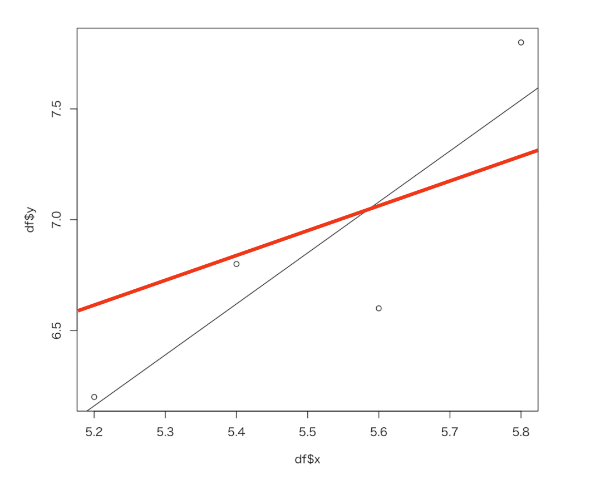
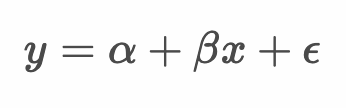
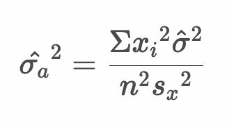
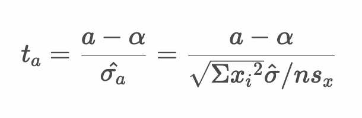
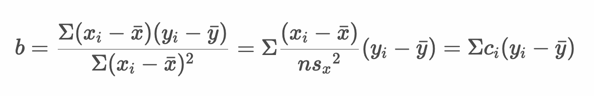

# 参考：回帰係数のt検定



* これまでに学習してきた回帰分析を母集団から得られた標本についての回帰分析と考える
* 標本は確率変数であるから、サンプリングされた標本によって回帰式も変わる
* 母集団には真の回帰直線が存在するものと考える

---

## 回帰係数のt検定 

* 手元の標本から得られた回帰式の回帰係数（傾きや切片）が意味のあるものかどうかを考える
* 回帰係数の検定にはt検定を使う
* t値は以下の式で計算できる

  

  > このときt値は、自由度(`n - k`)のt分布にしたがいます（kはパラメータ数）。計算式の詳細については後述します。

---

## t分布

* t分布とは正規分布のばらつきを大きくしたようなベル型の分布
* パラメータに自由度を受けとる
* 標本から算出した統計量t（t値）はt分布にしたがう

  

  > t分布はパラメータに自由度を受け取ります。パラメータの自由度によって形状が決まります。

---

## 母集団の回帰直線

* 母集団における回帰直線を以下のように表現する

  

  

  

> y = a + bx ではない点に注意してください。母集団のパラメータをα、βとしています。

* ここで `α` は母集団における真の回帰直線における切片、`β` は傾き、`ε` は誤差を表す
* 誤差 `ε` は平均：`0`、分散：`σ^2` の正規分布にしたがう ε〜N(0, σ^2)
* 目的変数 `y` は平均：`α + βx` 分散：`σ^2` の正規分布にしたがう y〜N(α+βx, σ^2)

---

## 参考：標本から得られた回帰式の傾きと切片について

* 標本から傾きと切片は以下のように算出できる（以下の正規方程式から線形回帰モデルのパラメータ a , b を計算できる）

  

* 上記の連立方程式を a, b について解くと次のようになる

  

---

## 例： ある植物の花びらの縦幅と横幅

* ある植物の花びらの縦幅と横幅の関係を整理すると次のようになった

  |縦幅 x|横幅 y|
  |--:|--:|
  |5.2|6.2|
  |5.4|6.8|
  |5.6|6.6|
  |5.8|7.8|

* Rプログラムで回帰式のサマリーを出力する

```r
df <- data.frame(
  x <- c(5.2, 5.4, 5.6, 5.8),
  y <- c(6.2, 6.8, 6.6, 7.8)
)
model <- lm(formula = y ~ x, data = df)
summary(model)
plot(df$x, df$y)
abline(model)
```

#### 実行結果

```r
> df <- data.frame(
+   x <- c(5.2, 5.4, 5.6, 5.8),
+   y <- c(6.2, 6.8, 6.6, 7.8)
+ )
> model <- lm(formula = y ~ x, data = df)
> summary(model)

Call:
lm(formula = y ~ x, data = df)

Residuals:
    1     2     3     4 
 0.04  0.18 -0.48  0.26 

Coefficients:
            Estimate Std. Error t value Pr(>|t|)
(Intercept)   -5.800      5.015  -1.157    0.367
x              2.300      0.911   2.525    0.128

Residual standard error: 0.4074 on 2 degrees of freedom
Multiple R-squared:  0.7612,	Adjusted R-squared:  0.6417 
F-statistic: 6.373 on 1 and 2 DF,  p-value: 0.1276

> plot(df$x, df$y)
> abline(model)
```


* ここで回帰係数の出力について確認する

```r
Coefficients:
            Estimate Std. Error t value Pr(>|t|)
(Intercept)   -5.800      5.015  -1.157    0.367
x              2.300      0.911   2.525    0.128
```

> 切片 a = -5.8、傾き b = 2.3 と読み取ることができます。

* このとき回帰係数以外にも以下の項目を確認できる

|項目名|意味|
|:--|:--|
| Std. Error|標準誤差（SE）|
| t value |t値 （回帰係数をSEで割った値）|
| Pr(>\|t\|) |p値 （t分布においてt値が出現する確率）| 

> これらは母集団における真の回帰直線において、回帰係数を0としたとき（帰無仮説）の指標です。有意水準を5%とする場合、p値が5%を下回ると回帰係数は 0 ではないと考えることができます。

---

## 参考：回帰係数（傾き b）のt検定

> 回帰分析を行う上では複雑な計算はすべてRに任せることがことができます。以下に回帰係数の検定の流れをまとめます。

* 回帰係数 `b` は確率変数であり、その期待値と分散は以下のようになる

  

  > ここで回帰係数 `b` の期待値は `β` に一致します。また `b` の分散に含まれる `σ^2` は母集団の真の回帰式における誤差（ `ε` ）の分散です。期待値と分散の証明については後述します。

* また確率変数 `b` は以下の正規分布にしたがう

  

* 確率変数 `b` を標準化すると標準正規分布にしたがう

  

  > このとき `σb` に含まれる `σ^2` （誤差 `ε` の分散）は不明であるため、誤差の不偏推定量である残差 `e` の分散を使います。

* 残差 `e` の分散を求める 

  

  > このとき、自由度は `n - 2` となる点に注意してください。残差の自由度は `n - k` （kはパラメータ数、この場合、 `α` , `β` の2つ）となります。

* 確率変数 `b` の分散を上記で求めた推定量（残差の分散）で定義する

  

* 両辺の平方根（確率変数 `b` の標準偏差）を求める

  

* 上記の推定量を使ってt値を算出する

  

  > 一般的に回帰係数の仮説検定においては、βに0を代入したものを帰無仮説として仮説検定を行います。つまり帰無仮説においてp値が小さくなるとき、帰無仮説を棄却することで、βは0でないと考えることができます。

#### Rプログラム

```r
df <- data.frame(
  x <- c(5.2, 5.4, 5.6, 5.8),
  y <- c(6.2, 6.8, 6.6, 7.8)
)
model <- lm(formula = y ~ x, data = df)
summary(model)
my_var <- function(x) {
  var(x) * (length(x) - 1) / length(x)
}
my_sd <- function(x) {
  sqrt(my_var(x))
}
n <- length(df$y)
sigma_hat2 <- (1 / (n - 2)) * sum(model$residuals^2)
sigma_b_hat <- sqrt(sigma_hat2) / (sqrt(n) * my_sd(df$x)) 
t <- (2.3 - 0) / sigma_b_hat 
t
```

#### 実行結果

```r
> df <- data.frame(
+   x <- c(5.2, 5.4, 5.6, 5.8),
+   y <- c(6.2, 6.8, 6.6, 7.8)
+ )
> model <- lm(formula = y ~ x, data = df)
> summary(model)

Call:
lm(formula = y ~ x, data = df)

Residuals:
    1     2     3     4 
 0.04  0.18 -0.48  0.26 

Coefficients:
            Estimate Std. Error t value Pr(>|t|)
(Intercept)   -5.800      5.015  -1.157    0.367
x              2.300      0.911   2.525    0.128

Residual standard error: 0.4074 on 2 degrees of freedom
Multiple R-squared:  0.7612,	Adjusted R-squared:  0.6417 
F-statistic: 6.373 on 1 and 2 DF,  p-value: 0.1276

> my_var <- function(x) {
+   var(x) * (length(x) - 1) / length(x)
+ }
> my_sd <- function(x) {
+   sqrt(my_var(x))
+ }
> n <- length(df$y)
> sigma_hat2 <- (1 / (n - 2)) * sum(model$residuals^2)
> sigma_b_hat <- sqrt(sigma_hat2) / (sqrt(n) * my_sd(df$x)) 
> t <- (2.3 - 0) / sigma_b_hat 
> t
[1] 2.524578
```

> summary関数の出力に含まれるt値と、後の計算で求めたt値が一致していることがわかります。

---

## 参考：回帰係数（傾き a）のt検定

* 回帰係数 `a` は確率変数であり、その期待値と分散は以下のようになる

  

  > ここで回帰係数 `a` の期待値は `α` に一致します。また `a` の分散に含まれる `σ^2` は母集団の真の回帰式における誤差（ `ε` ）の分散です。期待値と分散の証明については後述します。

* また確率変数 `a` は以下の正規分布にしたがう

  

* 確率変数 `a` を標準化すると標準正規分布にしたがう

  

  > このとき `σ_a` に含まれる `σ^2` （誤差 `ε` の分散）は不明であるため、誤差の不偏推定量である残差 `e` の分散を使います。

* 残差 `e` の分散を求める 

  

  > このとき、自由度は `n - 2` となる点に注意してください。残差の自由度は `n - k` （kはパラメータ数、この場合、a, b の2つ）となります。

* 確率変数 `a` の分散を上記で求めた推定量（残差の分散）で定義する

  

* 両辺の平方根（確率変数 `a` の標準偏差）を求める

  

* 上記の推定量を使ってt値を算出する

  

  > 一般的に回帰係数の仮説検定においては、`α`に0を代入したものを帰無仮説として仮説検定を行います。つまり帰無仮説においてp値が小さくなるとき、帰無仮説を棄却することで、`α`は0でないと考えることができます。また求めたt値は自由度（n - k）のt分布（この場合、パラメータ数である `k` は `α` 、 `β` の2つであるため自由度2のt分布）にしたがいます。

#### Rプログラム

```r
df <- data.frame(
  x <- c(5.2, 5.4, 5.6, 5.8),
  y <- c(6.2, 6.8, 6.6, 7.8)
)
model <- lm(formula = y ~ x, data = df)
summary(model)
my_var <- function(x) {
  var(x) * (length(x) - 1) / length(x)
}
my_sd <- function(x) {
  sqrt(my_var(x))
}
n <- length(df$y)
sigma_hat2 <- (1 / (n - 2)) * sum(model$residuals^2)
sigma_a_hat <- sqrt(sum(df$x^2) * sigma_hat2) / (n * my_sd(df$x)) 
t <- (-5.8 - 0) / sigma_a_hat 
t
```

#### 実行結果

```r
> df <- data.frame(
+   x <- c(5.2, 5.4, 5.6, 5.8),
+   y <- c(6.2, 6.8, 6.6, 7.8)
+ )
> model <- lm(formula = y ~ x, data = df)
> summary(model)

Call:
lm(formula = y ~ x, data = df)

Residuals:
    1     2     3     4 
 0.04  0.18 -0.48  0.26 

Coefficients:
            Estimate Std. Error t value Pr(>|t|)
(Intercept)   -5.800      5.015  -1.157    0.367
x              2.300      0.911   2.525    0.128

Residual standard error: 0.4074 on 2 degrees of freedom
Multiple R-squared:  0.7612,	Adjusted R-squared:  0.6417 
F-statistic: 6.373 on 1 and 2 DF,  p-value: 0.1276

> my_var <- function(x) {
+   var(x) * (length(x) - 1) / length(x)
+ }
> my_sd <- function(x) {
+   sqrt(my_var(x))
+ }
> n <- length(df$y)
> sigma_hat2 <- (1 / (n - 2)) * sum(model$residuals^2)
> sigma_a_hat <- sqrt(sum(df$x^2) * sigma_hat2) / (n * my_sd(df$x)) 
> t <- (-5.8 - 0) / sigma_a_hat 
> t
[1] -1.156559
```

> summary関数の出力に含まれるt値と、後の計算で求めたt値が一致していることがわかります。

---

## 参考：回帰係数（傾き：b）の期待値と分散について

* 傾き `b` は以下のように計算できる - ①

  

  * 上記の `c_i` は以下のとおり 

    

  * また `Σc_i` は 0 となる - ②

    

* ①に②の計算を適用すると傾き b は以下のように計算できる - ③

  

  > ここで `y_i` は確率変数です。 一方で `Σc_i` は確率変数ではなく `x` から決まる定数である点に注意します。

* ③の式の `y` に `α + βx_i +  ε_i` を代入する - ④

  

  * ④では以下の変換を行っている

    

  * ④では以下の変換を行っている

    

  * 結果として傾き `b` は次のようになる

    

* 確率変数 `b` の期待値を計算する

  

  > 確率変数 `b` の期待値は母集団における真の回帰係数である `β` に等しくなります。

* 確率変数 `b` の分散を計算する

  

  > `σ^2` は誤差 `ε` の分散です。

  * ここで `Σc_i^2` は以下のように計算できる

    

  * よって確率変数 `b` の分散は以下のようになる

    

---

## 参考：回帰係数（切片：a）の期待値と分散について

* 切片 `a` は以下のように計算できる - ①

  

* 切片 `a` の期待値は以下のとおり

  

* 続いて、切片 `a` の分散を求めるために①の式を変形する

  

  * ここでは以下の計算式を利用している
   
    

* 切片 `a` の分散を求める - ②

  

  * ここで `y_i` の分散は `σ^2` であるから - ③

    

  * ②の式に③を代入する

    

  * 2乗を計算する 

    

  * 各項にΣを計算する - ④

    
  
  * ここで `Σc_i` = 0である - ⑤

    

  * ④に⑤を代入する - ⑥

    

  * また `Σc_i^2` は以下のとおり - ⑦

    

  * ⑥に⑦を代入する - ⑧

    

  * ここで `ns_x^2` は以下のとおり変形できる - ⑨

    

  * ⑧に⑨を代入すると切片 `a` の分散は以下のようになる

    


--- 