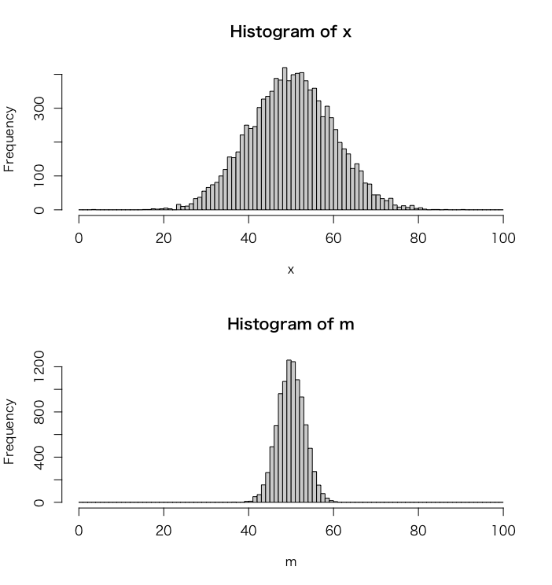

# 正規分布

## 確率密度関数

$$
f(x) = \frac{1}{\sqrt{2\pi\sigma^2}}\exp(\frac{-(x - \mu)^2}{2\sigma^2})
$$

## サンプルコード

```r
x <- seq(0, 100, 0.1)
y <- dnorm(x, mean = 50, sd = 10)
plot(x, y, type="l")
```

---

# 正規分布と標本平均

* 母集団の従う正規分布

$$ 
X \sim N(50, 100)
$$

* 標本平均の従う正規分布

$$ 
\bar{X} \sim N(50, \frac{100}{n})
$$


```r
par(mfrow=c(2, 1))
x <- rnorm(10000, mean = 50, sd = 10)
hist(x, seq(0, 100, 1))

m <- numeric(10000)
for (i in 1:10000) {
  x <- rnorm(10, mean = 50, sd = 10)
  m[i] <- mean(x)
}
hist(m, breaks = seq(0, 100, 1))
```



$$
E(X) = 50 \\
V(X) = 100
$$

$$
E(\bar{X}) = 50 \\
V(\bar{X}) = 10
$$

$$
E(\bar{X}) = E(\frac{1}{10}\sum_{i=1}^{10} X_i) = \frac{1}{10}(E(X_1) + E(X_2) + \dots + E(X_{10})) = 50 \\
V(\bar{X}) = V(\frac{1}{10}\sum_{i=1}^{10} X_i) = \frac{1}{10^2}(V(X_1) + V(X_2) + \dots + V(X_{10})) =10
$$


* 母集団の従う正規分布

$$ 
X \sim N(\mu, \sigma^2)
$$

* 標本平均の従う正規分布

$$ 
\bar{X} \sim N(\mu, \frac{\sigma^2}{n})
$$

---

## 仮説検定 - 母分散が既知の場合

### 標本平均の標準化

$$
z = \frac{\bar{x} - \mu}{\frac{\sigma}{\sqrt{n}}} \sim N(0, 1)
$$

### 95%信頼区間

$$
-1.96 \leq z \leq 1.96
$$

### 仮説検定（母分散が既知の場合）

* ある品種の植物の花びらのサイズをサンプリングしたところ以下のとおりでした。

```
5.1, 4.9, 4.7, 4.6, 5.0, 5.4, 4.6, 5.0, 4.4, 4.9
```

* またこの植物の母分散は0.1と仮定できるものとします。この植物の花びらのサイズは5.0といえるか。有意水準5%で仮説検定してください。

```r
x <- c(5.1, 4.9, 4.7, 4.6, 5.0, 5.4, 4.6, 5.0, 4.4, 4.9)
m <- mean(x)
(m - 5) / (0.2 / sqrt(10))
```

```r
> x <- c(5.1, 4.9, 4.7, 4.6, 5.0, 5.4, 4.6, 5.0, 4.4, 4.9)
> m <- mean(x)
> (m - 5) / (0.2 / sqrt(10))
[1] -2.213594
```

```r
library(BSDA)
z.test(x, mu = 5, sigma.x = 0.2)
```

```r
> library(BSDA)
> z.test(x, mu = 5, sigma.x = 0.2)

	One-sample z-Test

data:  x
z = -2.2136, p-value = 0.02686
alternative hypothesis: true mean is not equal to 5
95 percent confidence interval:
 4.736041 4.983959
sample estimates:
mean of x 
     4.86 
```

---

## 仮説検定 - 母分散が未知の場合

### 統計量t

$$
t = \frac{\bar{x} - \mu}{\frac{s}{\sqrt{n}}} \sim t(\nu = n - 1)
$$

### 95%信頼区間

$$
t_{0.025}(n-1) \leq z \leq t_{0.975}(n-1)
$$

### 仮説検定（母分散が未知の場合）

* ある品種の植物の花びらのサイズをサンプリングしたところ以下のとおりでした。

```
5.1, 4.9, 4.7, 4.6, 5.0, 5.4, 4.6, 5.0, 4.4, 4.9
```

* この植物の花びらのサイズは5.0といえるか。有意水準5%で仮説検定してください。

```r
x <- c(5.1, 4.9, 4.7, 4.6, 5.0, 5.4, 4.6, 5.0, 4.4, 4.9)
m <- mean(x)
t <- (m - 5) / (sd(x) / sqrt(10))
t
pt(t, df = 9) * 2
```

```r
> x <- c(5.1, 4.9, 4.7, 4.6, 5.0, 5.4, 4.6, 5.0, 4.4, 4.9)
> m <- mean(x)
> t <- (m - 5) / (sd(x) / sqrt(10))
> t
[1] -1.519507
> pt(t, df = 9) * 2
[1] 0.1629542
```

```r
t.test(x, mu = 5)
```

```r
> t.test(x, mu = 5)

	One Sample t-test

data:  x
t = -1.5195, df = 9, p-value = 0.163
alternative hypothesis: true mean is not equal to 5
95 percent confidence interval:
 4.651576 5.068424
sample estimates:
mean of x 
     4.86 
```