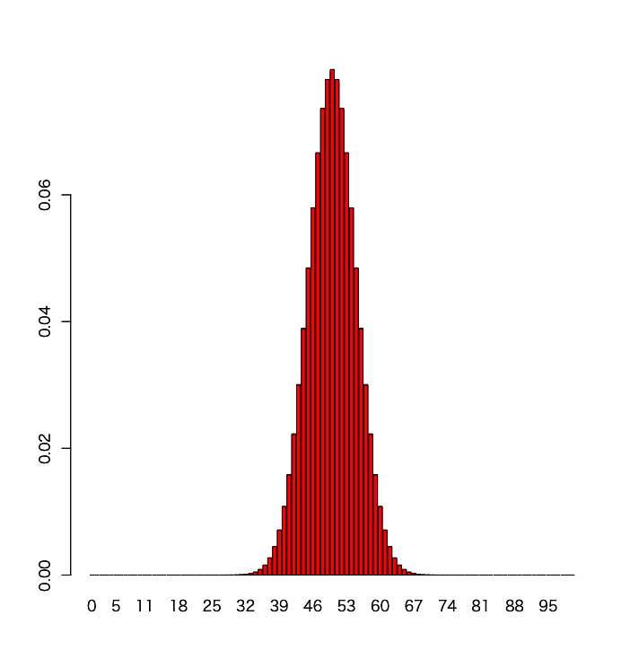

# 確率変数

## 離散型確率変数

### 期待値

$$
E(X) = \sum_{i=1}^nx_iP(x_i)
$$

### 分散

$$
V(X) = \sum_{i=1}^n(x_i - \mu)^2P(x_i)
$$

$$
V(X) = E(X^2) - E(X)^2
$$

### 例題-サイコロの期待値と分散

|X|1|2|3|4|5|6|
|:--|:--|:--|:--|:--|:--|:--|
|P(X)|1/6|1/6|1/6|1/6|1/6|1/6|

$$
E(X) = 1 * 1/6 + 2 * 1/6 + 3 * 1/6 + 4 * 1/6 + 5 * 1/6 + 6 * 1/6 = 3.5
$$

$$
V(X) = (1 - 3.5)^2 * 1/6 + (2 - 3.5)^2 * 1/6 + (3 - 3.5)^2 * 1/6 + (4 - 3.5)^2 * 1/6 + (5 - 3.5)^2 * 1/6 + (6 - 3.5)^2 * 1/6 = 2.9167
$$

```r
x <- 1:6
px <- rep(1/6, 6)
x %*% px
(x - mean(x))^2 %*% px
```

```r
> x <- 1:6
> px <- rep(1/6, 6)
> x %*% px
     [,1]
[1,]  3.5
> (x - mean(x))^2 %*% px
         [,1]
[1,] 2.916667
```

---

## 参考-連続型確率変数

### 期待値

$$
E(X) = \int_{-\infty}^{\infty} xf(x)dx
$$

### 分散

$$
V(X) = \int_{-\infty}^{\infty} (x - \mu)^2f(x)dx
$$

---

# 確率分布

## 二項分布

$$
P(X=x) = {}_nC_xp^x(1-p)^{n-x}
$$

### 3枚のコイン投げで表の出る枚数

* n = 3
* p = 1

|X|0|1|2|3|
|:--|:--|:--|:--|:--|
|P(X)|0.125|0.375|0.375|0.125|

#### 3枚のコイン投げで表の出る枚数の期待値

$$
\begin{align*}
E(X) &= \sum_{i=1}^nx_iP(x_i) \\
&= 0 * 0.125 + 1 * 0.375 + 2 * 0.375 + 3 * 0.125 \\
&= 1.5
\end{align*}
$$

#### 3枚のコイン投げで表の出る枚数の分散

$$
\begin{align*}
V(X) &= \sum_{i=1}^n(x_i - \mu)^2P(x_i) \\
&= (0-1.5)^2 * 0.125 + (1-1.5)^2 * 0.375 + (2-1.5)^2 * 0.375 + (3-1.5)^2 * 0.125 \\
&= 0.75
\end{align*}
$$

> 二項分布の期待値はnp 、分散はnp(1-p)で求めることもできる

```r
x <- 0:3
px <- dbinom(x, 3, 0.5)
m <- as.vector(x %*% px)
m
x2 <- (x - m)^2
v <- as.vector(x2 %*% px)
v
```

```r
> x <- 0:3
> px <- dbinom(x, 3, 0.5)
> m <- as.vector(x %*% px)
> m
[1] 1.5
> x2 <- (x - m)^2
> v <- as.vector(x2 %*% px)
> v
[1] 0.75
```

---

## 二項分布の正規分布近似

* nが大きいとき、二項分布は正規分布に近似できる

```r
n <- 100
p <- 0.5
x <- 0:n
prob <- dbinom(x, n, p)
barplot(prob, names.arg = x)
```

```r
n <- 100
p <- 0.5
x <- 0:n
prob <- dbinom(x, n, p)
barplot(prob, names.arg = x)
barplot(dnorm(x, mean=50, sd=sqrt(25)), names.arg = x, add = T, col = "red")
```

