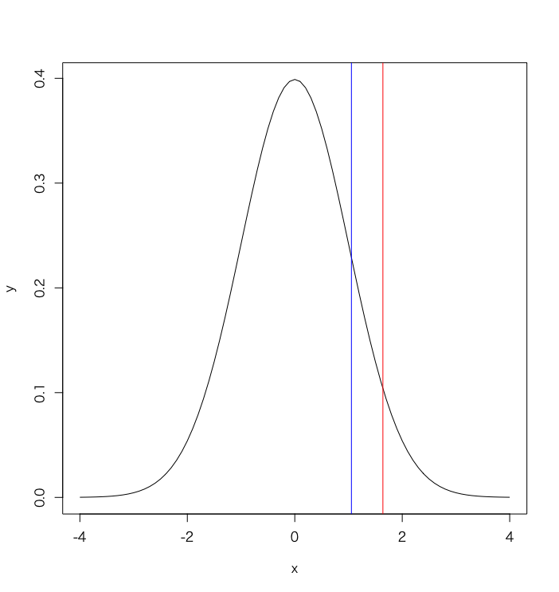
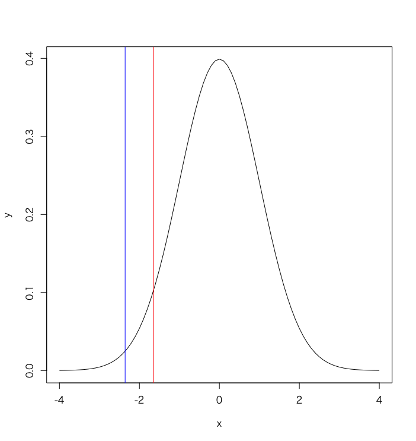

# 演習 - 正規分布の近似

## 演習1

* 企業Aは顧客に対してセールの案内メールを配信します。
* 企業Aには、セールの案内メールの開封率は10%というデータがあるものとします。
* 今回、対象の顧客1000人に対して案内メールを配信したところ110件の開封がありました。
* 今回のメールは、これまでの開封率と比べて有意差があると言えるのでしょうか。有意水準5%で片側検定してください。
* ただし、正規分布に近似して考えるものとします。

<!-- 

$$
\begin{aligned}
n &= 1000 \\
p &= 0.1 \\
np &= 100 \\
np(1-p) &= 90 \\
X &\sim N(np, np(1-p)) = N(100, 90)\\
z &= \frac{110 - 100}{\sqrt{90}} \risingdotseq 1.05... \\
p &= 14.59\%
\end{aligned}
$$

> より高度な近似を求める場合、連続補正（半整数補正）を適用します。この場合、110ではなく109.5を使います。


```r
n <- 1000
p <- 0.1
np <- n * p
npq <- n * p * (1-p)
z <- (110 - np) / sqrt(npq)
pnorm(z, 0, 1, lower.tail = F)

x <- seq(-4, 4, 0.1)
y <- dnorm(x, 0, 1)
plot(x, y, type="l")
abline(v = 1.64, col="red")
abline(v = z, col="blue")
```



-->

---

## 演習2

* ある医療メーカーAが開発した薬Bは、90%の改善効果があると発表されています。
* 実際に200人の利用者の効果を測定したところ170人に効果がありました。
* この薬Bは90%の改善効果があると言えるか。有意水準5%で片側検定してください。
* ただし、正規分布に近似して考えるものとします。

<!-- 

$$
\begin{aligned}
n &= 200 \\
p &= 0.9 \\
np &= 180 \\
np(1-p) &= 18 \\
X &\sim N(np, np(1-p)) = N(180, 18)\\
z &= \frac{170 - 180}{\sqrt{18}} \risingdotseq -2.357... \\
p &= 0.009\%
\end{aligned}
$$


```r
n <- 200
p <- 0.9
np <- n * p
npq <- n * p * (1-p)
z <- (170 - np) / sqrt(npq)
pnorm(z, 0, 1, lower.tail = T)

x <- seq(-4, 4, 0.1)
y <- dnorm(x, 0, 1)
plot(x, y, type="l")
abline(v = -1.64, col="red")
abline(v = z, col="blue")
```



-->

---

## 演習3

* 企業Aが顧客に対してセールの案内メールを配信します。
* 企業Aには、セールの案内メールの開封率は10%というデータがあるものとします。
* 今回、対象の顧客1000人に対して案内メールを配信したところ11%の開封率であった。
* 今回のメールは、これまでの開封率と比べて有意差があると言えるのでしょうか。有意水準5%で片側検定してください。
* ただし、正規分布に近似して考えるものとします。

<!-- 

$$
\begin{aligned}
n &= 1000 \\
p &= 0.1 \\
np &= 100 \\
np(1-p) &= 90 \\
X &\sim N(np/n, np(1-p)/n^2) = N(0.10, 0.00009)\\
z &= \frac{0.11 - 0.10}{\sqrt{0.09}} \risingdotseq 1.05... \\
p &= 14.59\%
\end{aligned}
$$

```r
n <- 1000
p <- 0.1
np <- n * p / n
npq <- n * p * (1-p) / n^2
z <- (0.11 - np) / sqrt(npq)
pnorm(z, 0, 1, lower.tail = F)
```

-->

---

## 演習4

* ある飲食店Cのオーナーはランチ時のコーヒーの注文を増やす方法を検討しています。
* これまでの売上実績を調査すると、来店した顧客の5%はランチ時にコーヒーを注文してます。
* オーナーはコーヒーの注文を増やすために新しい看板を設置しました。
* 看板を出した翌週は100人の顧客が来店し、コーヒーの売上は10件ありました。
* オーナーの出した看板に効果はあったと言えますか。

<!-- 

$$
\begin{aligned}
n &= 100 \\
p &= 0.05 \\
np &= 5 \\
np(1-p) &= 4.75 \\
X &\sim N(np, np(1-p)) = N(5, 4.75)\\
z &= \frac{10 - 5}{\sqrt{4.75}} \risingdotseq 2.29... \\
p &= 0.01\%
\end{aligned}
$$

```r
n <- 100
p <- 0.05
np <- n * p
npq <- n * p * (1-p)
z <- (10 - np) / sqrt(npq)
pnorm(z, 0, 1, lower.tail = F)

x <- seq(-4, 4, 0.1)
y <- dnorm(x, 0, 1)
plot(x, y, type="l")
abline(v = 1.64, col="red")
abline(v = z, col="blue")
```

-->

---