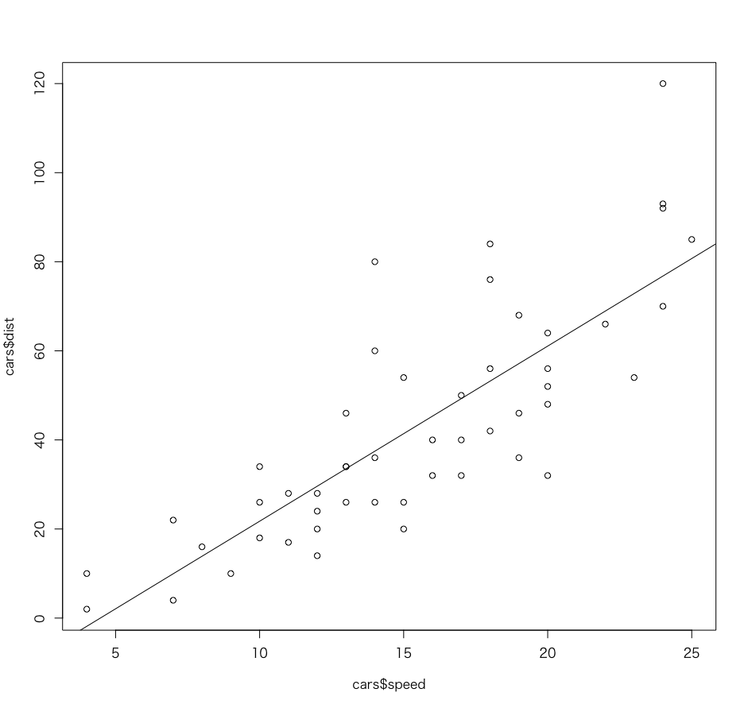
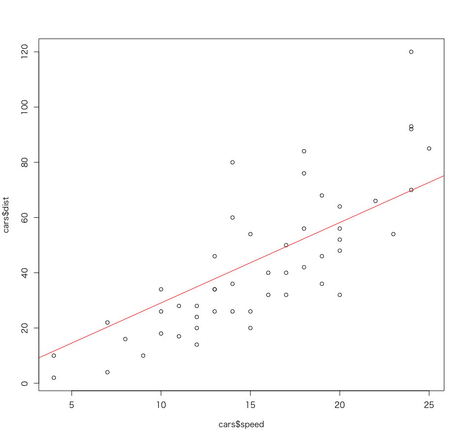
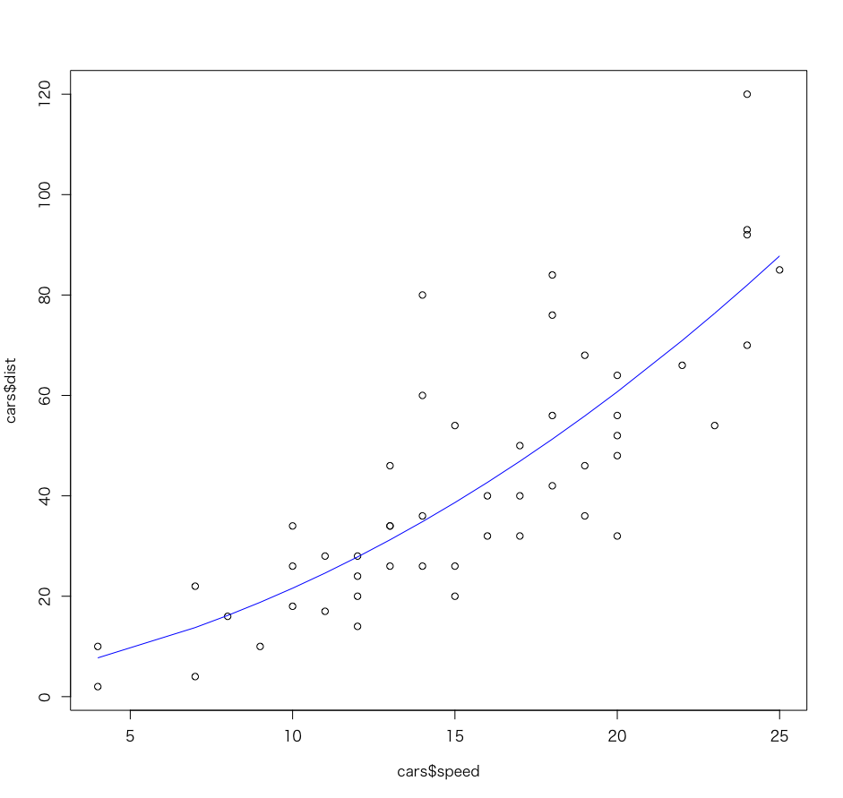
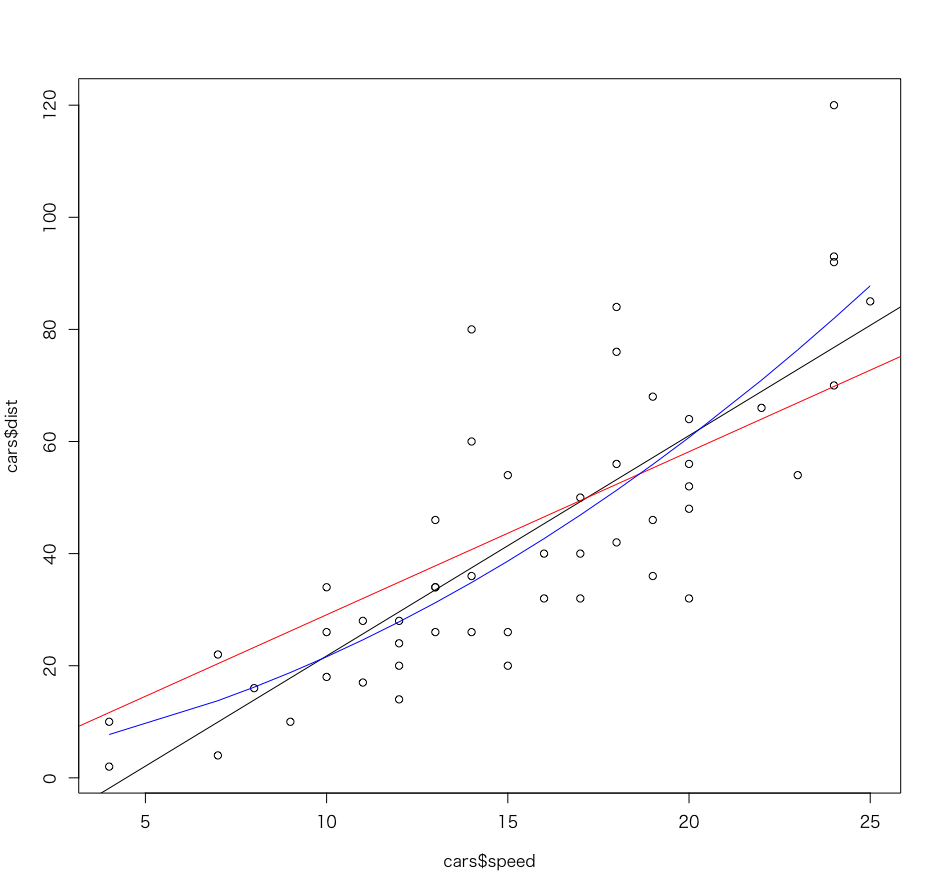

# 回帰分析

## cars

```
cars
   speed dist
1      4    2
2      4   10
3      7    4
4      7   22
5      8   16
...
>
```

## 線形モデル

$$
\hat{y} = a + b x_i
$$


### 最小二乗法

$$
\sum(y_i - \hat{y_i})^2
$$


$$
\sum(y_i - (a + bx_i))^2
$$

#### 参考：正規方程式


$$
na + b\sum x_i = \sum y_i 
$$

$$
a\sum x_i + b\sum x_i^2 = \sum x_iy_i
$$


### 決定係数

$$
R^2 = 1 - \frac{\sum(y_i - \hat{y})^2}{\sum(y_i - \bar{y})^2}
$$

> 決定係数はモデルの評価指標の一つ。一般的に決定係数は1に近づくほど良い。

---

### Rプログラミング


```r
plot(cars$speed, cars$dist)
model1 <- lm(dist ~ speed, cars)
abline(model1)
summary(model1)
```

#### 実行結果

```r
> plot(cars$speed, cars$dist)
> model1 <- lm(dist ~ speed, cars)
> abline(model1)
> summary(model1)

Call:
lm(formula = dist ~ speed, data = cars)

Residuals:
    Min      1Q  Median      3Q     Max 
-29.069  -9.525  -2.272   9.215  43.201 

Coefficients:
            Estimate Std. Error t value Pr(>|t|)    
(Intercept) -17.5791     6.7584  -2.601   0.0123 *  
speed         3.9324     0.4155   9.464 1.49e-12 ***
---
Signif. codes:  0 ‘***’ 0.001 ‘**’ 0.01 ‘*’ 0.05 ‘.’ 0.1 ‘ ’ 1

Residual standard error: 15.38 on 48 degrees of freedom
Multiple R-squared:  0.6511,	Adjusted R-squared:  0.6438 
F-statistic: 89.57 on 1 and 48 DF,  p-value: 1.49e-12
```




---

## 切片が0の線形モデル

$$
\hat{y} = b x_i
$$

> 必ず原点(0, 0)を通る

### Rプログラミング

```r
plot(cars$speed, cars$dist)
model2 <- lm(dist ~ speed + 0, cars)
abline(model2, col="red")
summary(model2)
```

> lm関数の第１引数に `+ 0` を追加する

#### 実行結果

```r
> plot(cars$speed, cars$dist)
> model2 <- lm(dist ~ speed + 0, cars)
> abline(model2, col="red")
> summary(model2)

Call:
lm(formula = dist ~ speed + 0, data = cars)

Residuals:
    Min      1Q  Median      3Q     Max 
-26.183 -12.637  -5.455   4.590  50.181 

Coefficients:
      Estimate Std. Error t value Pr(>|t|)    
speed   2.9091     0.1414   20.58   <2e-16 ***
---
Signif. codes:  0 ‘***’ 0.001 ‘**’ 0.01 ‘*’ 0.05 ‘.’ 0.1 ‘ ’ 1

Residual standard error: 16.26 on 49 degrees of freedom
Multiple R-squared:  0.8963,	Adjusted R-squared:  0.8942 
F-statistic: 423.5 on 1 and 49 DF,  p-value: < 2.2e-16
```




---

## 多項式回帰モデル

$$
\hat{y} = a + b x_i + c x_i^2
$$

> 回帰式が曲線になる

### Rプログラミング

```r
plot(cars$speed, cars$dist)
model3 <- lm(dist ~ speed + I(speed^2), cars)
summary(model3)
lines(cars$speed, fitted(model3), col="blue")
```

#### 実行結果

```r
> plot(cars$speed, cars$dist)
> model3 <- lm(dist ~ speed + I(speed^2), cars)
> summary(model3)

Call:
lm(formula = dist ~ speed + I(speed^2), data = cars)

Residuals:
    Min      1Q  Median      3Q     Max 
-28.720  -9.184  -3.188   4.628  45.152 

Coefficients:
            Estimate Std. Error t value Pr(>|t|)
(Intercept)  2.47014   14.81716   0.167    0.868
speed        0.91329    2.03422   0.449    0.656
I(speed^2)   0.09996    0.06597   1.515    0.136

Residual standard error: 15.18 on 47 degrees of freedom
Multiple R-squared:  0.6673,	Adjusted R-squared:  0.6532 
F-statistic: 47.14 on 2 and 47 DF,  p-value: 5.852e-12
```




---

## 3つのモデルの評価

### Rプログラミング

```r
plot(cars$speed, cars$dist)
abline(model1)
abline(model2, col="red")
lines(cars$speed, fitted(model3), col="blue")
summary(model1)$r.squared
summary(model2)$r.squared
summary(model3)$r.squared
AIC(model1, model2, model3)
```

#### 実行結果

```r
> plot(cars$speed, cars$dist)
> abline(model1)
> abline(model2, col="red")
> lines(cars$speed, fitted(model3), col="blue")
> summary(model1)$r.squared
[1] 0.6510794
> summary(model2)$r.squared
[1] 0.8962893
> summary(model3)$r.squared
[1] 0.6673308
> AIC(model1, model2, model3)
       df      AIC
model1  3 419.1569
model2  2 423.7498
model3  4 418.7721
```

> AICは赤池情報量基準と呼ばれるモデルの評価指標です。AICの値が小さいほど、予測精度の高いモデルと言えます。




