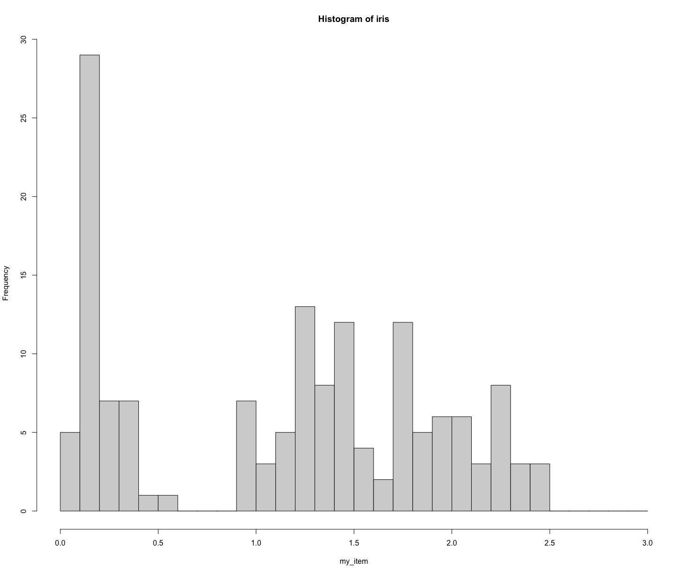
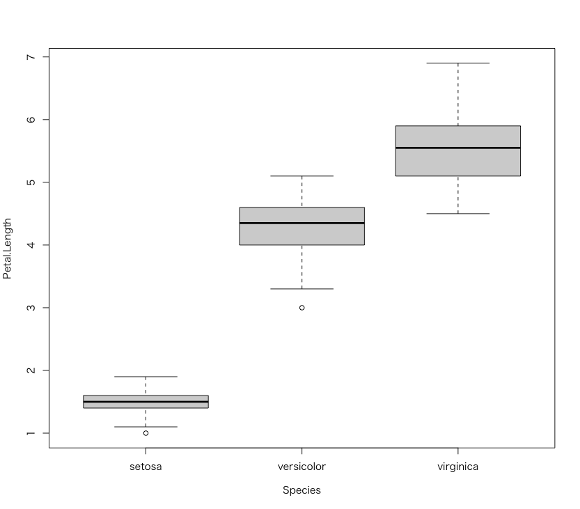

# irisデータセットの分析 - 1変数データの分析

* iris - アヤメの花のデータセットです。

```r
  Sepal.Length Sepal.Width Petal.Length Petal.Width Species
1          5.1         3.5          1.4         0.2  setosa
2          4.9         3.0          1.4         0.2  setosa
3          4.7         3.2          1.3         0.2  setosa
4          4.6         3.1          1.5         0.2  setosa
5          5.0         3.6          1.4         0.2  setosa
6          5.4         3.9          1.7         0.4  setosa
...
```


## 問1

irisデータセットの行数を求めてください。

---

## 問2

irisデータセットの列数を求めてください。

---

## 問3

Sepal.Length, Sepal.Width, Petal.Length, Petal.Widthの4項目について、平均値、標準偏差を求めてください。

---

## 問4

Sepal.Length, Sepal.Width, Petal.Length, Petal.Widthの4項目について中央値、四分位範囲を求めてください。

---

## 問5

以下のヒストグラムはSepal.Length, Sepal.Width, Petal.Length, Petal.Widthのいずれに該当するか調べてください。



---

## 問6

Speciesを以下の3つに分類して、Petal.Lengthの平均値、標準偏差、四分位数（中央値）、四分位範囲を求めてください。

* setosa
* versicolor
* virginica

---

## 問7

Speciesを以下の3つに分類して、Petal.Lengthの箱ひげ図を出力してください。

* setosa
* versicolor
* virginica



---

## 問8

`setosa` の特徴の説明してください。

> `versicolor` や `virginica` と比べるとどのような特徴があるのでしょうか。

---

<!--
```
> nrow(iris)
[1] 150


> ncol(iris)
[1] 5


> mean(iris$Sepal.Length)
[1] 5.843333
> sd(iris$Sepal.Length)
[1] 0.8280661
> mean(iris$Sepal.Width)
[1] 3.057333
> sd(iris$Sepal.Width)
[1] 0.4358663
> mean(iris$Petal.Length)
[1] 3.758
> sd(iris$Petal.Length)
[1] 1.765298
> mean(iris$Petal.Width)
[1] 1.199333
> sd(iris$Petal.Width)
[1] 0.7622377


> median(iris$Sepal.Length)
[1] 5.8
> IQR(iris$Sepal.Length)
[1] 1.3
> median(iris$Sepal.Width)
[1] 3
> IQR(iris$Sepal.Width)
[1] 0.5
> median(iris$Petal.Length)
[1] 4.35
> IQR(iris$Petal.Length)
[1] 3.5
> median(iris$Petal.Width)
[1] 1.3
> IQR(iris$Petal.Width)
[1] 1.5


par(mfrow=c(4, 1))
hist(iris$Sepal.Length, breaks = seq(0, 10, 0.1))
hist(iris$Sepal.Width, breaks = seq(0, 10, 0.1))
hist(iris$Petal.Length, breaks = seq(0, 10, 0.1))
hist(iris$Petal.Width, breaks = seq(0, 10, 0.1))


iris_setosa <- iris[iris["Species"] == "setosa", ]
iris_versicolor <- iris[iris["Species"] == "versicolor", ]
iris_virginica <- iris[iris["Species"] == "virginica", ]
mean(iris_setosa$Petal.Length)
mean(iris_versicolor$Petal.Length)
mean(iris_virginica$Petal.Length)
sd(iris_setosa$Petal.Length)
sd(iris_versicolor$Petal.Length)
sd(iris_virginica$Petal.Length)
median(iris_setosa$Petal.Length)
median(iris_versicolor$Petal.Length)
median(iris_virginica$Petal.Length)
IQR(iris_setosa$Petal.Length)
IQR(iris_versicolor$Petal.Length)
IQR(iris_virginica$Petal.Length)


iris_setosa <- iris[iris["Species"] == "setosa", ]
iris_versicolor <- iris[iris["Species"] == "versicolor", ]
iris_virginica <- iris[iris["Species"] == "virginica", ]
par(mfrow=c(1, 1))
boxplot(iris_setosa$Sepal.Length, iris_versicolor$Sepal.Length, iris_virginica$Sepal.Length)
```


```
nrow(iris)

ncol(iris)

mean(iris$Sepal.Length)
sd(iris$Sepal.Length)
mean(iris$Sepal.Width)
sd(iris$Sepal.Width)
mean(iris$Petal.Length)
sd(iris$Petal.Length)
mean(iris$Petal.Width)
sd(iris$Petal.Width)


iris %>% as_tibble() %>% 
  summarise(
    mean(Sepal.Length),
    sd(Sepal.Length),
    mean(Sepal.Width),
    sd(Sepal.Width),
    mean(Petal.Length),
    sd(Petal.Length),
    mean(Petal.Width),
    sd(Petal.Width),
)

median(iris$Sepal.Length)
IQR(iris$Sepal.Length)

median(iris$Sepal.Width)
IQR(iris$Sepal.Width)

median(iris$Petal.Length)
IQR(iris$Petal.Length)

median(iris$Petal.Width)
IQR(iris$Petal.Width)


par(mfrow=c(4, 1))
hist(iris$Sepal.Length, breaks = seq(0, 10, 0.1))
hist(iris$Sepal.Width, breaks = seq(0, 10, 0.1))
hist(iris$Petal.Length, breaks = seq(0, 10, 0.1))
hist(iris$Petal.Width, breaks = seq(0, 10, 0.1))


iris %>% as_tibble() %>% 
  ggplot() + 
  geom_histogram(aes(Sepal.Length), breaks = seq(0, 10, 0.1)) -> hist_sl
iris %>% as_tibble() %>% 
  ggplot() + 
  geom_histogram(aes(Sepal.Width), breaks = seq(0, 10, 0.1)) -> hist_sw
iris %>% as_tibble() %>% 
  ggplot() + 
  geom_histogram(aes(Petal.Length), breaks = seq(0, 10, 0.1)) -> hist_pl
iris %>% as_tibble() %>% 
  ggplot() + 
  geom_histogram(aes(Petal.Width), breaks = seq(0, 10, 0.1)) -> hist_pw
hist_sl / hist_sw / hist_pl / hist_pw


iris_setosa <- iris[iris["Species"] == "setosa", ]
iris_versicolor <- iris[iris["Species"] == "versicolor", ]
iris_virginica <- iris[iris["Species"] == "virginica", ]

mean(iris_setosa$Petal.Length)
sd(iris_setosa$Petal.Length)

mean(iris_versicolor$Petal.Length)
sd(iris_versicolor$Petal.Length)

mean(iris_virginica$Petal.Length)
sd(iris_virginica$Petal.Length)

iris %>% as_tibble() %>% 
  group_by(Species) %>% 
  summarise(
    mean(Petal.Length),
    sd(Petal.Length)
  )


par(mfrow=c(4, 1))
hist(iris$Sepal.Length, breaks = seq(0, 10, 0.1))
hist(iris_setosa$Sepal.Length, breaks = seq(0, 10, 0.1))
hist(iris_versicolor$Sepal.Length, breaks = seq(0, 10, 0.1))
hist(iris_virginica$Sepal.Length, breaks = seq(0, 10, 0.1))


t.test(iris_versicolor$Sepal.Length, iris_virginica$Sepal.Length)

par(mfrow=c(4, 1))
hist(iris$Sepal.Width, breaks = seq(0, 10, 0.1))
hist(iris_setosa$Sepal.Width, breaks = seq(0, 10, 0.1))
hist(iris_versicolor$Sepal.Width, breaks = seq(0, 10, 0.1))
hist(iris_virginica$Sepal.Width, breaks = seq(0, 10, 0.1))

t.test(iris_versicolor$Sepal.Width, iris_virginica$Sepal.Width)

par(mfrow=c(4, 1))
hist(iris$Petal.Length, breaks = seq(0, 10, 0.1))
hist(iris_setosa$Petal.Length, breaks = seq(0, 10, 0.1))
hist(iris_versicolor$Petal.Length, breaks = seq(0, 10, 0.1))
hist(iris_virginica$Petal.Length, breaks = seq(0, 10, 0.1))

t.test(iris_versicolor$Petal.Length, iris_virginica$Petal.Length)


par(mfrow=c(4, 1))
hist(iris$Petal.Width, breaks = seq(0, 10, 0.1))
hist(iris_setosa$Petal.Width, breaks = seq(0, 10, 0.1))
hist(iris_versicolor$Petal.Width, breaks = seq(0, 10, 0.1))
hist(iris_virginica$Petal.Width, breaks = seq(0, 10, 0.1))

t.test(iris_versicolor$Petal.Width, iris_virginica$Petal.Width)


par(mfrow=c(4, 1))
hist(iris$Sepal.Width, breaks = seq(0, 10, 0.1))
hist(iris_setosa$Sepal.Width, breaks = seq(0, 10, 0.1))
hist(iris_versicolor[1:20,]$Sepal.Width, breaks = seq(0, 10, 0.1))
hist(iris_virginica[1:20,]$Sepal.Width, breaks = seq(0, 10, 0.1))

t.test(iris_versicolor[1:31,]$Sepal.Width, iris_virginica[1:31,]$Sepal.Width)


median(iris_setosa$Petal.Length)
median(iris_versicolor$Petal.Length)
median(iris_virginica$Petal.Length)
IQR(iris_setosa$Petal.Length)
IQR(iris_versicolor$Petal.Length)
IQR(iris_virginica$Petal.Length)


iris_setosa <- iris[iris["Species"] == "setosa", ]
iris_versicolor <- iris[iris["Species"] == "versicolor", ]
iris_virginica <- iris[iris["Species"] == "virginica", ]
par(mfrow=c(1, 1))
boxplot(iris_setosa$Sepal.Length, iris_versicolor$Sepal.Length, iris_virginica$Sepal.Length)

boxplot(iris_setosa$Petal.Length, iris_versicolor$Petal.Length, iris_virginica$Petal.Length)
boxplot(Petal.Length~Species, data=iris)
```
-->