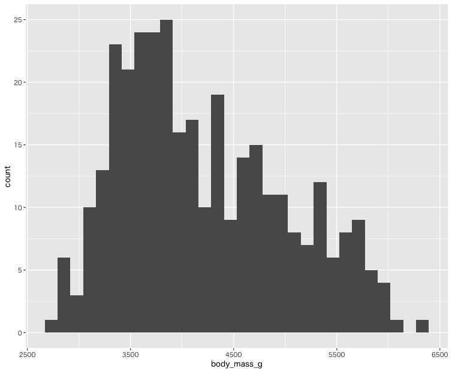
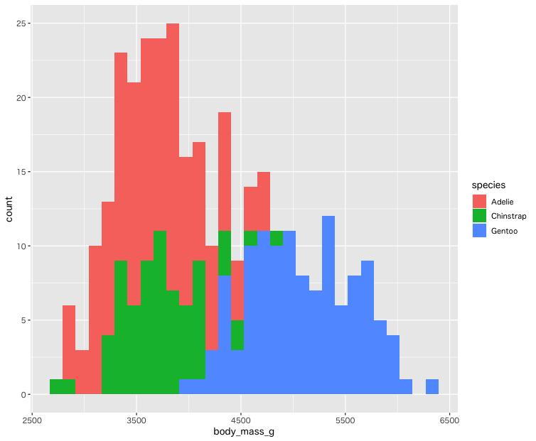
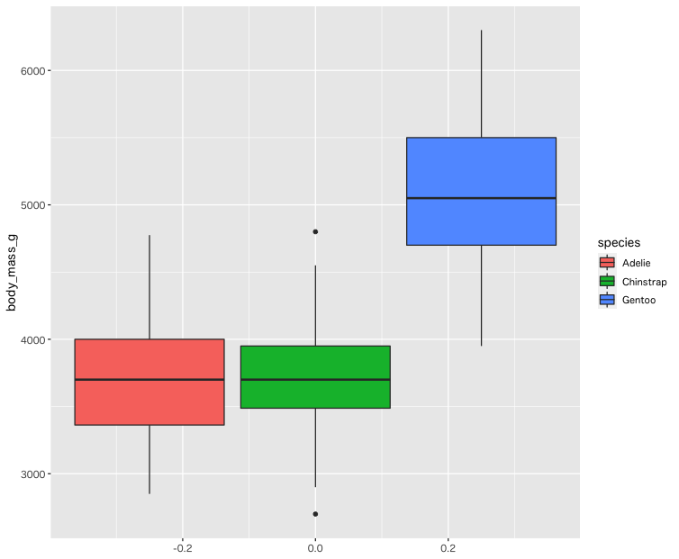
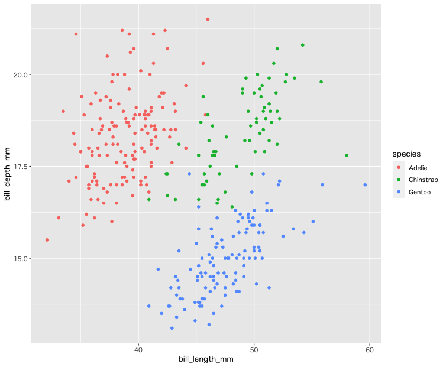

# palmerpenguins

## palmerpenguinsデータセット

+ palmerpenguinsデータセットは344 x 8のデータセットです。
+ NAデータが存在する点に注意してください。

```r
> library(palmerpenguins)
> penguins
# A tibble: 344 × 8
   species island    bill_length_mm bill_depth_mm flipper_length_mm body_mass_g sex     year
   <fct>   <fct>              <dbl>         <dbl>             <int>       <int> <fct>  <int>
 1 Adelie  Torgersen           39.1          18.7               181        3750 male    2007
 2 Adelie  Torgersen           39.5          17.4               186        3800 female  2007
 3 Adelie  Torgersen           40.3          18                 195        3250 female  2007
 4 Adelie  Torgersen           NA            NA                  NA          NA NA      2007
 5 Adelie  Torgersen           36.7          19.3               193        3450 female  2007
 6 Adelie  Torgersen           39.3          20.6               190        3650 male    2007
 7 Adelie  Torgersen           38.9          17.8               181        3625 female  2007
 8 Adelie  Torgersen           39.2          19.6               195        4675 male    2007
 9 Adelie  Torgersen           34.1          18.1               193        3475 NA      2007
10 Adelie  Torgersen           42            20.2               190        4250 NA      2007
# … with 334 more rows
```

+ データの構造は以下のとおりです。

```r
> str(penguins)
tibble [344 × 8] (S3: tbl_df/tbl/data.frame)
 $ species          : Factor w/ 3 levels "Adelie","Chinstrap",..: 1 1 1 1 1 1 1 1 1 1 ...
 $ island           : Factor w/ 3 levels "Biscoe","Dream",..: 3 3 3 3 3 3 3 3 3 3 ...
 $ bill_length_mm   : num [1:344] 39.1 39.5 40.3 NA 36.7 39.3 38.9 39.2 34.1 42 ...
 $ bill_depth_mm    : num [1:344] 18.7 17.4 18 NA 19.3 20.6 17.8 19.6 18.1 20.2 ...
 $ flipper_length_mm: int [1:344] 181 186 195 NA 193 190 181 195 193 190 ...
 $ body_mass_g      : int [1:344] 3750 3800 3250 NA 3450 3650 3625 4675 3475 4250 ...
 $ sex              : Factor w/ 2 levels "female","male": 2 1 1 NA 1 2 1 2 NA NA ...
 $ year             : int [1:344] 2007 2007 2007 2007 2007 2007 2007 2007 2007 2007 ...
> 
```

+ `na.omit` 関数を使ってNAデータを含むレコードを除去しておきます。

```r
> pgs <- na.omit(penguins)
> pgs
# A tibble: 333 × 8
   species island    bill_length_mm bill_depth_mm flipper_length_mm body_mass_g sex     year
   <fct>   <fct>              <dbl>         <dbl>             <int>       <int> <fct>  <int>
 1 Adelie  Torgersen           39.1          18.7               181        3750 male    2007
 2 Adelie  Torgersen           39.5          17.4               186        3800 female  2007
 3 Adelie  Torgersen           40.3          18                 195        3250 female  2007
 4 Adelie  Torgersen           36.7          19.3               193        3450 female  2007
 5 Adelie  Torgersen           39.3          20.6               190        3650 male    2007
 6 Adelie  Torgersen           38.9          17.8               181        3625 female  2007
 7 Adelie  Torgersen           39.2          19.6               195        4675 male    2007
 8 Adelie  Torgersen           41.1          17.6               182        3200 female  2007
 9 Adelie  Torgersen           38.6          21.2               191        3800 male    2007
10 Adelie  Torgersen           34.6          21.1               198        4400 male    2007
# … with 323 more rows
```

> 以降は `pgs` データセットを使います。

---

## No.1

* flipper_length_mm が 230以上のレコードを出力してください。

```r
# A tibble: 8 × 8
  species island bill_length_mm bill_depth_mm flipper_length_mm body_mass_g sex    year
  <fct>   <fct>           <dbl>         <dbl>             <int>       <int> <fct> <int>
1 Gentoo  Biscoe           50            16.3               230        5700 male   2007
2 Gentoo  Biscoe           59.6          17                 230        6050 male   2007
3 Gentoo  Biscoe           54.3          15.7               231        5650 male   2008
4 Gentoo  Biscoe           49.8          16.8               230        5700 male   2008
5 Gentoo  Biscoe           48.6          16                 230        5800 male   2008
6 Gentoo  Biscoe           52.1          17                 230        5550 male   2009
7 Gentoo  Biscoe           51.5          16.3               230        5500 male   2009
8 Gentoo  Biscoe           55.1          16                 230        5850 male   2009
```

---

## No.2

* flipper_length_mm が 230以上かつ、body_mass_g が 6000 以上のレコードを出力してください。

```r
# A tibble: 1 × 8
  species island bill_length_mm bill_depth_mm flipper_length_mm body_mass_g sex    year
  <fct>   <fct>           <dbl>         <dbl>             <int>       <int> <fct> <int>
1 Gentoo  Biscoe           59.6            17               230        6050 male   2007
```

---

## No.3

* body_mass_g の降順でレコードを出力してください。

```r
# A tibble: 333 × 8
   species island bill_length_mm bill_depth_mm flipper_length_mm body_mass_g sex    year
   <fct>   <fct>           <dbl>         <dbl>             <int>       <int> <fct> <int>
 1 Gentoo  Biscoe           49.2          15.2               221        6300 male   2007
 2 Gentoo  Biscoe           59.6          17                 230        6050 male   2007
 3 Gentoo  Biscoe           51.1          16.3               220        6000 male   2008
 4 Gentoo  Biscoe           48.8          16.2               222        6000 male   2009
 5 Gentoo  Biscoe           45.2          16.4               223        5950 male   2008
 6 Gentoo  Biscoe           49.8          15.9               229        5950 male   2009
 7 Gentoo  Biscoe           48.4          14.6               213        5850 male   2007
 8 Gentoo  Biscoe           49.3          15.7               217        5850 male   2007
 9 Gentoo  Biscoe           55.1          16                 230        5850 male   2009
10 Gentoo  Biscoe           49.5          16.2               229        5800 male   2008
# … with 323 more rows
```

---

## No.4

* species が Adelie のレコードについて、flipper_length_mm 列について出力してください。またflipper_length_mmの平均との差分、平均との差分を2乗した値を出力しています。

```r
# A tibble: 146 × 3
   flipper_length_mm mean_diff mean_diff_squared
               <int>     <dbl>             <dbl>
 1               181    -9.10            82.9   
 2               186    -4.10            16.8   
 3               195     4.90            24.0   
 4               193     2.90             8.39  
 5               190    -0.103            0.0106
 6               181    -9.10            82.9   
 7               195     4.90            24.0   
 8               182    -8.10            65.7   
 9               191     0.897            0.805 
10               198     7.90            62.4   
# … with 136 more rows
```

---

## No.5

* body_math_g 列について、以下の項目を出力してください。
  * 平均
  * 標準偏差
  * 中央値
  * 四分位範囲
  * 最小値
  * 最大値

```r
# A tibble: 1 × 6
  mean_bmg sd_bmg median_bmg iqr_bmg min_bmg max_bmg
     <dbl>  <dbl>      <int>   <dbl>   <int>   <int>
1    4207.   805.       4050    1225    2700    6300
# … with 136 more rows
```

---

## No.6

* species ごとに body_mass_g の最大値を出力してください。

```r
# A tibble: 3 × 2
  species   max_body_mass_g
  <fct>               <int>
1 Adelie               4775
2 Chinstrap            4800
3 Gentoo               6300
```

---

## No.7

* body_mass_g 列のヒストグラムを出力してください。



---

## No.8

* body_mass_g 列のヒストグラムを出力してください。ただし species ごとに色分けしてください。



---

## No.9

* body_mass_g 列の箱ひげ図を出力してください。ただし species ごとに色分けしてください。



---

## No.10

* bill_length_mm、bill_depth_mm  列の散布図を出力してください。ただし species ごとに色分けしてください。



---


<!-- 
library(tidyverse)
library(palmerpenguins)
penguins
str(penguins)

pgs <- na.omit(penguins)
pgs


# 1
pgs %>% filter(flipper_length_mm >= 230)


# 2
pgs %>% filter(flipper_length_mm >= 230) %>% filter(body_mass_g >= 6000)

# 3
pgs %>% arrange(desc(body_mass_g))

# 4
pgs %>% filter(species== "Adelie") %>% 
  select(flipper_length_mm) %>% 
  mutate(
    mean_diff = flipper_length_mm - mean(flipper_length_mm),
    mean_diff_squared = mean_diff^2
  )

# 5
pgs %>% summarise(
  mean_bmg = mean(body_mass_g),
  sd_bmg = sd(body_mass_g),
  median_bmg = median(body_mass_g),
  iqr_bmg = IQR(body_mass_g),
  min_bmg = min(body_mass_g),
  max_bmg = max(body_mass_g)
)

# 6
pgs %>% group_by(species) %>% 
  summarise(
    max_body_mass_g = max(body_mass_g)
  )


# 7
ggplot(pgs) +
  geom_histogram(aes(body_mass_g))

# 8
ggplot(pgs) +
  geom_histogram(aes(body_mass_g, fill=species))

# 9
ggplot(pgs) +
  geom_boxplot(aes(body_mass_g, fill=species)) +
  coord_flip()

# 10
ggplot(pgs) +
  geom_point(aes(bill_length_mm, bill_depth_mm, col=species))

-->