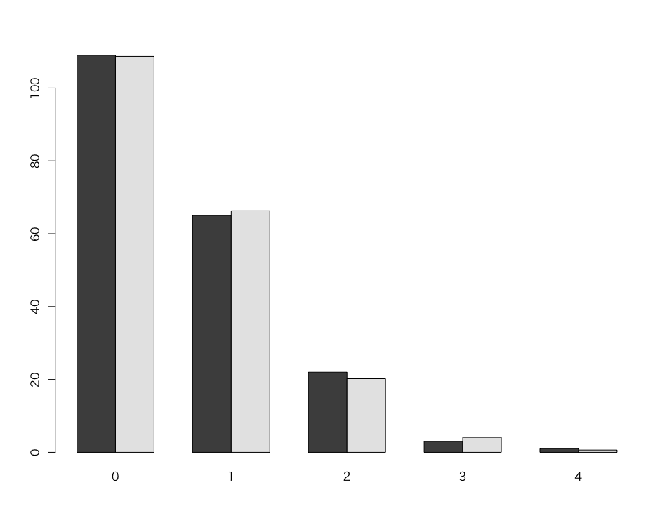

# 練習問題 - ポアソン分布

1875年〜1894年におけるプロシアの軍隊において、馬に蹴られて死亡した兵士の数は以下のとおり。

|死亡者数|0|1|2|3|4|合計|
|:--|--:|--:|--:|--:|--:|--:|
|部隊数|109|65|22|3|1|200|

この表から、馬に蹴られて死亡した各部隊の平均死亡者数は 0.61 である。

$$
 (0 * 109 + 1 * 65 + 2 * 22 + 3 * 3 + 4 * 1) / 200 = 0.61
$$

死亡者数 X が λ = 0.61にしたがうものとして分析する。

```r
x <- 0:4
y1 <- c(109, 65, 22, 3, 1)
y2 <- 200 * dpois(x, 0.61)
barplot(rbind(y1, y2), beside = T, names.arg = x)
```

