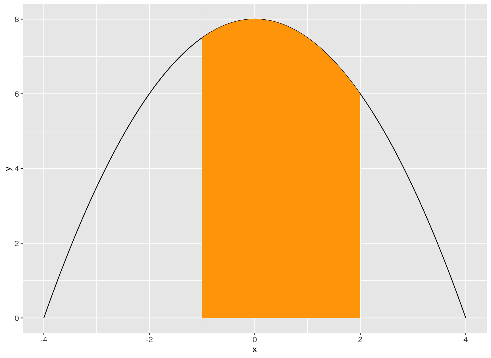

# 関数の積分

## 一次関数

1. 次のグラフの塗りつぶした部分の面積を求めてください。


<!--
$$
\int_{0}^{2} xdx = [\frac{1}{2}x^2]_{0}^{2} = 2 - 0 = 2
$$
-->

---

2. 次のグラフの塗りつぶした部分の面積を求めてください。


---

3. 次のグラフの塗りつぶした部分の面積を求めてください。


---

## 二次関数

4. 次のグラフの塗りつぶした部分の面積を求めてください。


<!-- 
$$
\int_{0}^{2} x^2dx = [\frac{1}{3}x^3]_{0}^{2} = \frac{8}{3} - 0 = 2
$$
-->

---

5. 次のグラフの塗りつぶした部分の面積を求めてください。


---


6. 次のグラフの塗りつぶした部分の面積を求めてください。



<!-- 
$$
\int_{-1}^2 -\frac{1}{2}x^2 + 8dx = [-\frac{1}{6}x^3 + 8x]_{-1}^2 = -\frac{8}{6} + 16 - (\frac{1}{6} - 8) = 22.5
$$
-->
---

<!--

```
integrate(function(x) x, 0, 2)
integrate(function(x) x, 0, 4)
integrate(function(x) x, 2, 4)

integrate(function(x) x ** 2, 0, 2)
integrate(function(x) x ** 2, 1, 2)
integrate(function(x) -1/2 * x ** 2 + 8, -1, 2)

integrate(function(x) -(1 / sqrt(2 * pi) * exp(-x ** 2 / 2)), 0, 1.96)
integrate(function(x) -(1 / sqrt(2 * pi) * exp(-x ** 2 / 2)), 1.96, 4)
integrate(dnorm, 0, 1.96)
integrate(dnorm, 1.96, 5)
```


```
my_data <- tibble(
  x = seq(0, 8, len = 100),
  x2 = seq(2, 4, len = 100),
  y1 = x,
  y12 = x2,
  y2 = 2 * x,
  y3 = 0.5 * x,
  y4 = x + 2,
  y5 = -1 * x + 8
)

my_data %>%
  ggplot() +
  geom_line(aes(x, y1)) +
  geom_ribbon(aes(x2, y12, ymin=0, ymax=y12 ), fill="orange")+
  ylab("y") + 
  xlim(0, 8) + 
  ylim(0, 8)

```
-->