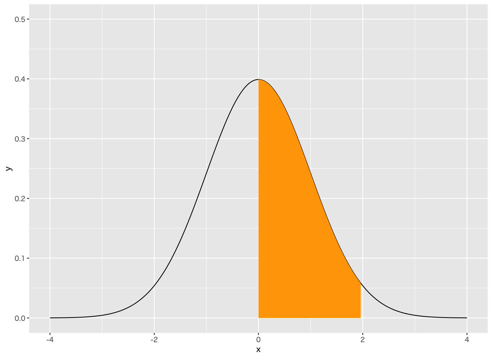
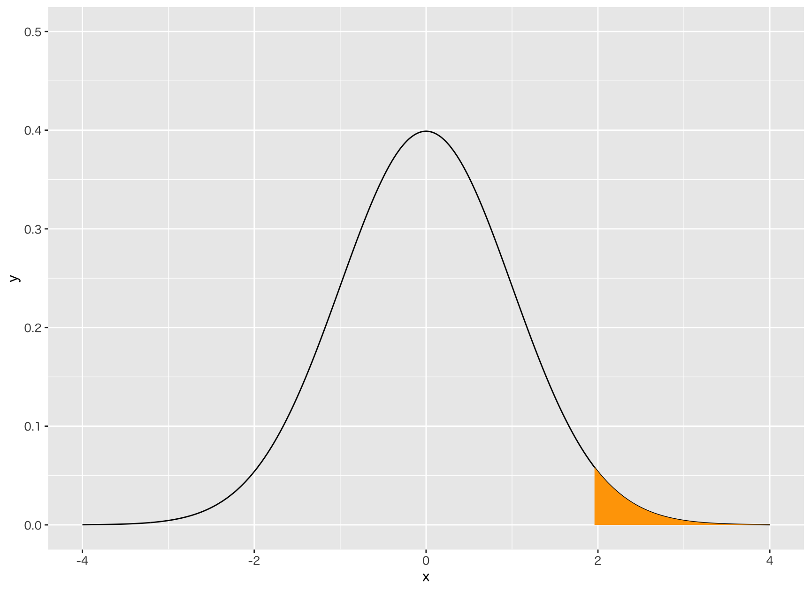

## 正規分布の確率密度関数

7. 次のグラフの塗りつぶした部分の面積を求めてください。




> 0 〜 1.96 の範囲の面積を求めます。

---

8. 次のグラフの塗りつぶした部分の面積を求めてください。




> 1.96〜 の範囲の面積を求めます。

---

<!--

```
integrate(function(x) x, 0, 2)
integrate(function(x) x, 0, 4)
integrate(function(x) x, 2, 4)

integrate(function(x) x ** 2, 0, 2)
integrate(function(x) x ** 2, 1, 2)
integrate(function(x) -1 * x ** 2 + 8, -1, 2)

integrate(function(x) -(1 / sqrt(2 * pi) * exp(-x ** 2 / 2)), 0, 1.96)
integrate(function(x) -(1 / sqrt(2 * pi) * exp(-x ** 2 / 2)), 1.96, 4)
integrate(dnorm, 0, 1.96)
integrate(dnorm, 1.96, 5)
```


```
my_data <- tibble(
  x = seq(0, 8, len = 100),
  x2 = seq(2, 4, len = 100),
  y1 = x,
  y12 = x2,
  y2 = 2 * x,
  y3 = 0.5 * x,
  y4 = x + 2,
  y5 = -1 * x + 8
)

my_data %>%
  ggplot() +
  geom_line(aes(x, y1)) +
  geom_ribbon(aes(x2, y12, ymin=0, ymax=y12 ), fill="orange")+
  ylab("y") + 
  xlim(0, 8) + 
  ylim(0, 8)

```
-->