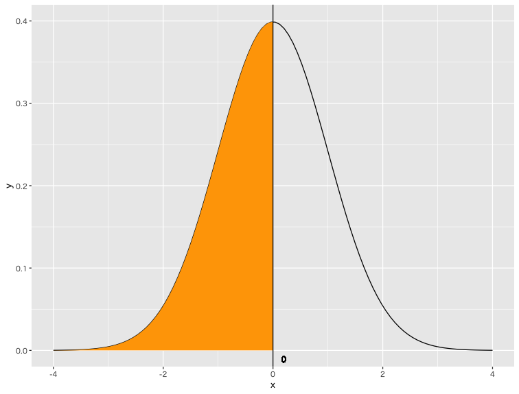
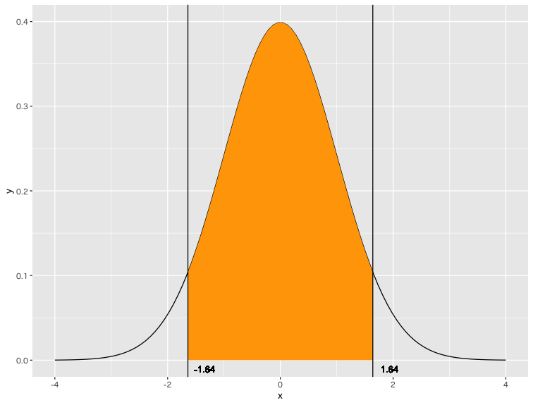
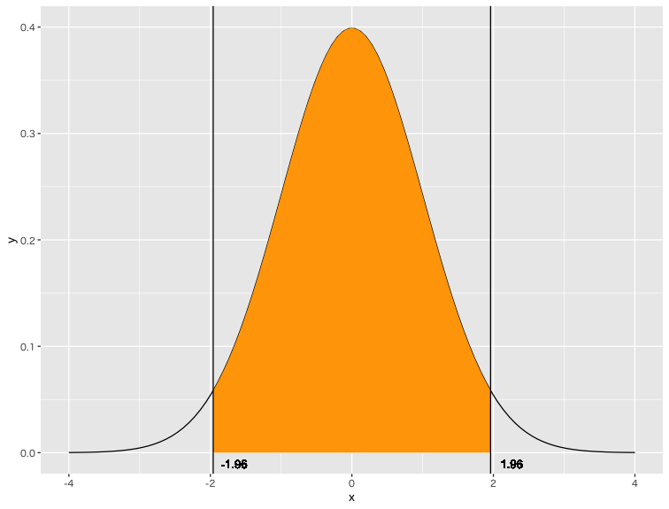
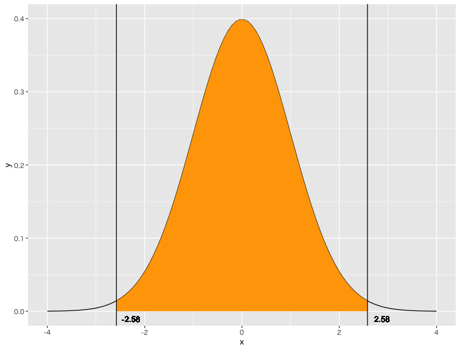
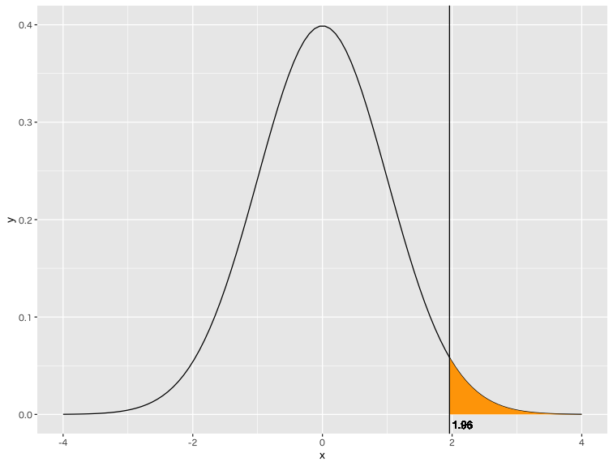
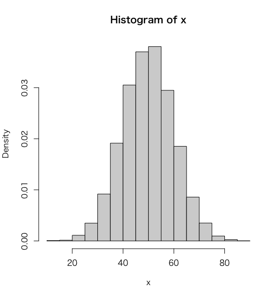

# 確認テスト - 正規分布

## No.1

標準正規分布の確率密度関数について、以下のオレンジ色の範囲をとる確率を求めてください。

> x = 0 以下となる確率を求めてください。
---

## No.2

標準正規分布の確率密度関数について、以下のオレンジ色の範囲をとる確率を求めてください。

> x = -1.64 以上、かつ、x = 1.64 以下となる確率を求めてください。

---

## No.3

標準正規分布の確率密度関数について、以下のオレンジ色の範囲をとる確率を求めてください。

> x = -1.96 以上、かつ、x = 1.96 以下となる確率を求めてください。

---

## No.4

標準正規分布の確率密度関数について、以下のオレンジ色の範囲をとる確率を求めてください。

> x = -2.58 以上、かつ、x = 2.58 以下となる確率を求めてください。

---

## No.5

標準正規分布の確率密度関数について、以下のオレンジ色の範囲をとる確率を求めてください。

> x = 1.96 以上となる確率を求めてください。

---

## No.6

正規分布 `N(50, 10^2)` の確率密度関数について、以下のオレンジ色の範囲をとる確率を求めてください。

> x = 60 以下となる確率を求めてください。

---

## No.7

正規分布 `N(50, 10^2)` の確率密度関数について、以下のオレンジ色の範囲をとる確率を求めてください。

> x = 70 以上となる確率を求めてください。

---

## No.8

正規分布 `N(50, 10^2)` に従う乱数を10,000件生成して、次のようなヒストグラムを作成してください。

> `hist` 関数に `freq = F` 引数を指定するとY軸がDensityになります。

---

## No.9

正規分布 `N(50, 10^2)` の確率密度関数を使って、次のようなグラフを描画してください。

> X軸は0〜100、Y軸にはXの確率密度を出力しています。

---

## No.10

正規分布 `N(50, 10^2)` の累積分布関数を使って、次のようなグラフを描画してください。

> X軸は0〜100、Y軸にはXの確率（下側累積確率）を出力しています。

---

<!-- 

library(tidyverse)

q1 <- -2.58
q2 <- 2.58
my_data <- tibble(
  x1 = seq(-4, 4, len = 100),
  x2 = seq(q1, q2, len = 100),
  y1 = dnorm(x1, 0, 1),
  y2 = dnorm(x2, 0, 1),
)
my_data %>%
  ggplot() +
  geom_line(aes(x1, y1)) +
  geom_ribbon(aes(x2, y2, ymin=0, ymax=y2 ), fill="orange")+
  geom_text(x = q1 + 0.3, y = -0.01, label = q1) + 
  geom_vline(xintercept = q1) + 
  geom_text(x = q2 + 0.3, y = -0.01, label = q2) + 
  geom_vline(xintercept = q2) + 
  xlab("x") + 
  ylab("y") + 
  xlim(-4, 4) + 
  ylim(0, 0.4)

###

library(tidyverse)

q1 <- 70
q2 <- 100
my_data <- tibble(
  x1 = seq(0, 100, len = 100),
  x2 = seq(q1, q2, len = 100),
  y1 = dnorm(x1, 50, 10),
  y2 = dnorm(x2, 50, 10),
)
my_data %>%
  ggplot() +
  geom_line(aes(x1, y1)) +
  geom_ribbon(aes(x2, y2, ymin=0, ymax=y2 ), fill="orange")+
  geom_text(x = q1 + 3, y = -0.001, label = q1) + 
  geom_vline(xintercept = q1) + 
  #geom_text(x = q2 + 3, y = -0.001, label = q2) + 
  #geom_vline(xintercept = q2) + 
  xlab("x") + 
  ylab("y") + 
  xlim(0, 100) + 
  ylim(0, 0.05)

-->