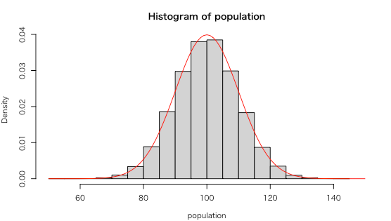

# 母平均を推定する

* 正規母集団 `N(100, 10^2)` から標本を抽出する様子をシミュレーションする

> 標本の平均値（標本平均）から母平均を推定する様子を学習します。

## 母集団データの準備

* `par` 関数を使って、複数のグラフを縦に4つ並べて出力する
* `set.seed` 関数を使って乱数のシードを設定する
* `rnorm` 関数を使って母集団データを準備する

```r
par(mfrow=c(4,1))
set.seed(1)
population <- rnorm(100000, 100, 10)
hist(population, freq = F, xlim = c(50, 150))
curve(dnorm(x, 100, 10), add = T, col = "red")
```

> `curve` 関数に `add = T` 引数を指定することで、既存のグラフに曲線を上書きできます。

### 実行結果




> 現実の問題では、このような母集団データは把握できないことがほとんどです。そのため母集団から抽出した標本（サンプル）を使って母集団の母数（母平均や母分散など）を推定します。

---

## 標本抽出

* `sample` 関数を使ってサンプリング（標本抽出）する
* `mean` 関数を使って標本の平均値を計算する（）

```r
sample <- sample(population, 1)
sample_mean <- mean(sample)
abline(v = sample_mean, col = "blue")
```

### 実行結果


> ランダムに青い直線が表示されます。上記のコードを繰り返し実行すると青い直線がランダムに増える様子が確認できるでしょう。

### 実験

* もう一度、母集団のヒストグラムを出力します。（2つ目のヒストグラムが出力されます）
* サンプルサイズを2に変更して、標本平均（青い直線）を出力してみましょう。
* ※同様に、母集団のヒストグラムを出力、サンプルサイズを4、16と変えて標本平均を出力してみましょう。

---


## 標本平均の確率分布

* 標本抽出のコードを1000回くりかえす 

```r
sample_means <- numeric(1000)
for (i in 1:1000) {
  sample <- sample(population, 4)
  sample_means[i] <- mean(sample)
}
hist(sample_means, freq = F, xlim = c(50, 150))
curve(dnorm(x, 100, 10 / sqrt(4)), add = T, col = "red")
```

> 上記のコードではサンプルサイズ4の標本抽出を1000回実施しています。現実の問題では標本抽出にもコストがかかるので、1000回も実施するのは現実的ではありません。

### 実行結果


> サンプルサイズ4の標本平均の確率分布は、母集団の正規分布のよりもばらつきが小さくなっているのがわかります。理論上、この標本平均は `N(100, 10^2/4)` の正規分布に従います。

---

## 確率変数の期待値と分散

* 正規分布に従う確率変数 `X`

$$
X \sim N(\mu, \sigma^2) \\
$$

* 確率変数 `X` の実現値 `x1` の期待値と分散

$$
E(x_1) = \mu \\
$$

$$
V(x_1) = \sigma^2 \\
$$


* 確率変数 `X` の独立した実現値 `x1`、`x2`、`x3`、`x4` から作成した平均値（標本平均）の期待値と分散

$$
E(\frac{x_1 + x_2 + x_3 + x_4}{4}) = \frac{1}{4} \lbrace E(x_1) + E(x_2) + E(x_3) + E(x_4) \rbrace = \mu\\
$$

$$
V(\frac{x_1 + x_2 + x_3 + x_4}{4}) = \frac{1}{4^2} \lbrace V(x_1) + V(x_2) + V(x_3) + V(x_4) \rbrace = \frac{1}{4}\sigma^2
$$

<!-- 

ss <- sample(population, 4)
ss_mean <- mean(ss)
variance <- 100 / 4
sd <- sqrt(variance)
paste(ss_mean - 1.96 * sd, ss_mean + 1.96 * sd)

-->
