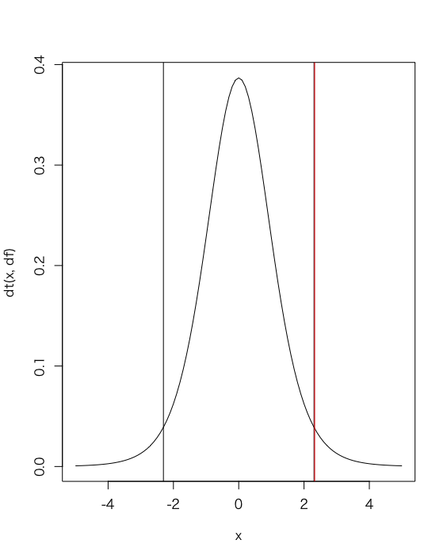
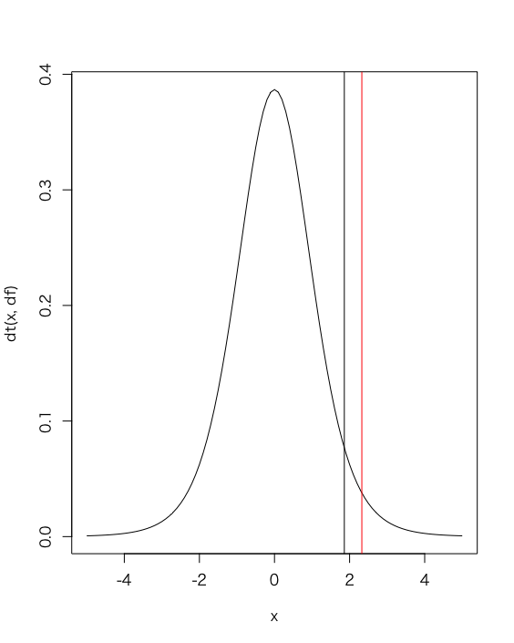

# 仮説検定

## t検定

ある企業Aの冬の賞与（ボーナス）の支給額について調査したところ、ランダムに抽出した9人の支給額は以下のとおりでした。

```
80, 74, 66, 54, 40, 62, 54, 48, 100
```

また平均支給額は 64.22222 万円です。

その年の民間企業の冬の平均賞与が50万円である場合、企業Aの冬の賞与は、民間企業の冬の平均賞与と差があると言えるか。有意水準5%で検定してください。

### 仮説検定

* 帰無仮説（H0）： 企業Aの冬の賞与は、民間企業の平均賞与と同じである（50万円と差が0である）
* 対立仮説（H1）： 企業Aの冬の賞与は、民間企業の平均賞与と同じでない（有意な差がある）
* 検定統計量： t値
* 有意水準： 5% 両側検定
* 標本： 80, 74, 66, 54, 40, 62, 54, 48, 100
* 帰無分布： 自由度8のt分布
* 臨界値： -2.306004, +2.306004
* 棄却域： -2.306004以下 あるいは +2.306004以上
* t値： 2.3261 ※棄却域にある
* p値： 0.04845
* 検定結果： 検定結果は5%水準で有意である（帰無仮説は棄却される。対立仮説を採択する）


### サンプルコード

```r
bonus_mu <- 50
bonus <- c(80, 74, 66, 54, 40, 62, 54, 48, 100)
t.test(bonus, mu = bonus_mu)
```

### 実行結果

```r
> bonus_mu <- 50
> bonus <- c(80, 74, 66, 54, 40, 62, 54, 48, 100)
> t.test(bonus, mu = bonus_mu)

	One Sample t-test

data:  bonus
t = 2.3261, df = 8, p-value = 0.04845
alternative hypothesis: true mean is not equal to 50
95 percent confidence interval:
 50.12299 78.32146
sample estimates:
mean of x 
 64.22222 
```

### 図解

```r
bonus_mu <- 50
bonus <- c(80, 74, 66, 54, 40, 62, 54, 48, 100)
result <- t.test(bonus, mu = bonus_mu)
result
t <- result$statistic
df <- length(bonus) - 1
x <- seq(-5, 5, 0.1)
plot(x, dt(x, df), type = "l")
min <- qt(0.025, df)
max <- qt(0.975, df)
abline(v = min)
abline(v = max)
abline(v = t, col = "red")
```



---

### 参考（片側検定）

```r
bonus_mu <- 50
bonus <- c(80, 74, 66, 54, 40, 62, 54, 48, 100)
result <- t.test(bonus, mu = bonus_mu, alternative = "greater")
result
t <- result$statistic
df <- length(bonus) - 1
x <- seq(-5, 5, 0.1)
plot(x, dt(x, df), type = "l")
# min <- qt(0.025, df)
max <- qt(0.95, df)
# abline(v = min)
abline(v = max)
abline(v = t, col = "red")
```



---

## 演習問題

* ある小学校で50m走を測定したところ、以下の結果となりました。

```
9.3, 9.1, 10.5, 11.2, 10.2, 8.3, 8.8
```

この年の小学校の平均記録9.0秒のとき、この小学校の記録は有意差があるか検定してください。有意水準は5%とします。
